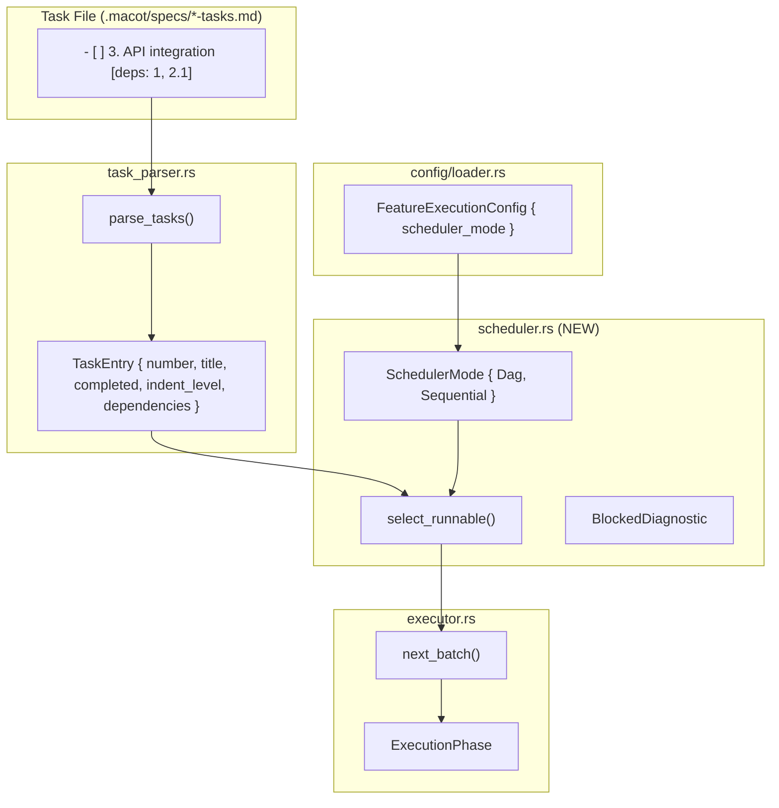

# Design: DAG-Based Task Scheduling

## 1. Overview

Extends the feature execution system from naive "first uncompleted" batch selection to dependency-aware (DAG) scheduling. Tasks can declare dependencies via `[deps: 1, 2.1]` metadata in the Markdown task file. The scheduler resolves which tasks are **runnable** (all dependencies satisfied) and detects **blocked** states (no runnable tasks remain but uncompleted tasks exist), transitioning to `Failed` with a diagnostic message.

Backward compatibility is preserved: task files without `[deps: ...]` annotations behave identically to the current sequential mode. A `scheduler_mode` config field allows explicit fallback to the legacy sequential behavior.

## 2. Architecture



**Data flow**:
1. `task_parser::parse_tasks()` reads Markdown, produces `Vec<TaskEntry>` with optional `dependencies`.
2. `scheduler::select_runnable()` takes `&[TaskEntry]` and `SchedulerMode`, returns `ScheduleResult` (runnable list or blocked diagnostic).
3. `executor::next_batch()` delegates to the scheduler module and applies `batch_size` truncation.
4. `poll_feature_executor()` in `app.rs` handles the new `ScheduleResult::Blocked` variant by transitioning to `Failed`.

## 3. Components and Interfaces

### 3.1 task_parser (modified)

- **File**: `src/feature/task_parser.rs`
- **Purpose**: Parse Markdown task files into structured task entries, now including dependency metadata.
- **Changes**: Add `dependencies` field to `TaskEntry`; extend regex to capture `[deps: ...]`.

```rust
#[derive(Debug, Clone)]
pub struct TaskEntry {
    pub number: String,
    pub title: String,
    pub completed: bool,
    pub indent_level: usize,
    pub dependencies: Vec<String>,  // NEW: parsed from [deps: ...]
}

/// Parse a task file and extract task entries.
///
/// Matches lines of the form:
///   `- [ ] N. Title`
///   `- [ ] N. Title [deps: X, Y]`
/// where N is an integer or dot-notation number.
pub fn parse_tasks(content: &str) -> Vec<TaskEntry>
```

**Regex change**: The current pattern `^(\s*)- \[([ x])\] (\d+(?:\.\d+)?)\.\s+(.+)$` captures `title` as everything after the number. The new regex captures the dependency annotation separately:

```
^(\s*)- \[([ x])\] (\d+(?:\.\d+)*)\.\s+(.+?)(?:\s+\[deps:\s*([^\]]*)\])?\s*$
```

Key changes:
- `(\d+(?:\.\d+)*)` — allows multi-level dot notation (`2.3.4`), matching the "前提" requirement.
- `(.+?)` — non-greedy title capture to avoid consuming `[deps: ...]`.
- `(?:\s+\[deps:\s*([^\]]*)\])?` — optional dependency group.

**Dependency parsing**: The captured group (e.g., `"1, 2.1"`) is split on `,`, each token trimmed, yielding `vec!["1", "2.1"]`. If no `[deps: ...]` is present, `dependencies` is `vec![]`.

### 3.2 scheduler (NEW)

- **File**: `src/feature/scheduler.rs`
- **Purpose**: Encapsulate batch selection strategies. Provides runnable-task selection for both DAG and sequential modes.

```rust
use std::collections::{HashMap, HashSet};
use crate::feature::task_parser::TaskEntry;

#[derive(Debug, Clone, Copy, PartialEq, Eq, Serialize, Deserialize)]
#[serde(rename_all = "lowercase")]
pub enum SchedulerMode {
    Dag,
    Sequential,
}

impl Default for SchedulerMode {
    fn default() -> Self {
        SchedulerMode::Dag
    }
}

#[derive(Debug)]
pub struct BlockedDiagnostic {
    pub blocked_tasks: Vec<BlockedTask>,
    pub has_cycle: bool,
}

#[derive(Debug)]
pub struct BlockedTask {
    pub number: String,
    pub missing_deps: Vec<String>,
}

#[derive(Debug)]
pub enum ScheduleResult<'a> {
    /// Tasks available for execution.
    Runnable(Vec<&'a TaskEntry>),
    /// All tasks completed.
    AllDone,
    /// Uncompleted tasks exist but none are runnable.
    Blocked(BlockedDiagnostic),
}

/// Select runnable tasks according to the given scheduling mode.
pub fn select_runnable<'a>(
    tasks: &'a [TaskEntry],
    mode: SchedulerMode,
) -> ScheduleResult<'a>
```

**Algorithm** (`SchedulerMode::Dag`):

1. Build `completed_set: HashSet<&str>` from tasks where `completed == true`.
2. Build `known_set: HashSet<&str>` from all task numbers.
3. For each uncompleted task:
   - Compute `missing_deps`: dependencies not in `completed_set`.
   - If `missing_deps` is empty, the task is **runnable**.
   - Otherwise, record as blocked with the missing deps list.
4. If runnable list is non-empty, return `ScheduleResult::Runnable(runnable)`.
5. If runnable list is empty and uncompleted tasks exist:
   - Check for cycle: if *all* missing deps reference tasks in `known_set` (none are missing/external), a cycle is likely. Set `has_cycle = true`.
   - Return `ScheduleResult::Blocked(diagnostic)`.
6. If all tasks are completed, return `ScheduleResult::AllDone`.

**Algorithm** (`SchedulerMode::Sequential`):

Simply collect uncompleted tasks in file order (current behavior). Always returns `Runnable` or `AllDone`.

**Cycle detection heuristic**: A true topological cycle exists when all blocked tasks' missing dependencies point to other blocked tasks. The scheduler does not perform full topological sort (unnecessary for the batch-selection use case). Instead, if `runnable.is_empty() && !uncompleted.is_empty()`, it checks whether every missing dependency belongs to the set of uncompleted-but-known tasks. If so, `has_cycle = true`.

### 3.3 executor (modified)

- **File**: `src/feature/executor.rs`
- **Purpose**: Orchestrate feature execution lifecycle. Now delegates batch selection to the scheduler.

```rust
use crate::feature::scheduler::{self, ScheduleResult, SchedulerMode};

pub struct FeatureExecutor {
    // ... existing fields ...
    scheduler_mode: SchedulerMode,  // NEW
}

impl FeatureExecutor {
    pub fn new(
        // ... existing params ...
        // config.scheduler_mode is read here
    ) -> Self { ... }

    /// Select the next batch of tasks to execute.
    /// Returns Ok(batch) on success, Err(msg) when blocked.
    pub fn next_batch<'a>(&self, tasks: &'a [TaskEntry]) -> Result<Vec<&'a TaskEntry>, String> {
        match scheduler::select_runnable(tasks, self.scheduler_mode) {
            ScheduleResult::Runnable(runnable) => {
                Ok(runnable.into_iter().take(self.batch_size).collect())
            }
            ScheduleResult::AllDone => Ok(vec![]),
            ScheduleResult::Blocked(diag) => {
                Err(format_blocked_message(&diag))
            }
        }
    }
}

fn format_blocked_message(diag: &BlockedDiagnostic) -> String
```

**Signature change for `next_batch`**: The current signature returns `Vec<&TaskEntry>` directly. The new signature returns `Result<Vec<&TaskEntry>, String>` to communicate the blocked state. This is a breaking change for callers (only `poll_feature_executor` in `app.rs`).

### 3.4 config/loader (modified)

- **File**: `src/config/loader.rs`
- **Purpose**: Add `scheduler_mode` to `FeatureExecutionConfig`.

```rust
use crate::feature::scheduler::SchedulerMode;

#[derive(Debug, Clone, Serialize, Deserialize)]
pub struct FeatureExecutionConfig {
    // ... existing fields ...
    #[serde(default)]
    pub scheduler_mode: SchedulerMode,  // NEW: defaults to Dag
}
```

**Backward compatibility** (NFR-1): Because `scheduler_mode` uses `#[serde(default)]` and `SchedulerMode::default()` returns `Dag`, existing config files without `scheduler_mode` deserialize without error and get DAG mode enabled.

### 3.5 tower/app.rs (modified)

- **File**: `src/tower/app.rs`
- **Purpose**: Adapt `poll_feature_executor` to handle the new `Result` return from `next_batch`.

Current code in `SendingBatch` handler:
```rust
let batch = executor.next_batch(&tasks);
if batch.is_empty() {
    executor.set_phase(ExecutionPhase::Completed);
}
```

New code:
```rust
match executor.next_batch(&tasks) {
    Ok(batch) if batch.is_empty() => {
        executor.set_phase(ExecutionPhase::Completed);
    }
    Ok(batch) => {
        // ... send batch (unchanged) ...
    }
    Err(blocked_msg) => {
        executor.set_phase(ExecutionPhase::Failed(blocked_msg));
    }
}
```

## 4. Data Models

### TaskEntry (extended)

| Field | Type | Description |
|-------|------|-------------|
| `number` | `String` | Task identifier (e.g., `"2.1"`) |
| `title` | `String` | Task description text |
| `completed` | `bool` | Whether `[x]` is checked |
| `indent_level` | `usize` | Indentation level (0 or 1) |
| `dependencies` | `Vec<String>` | **NEW**: Task numbers this task depends on |

**Invariants**:
- `number` is always a non-empty string of dot-separated integers.
- `dependencies` contains zero or more valid task number strings. Invalid references (pointing to non-existent tasks) are allowed by the parser but treated as unsatisfied by the scheduler.

### SchedulerMode

| Variant | Behavior |
|---------|----------|
| `Dag` | Dependency-aware: only runnable tasks are selected |
| `Sequential` | Legacy: first uncompleted tasks in file order |

### BlockedDiagnostic

| Field | Type | Description |
|-------|------|-------------|
| `blocked_tasks` | `Vec<BlockedTask>` | Each blocked task with its missing deps |
| `has_cycle` | `bool` | Whether a dependency cycle is suspected |

### BlockedTask

| Field | Type | Description |
|-------|------|-------------|
| `number` | `String` | Task number of the blocked task |
| `missing_deps` | `Vec<String>` | Dependency task numbers not yet completed |

## 5. Error Handling

| Scenario | Behavior | Requirement |
|----------|----------|-------------|
| `[deps: 99]` where task 99 doesn't exist | Task is Blocked; `missing_deps` includes `"99"` | FR-5, Section 7 |
| Circular dependency (e.g., A deps B, B deps A) | Runnable = 0, `has_cycle = true`; `Failed` with cycle warning | FR-5, Section 7 |
| Malformed `[deps: ...]` (e.g., `[deps: ]`) | Parsed as empty deps; task is treated as dependency-free | FR-6 |
| Task file read error | Existing `Failed` transition in executor (unchanged) | Existing behavior |
| `scheduler_mode` absent from config | Defaults to `Dag` via serde default | NFR-1 |

**Blocked message format example**:
```
Execution blocked: 2 tasks cannot proceed.
  Task 3: waiting on [1, 2.1] (incomplete)
  Task 4: waiting on [3] (incomplete)
Possible circular dependency detected.
```

## 6. Correctness Properties

1. **Dependency Ordering** — A task T is never selected as runnable while any of its declared dependencies remain uncompleted. Formally: for every task T in the runnable set, `T.dependencies` is a subset of the completed-tasks set.

2. **Parallel Maximization** — All tasks whose dependencies are fully satisfied appear in the runnable set simultaneously (before `batch_size` truncation). No runnable task is artificially deferred.

3. **Blocked Detection** — When `uncompleted_count > 0` and `runnable_count == 0`, the scheduler returns `Blocked`, never `AllDone` or `Runnable(empty)`.

4. **Sequential Equivalence** — When `scheduler_mode == Sequential`, the runnable set equals all uncompleted tasks in file order, regardless of `dependencies` values. This preserves exact legacy behavior.

5. **Backward Compatibility** — Tasks without `[deps: ...]` have `dependencies == vec![]` and are always eligible for runnable selection (no dependencies to block them).

6. **Config Backward Compatibility** — A config file missing `scheduler_mode` deserializes successfully, defaulting to `Dag`.

7. **Missing Dependency Safety** — A dependency referencing a non-existent task number is treated as unsatisfied (the task remains blocked). It is never silently ignored or treated as satisfied.

8. **Cycle Detection** — When all uncompleted tasks are blocked and every missing dependency references another known (but uncompleted) task, `has_cycle` is `true`.

9. **Batch Size Enforcement** — The returned batch never exceeds `batch_size` elements, regardless of how many runnable tasks exist.

10. **Idempotent Parsing** — Parsing the same task file content twice produces identical `TaskEntry` vectors (including `dependencies`). No hidden state affects parsing.

## 7. Testing Strategy

### Unit Tests (task_parser.rs)

Covers: **Properties 5, 10**

- `parse_tasks_with_deps`: Task with `[deps: 1, 2]` produces correct `dependencies`.
- `parse_tasks_without_deps`: Task without annotation produces empty `dependencies`.
- `parse_tasks_mixed_deps_and_no_deps`: Mixed file parses correctly.
- `parse_tasks_deps_with_dot_notation`: `[deps: 1.1, 2.3]` parsed correctly.
- `parse_tasks_deps_empty_bracket`: `[deps: ]` produces empty `dependencies`.
- `parse_tasks_deps_whitespace_variants`: Various spacing around commas and brackets.
- `parse_tasks_multi_level_dot_notation`: Task number `2.3.4` with deps `1.2.3`.
- `parse_tasks_title_preserved_with_deps`: Title does not include `[deps: ...]` suffix.

### Unit Tests (scheduler.rs)

Covers: **Properties 1, 2, 3, 4, 7, 8**

- `dag_simple_chain`: A→B→C, only A is runnable initially.
- `dag_parallel_after_common_dep`: B and C depend on A; after A completes, both are runnable.
- `dag_blocked_when_deps_incomplete`: No task is runnable but uncompleted tasks exist → `Blocked`.
- `dag_cycle_detected`: A→B→A yields `Blocked` with `has_cycle = true`.
- `dag_missing_dep_blocks_task`: Dep references non-existent task → blocked with missing dep info.
- `dag_no_deps_always_runnable`: Tasks without deps are always in the runnable set.
- `dag_all_done`: All tasks completed → `AllDone`.
- `sequential_ignores_deps`: In Sequential mode, all uncompleted tasks are returned regardless of deps.
- `sequential_all_done`: All tasks completed → `AllDone` in Sequential mode.

### Unit Tests (executor.rs)

Covers: **Properties 9**

- `next_batch_dag_mode_respects_deps`: Only dependency-satisfied tasks in batch.
- `next_batch_dag_mode_batch_size_limit`: Batch truncated to `batch_size`.
- `next_batch_dag_mode_blocked_returns_error`: When blocked, `next_batch` returns `Err`.
- `next_batch_sequential_mode_unchanged`: Sequential mode behavior identical to legacy.

### Integration Tests

Covers: **Properties 1, 3, 6** (end-to-end)

- Phase transition: `SendingBatch` → (blocked) → `Failed` with diagnostic message.
- Phase transition: `SendingBatch` → (all done) → `Completed`.
- Config without `scheduler_mode` → executor uses DAG mode by default.
