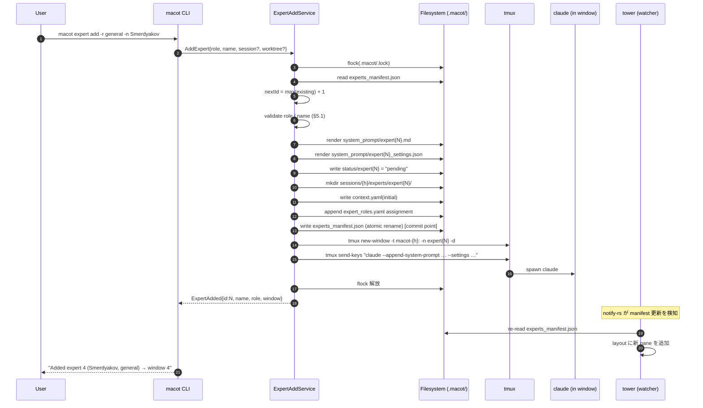
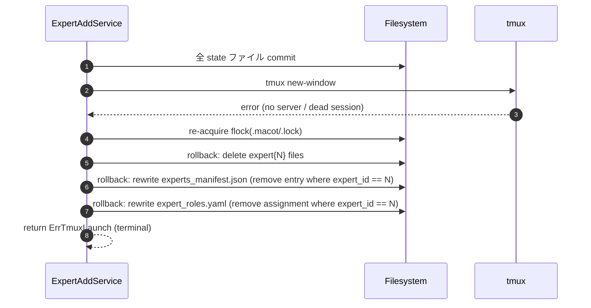

# Design: Dynamic Expert Add (Expert パネルへの動的 expert 追加)

## 1. Overview

`macot` は現状、`macot start -n N` で **起動時にのみ** N 体の expert を生成する固定構成である。途中で人手が足りない／別ロールが欲しいとなった場合、利用者は一度 `macot down` してから再度 `start` し直す必要があり、進行中の context.yaml・shared/decisions.yaml・messages/* を捨ててやり直すか、別セッションを並走させる以外に選択肢が無い。

本機能は、稼働中セッションを止めずに **expert を 1 体ずつ動的に追加** できるようにする。CLI (`macot expert add`) と tower TUI(キーバインド + モーダル)の両方からアクセス可能とし、追加された expert は既存 expert と完全に同等の権限・I/O 経路(messages/queue, shared/decisions.yaml, status/expertN)を持つ。

スコープは以下に限定する:

- **追加のみ**を本設計のスコープとする。`expert remove` は対称性のために CLI 形を将来予約するが本機能の実装対象外(§Future Work 参照)。
- 動的に追加した expert は **既存セッションと同一の tmux session** に所属し、新規 window として並ぶ。新規 tmux session の生成・複数 session への跨り追加は対象外。
- 追加直後は **未割当(no task)状態**で待機する。タスク自動割当・自動 onboarding は対象外。
- ロール選択は **既存ビルトインロール(`architect` / `planner` / `general`)** に加え、外部テンプレートファイル `.macot/templates/roles/{role}.md` を介したカスタムロールを許容する。組み込みロールの埋め込みテンプレートは触らない。
- 「追加と同時に worktree も切る」は **既存の Ctrl+W (Launch expert in worktree)** に委譲する。本機能では `--worktree` フラグで起動直後に Ctrl+W 相当を実行する糖衣のみ提供。
- 追加後の expert ID 採番ポリシーは **単調増加 (max + 1)**。旧 ID の再利用は行わない(理由は §4.2)。

由来: ユーザ依頼 (decisions.yaml decision-1777628325) — 「Expert パネルに動的にexpertを追加する機能を検討してください。」

### 1.1 Dependencies

本機能は新規に以下の crate を追加する必要がある(Cargo.toml の `[dependencies]` 節に追記)。

| Crate | バージョン | 用途 |
|---|---|---|
| `fs2` | `0.4` | クロスプラットフォームの advisory file lock(`flock(2)` / `LockFileEx` の薄いラッパ)。`.macot/.lock` の排他取得に使用。`flock` crate は async 版だが本機能ではブロッキング acquire で十分なため `fs2` を採用。 |
| `notify` | `6` | tower TUI が `experts_manifest.json` の rename イベントを検知するための inotify/fsevents 抽象化。 |

既存依存(`tokio`, `clap`, `serde`, `serde_json`, `serde_yaml`, `thiserror`, `tracing`, `anyhow`, `tempfile` など)はそのまま流用する。

### 1.2 既存実装の前提

設計に先立ち、本リポジトリに以下が既に存在することを確認している。後段の各節はこれらに整合する形で記述する。

- `src/experts/registry.rs` の `ExpertRegistry` がインメモリの expert 一覧と `next_id: ExpertId` カウンタを保持し、`pub const AUTO_ASSIGN_ID: ExpertId = u32::MAX` のセンチネル経由で自動採番できる(`register_expert` API)。
- `src/session/tmux.rs` の `TmuxManager` が **async API** で tmux 操作を行う(`async fn create_session(...)`, `async fn kill_session(...)` 等)。本機能で追加するメソッドも async とする。
- `src/config/loader.rs` の `Config::default()` がデフォルト 4 名 (`Alyosha`/`Ilyusha`/`Grigory`/`Katya`) を保持。これが現状の "name pool" 相当だが構造体としての `NamePool` は存在しない(§3.4 はこれを新規導入する形で説明する)。
- `.macot/messages/{inbox,outbox,queue,broadcast}/` は flat 構造であり、per-expert サブディレクトリは持たない(§4.1 参照)。
- `.macot/back_story.md` は free-form なプロジェクト note であり、ソースコードからの参照は無い(§4.1 参照)。

## 2. Architecture

### 2.1 全体像

`macot` のドメインは大きく 3 層に分かれる:

- **State 層** (`.macot/` ファイル群) — 永続的な真実の源泉
- **Process 層** (tmux + Claude プロセス) — 揮発的なランタイム
- **UI 層** (tower TUI / CLI) — 操作入口

動的追加は **State → Process → UI** の順で正方向に伝搬し、失敗時は逆順で巻き戻す(§5.2)。

```mermaid
flowchart LR
    subgraph UI[UI 層]
        CLI["macot expert add"]
        TUI["tower TUI<br/>F2 / 'a' key"]
    end
    subgraph CMD[Command Service]
        AS[ExpertAddService]
    end
    subgraph STATE[State 層]
        LOCK[".macot/.lock<br/>(advisory)"]
        MAN[experts_manifest.json]
        SP[system_prompt/expertN.*]
        ST[status/expertN]
        CTX[sessions/{h}/experts/expertN/]
        ROL[sessions/{h}/expert_roles.yaml]
    end
    subgraph PROC[Process 層]
        TMUX[tmux new-window]
        CLAUDE[claude CLI launch]
    end
    UI --> AS
    AS --> LOCK
    AS --> MAN
    AS --> SP
    AS --> ST
    AS --> CTX
    AS --> ROL
    AS --> TMUX
    TMUX --> CLAUDE
    AS -. "manifest 変更を notify" .-> TUI
```

### 2.2 シーケンス: 正常系



### 2.3 シーケンス: tmux 起動失敗 → ロールバック



### 2.4 並行制御モデル

State 層の整合性は **`.macot/.lock` の advisory file lock** (`fs2::FileExt::lock_exclusive`、内部的に `fcntl(LOCK_EX)` / `LockFileEx` を呼ぶ) で保護する。

- **クリティカルセクション**: ID 採番開始 〜 manifest コミット完了まで。ロック保持中は外部プロセス I/O を行わない(§Property 10)。
- **書き込みは temp + rename**: `experts_manifest.json` は `experts_manifest.json.tmp.{pid}` に書いてから `rename(2)` で原子的に置換する(POSIX の同一 FS 上 rename は原子的、Windows は `MoveFileExW` の `MOVEFILE_REPLACE_EXISTING` で同等)。
- **tmux 操作はロック外**: tmux 系操作 (`new-window`, `send-keys`) はロック解放後に行うことで、長時間ロック保持を避ける。tmux 失敗時のロールバックは再ロック取得して実施(§2.3 シーケンス参照)。
- **ロック取得タイムアウト**: `try_lock_exclusive` で 5 秒間 spin-retry し、失敗したら `LockBusy` エラーを返す(§5.2)。
- **tower の読み取り**: `notify` crate (v6) は inotify/fsevents で manifest の rename イベントを検知。読む際にロック取得は不要(rename 原子性で十分)。

## 3. Components and Interfaces

### 3.1 ExpertAddService (新規)

- **File**: `src/expert/add.rs`
- **Purpose**: 動的追加のドメインロジック。CLI/TUI どちらからも呼ばれる単一エントリ。
- **Key types/functions**:

```rust
pub struct ExpertAddRequest {
    pub session: Option<SessionName>,    // None なら唯一の running session
    pub role: RoleSpec,                  // Builtin(architect/planner/general) | Custom(path)
    pub name: Option<ExpertName>,        // None なら NamePool から自動採番
    pub worktree: Option<WorktreeOpt>,   // Some なら起動直後に worktree 化
}

pub struct ExpertAdded {
    pub session: SessionName,
    pub expert_id: ExpertId,
    pub name: ExpertName,
    pub role: String,
    pub tmux_window_index: u32,
}

pub async fn add_expert(req: ExpertAddRequest) -> Result<ExpertAdded, ExpertAddError>;

#[derive(thiserror::Error, Debug)]
pub enum ExpertAddError {
    #[error("session not found: {0}")] SessionNotFound(String),
    #[error("multiple sessions exist; specify --session")] AmbiguousSession,
    #[error("invalid role spec: {0}")] InvalidRole(String),
    #[error("invalid name '{0}': {1}")] InvalidName(String, String),
    #[error("name '{0}' already used in this session")] DuplicateName(String),
    #[error("another macot operation in progress (lock busy)")] LockBusy,
    #[error("manifest write failed: {0}")] StateWrite(#[source] std::io::Error),
    #[error("tmux launch failed: {0}")] TmuxLaunch(#[source] anyhow::Error),
    #[error("rollback failed after {original}: {rollback}")] RollbackFailure {
        original: Box<ExpertAddError>,
        rollback: String,
    },
}
```

`add_expert` は `async fn` とする(内部で `TmuxManager` の async API を呼ぶため、§3.5)。`NamePoolExhausted` variant は **意図的に削除**: §3.4 で `NamePool::fallback` が常に有効な名前を返すため、この error は到達不能。代わりに、ユーザ指定 name が `^[A-Za-z][A-Za-z0-9_-]*$` に違反した場合の `InvalidName` を新設する(§5.1 検証表に対応)。

### 3.2 ExpertRegistry 永続化拡張

- **File**: `src/experts/registry.rs` (既存)、`src/experts/persist.rs` (新規)
- **Purpose**: 既存の `ExpertRegistry`(インメモリ HashMap + `next_id` カウンタ + name/role lookup)に **manifest ファイルとの双方向同期** 機能を追加する。新規 module `persist.rs` は I/O 専従で、`registry.rs` は純粋ロジックを保つ。
- **既存実装との整合性**: `register_expert(ExpertInfo) -> Result<ExpertId, RegistryError>` は変更しない。`AUTO_ASSIGN_ID` センチネル(`u32::MAX`)経由の自動採番もそのまま使う。
- **Key types/functions**:

```rust
// src/experts/persist.rs (新規)
pub struct ManifestPersistor {
    project_root: PathBuf,    // .macot/ の親
}

impl ManifestPersistor {
    /// manifest.json を読み、ExpertRegistry を初期化する。
    /// next_id は manifest 配列の max(expert_id) + 1 として復元する(§4.2)。
    pub fn load_into_registry(&self) -> Result<ExpertRegistry, PersistError>;

    /// 単一 entry を append し、原子的に書き戻す。
    /// 呼び出し前に .macot/.lock を保持していることが前提。
    pub fn append_atomic(&self, entry: &ExpertEntry) -> Result<(), PersistError>;

    /// 単一 entry を expert_id で削除し、原子的に書き戻す。ロールバック用。
    pub fn remove_by_id_atomic(&self, expert_id: ExpertId) -> Result<(), PersistError>;
}

#[derive(Serialize, Deserialize, Clone)]
pub struct ExpertEntry {
    pub expert_id: u32,
    pub name: String,
    pub role: String,
    pub worktree_path: Option<String>,
}
```

**Manifest と in-memory state の関係**: §4.2 で詳述するが、`ExpertRegistry::next_id` フィールドは「永続状態の derived view」として再定義する。プロセス起動時に manifest から復元、書き込みのたびに manifest が真の source、`next_id` はキャッシュに過ぎない。

### 3.3 RoleResolver (新規)

- **File**: `src/expert/role.rs`
- **Purpose**: role 名から system prompt ソースを解決する。組み込み 3 種 + 外部テンプレート。
- **Key types/functions**:

```rust
pub enum RoleSpec {
    Builtin(BuiltinRole),    // architect | planner | general
    Custom { name: String }, // .macot/templates/roles/{name}.md を参照
}

pub enum BuiltinRole { Architect, Planner, General }

pub struct ResolvedRole {
    pub canonical_name: String,         // manifest.role に書き込む値
    pub prompt_md: String,              // expert{N}.md の本文
    pub settings_template: SettingsTemplate, // hook 内に expert{N} を埋める
}

pub fn resolve(spec: &RoleSpec, project_root: &Path) -> Result<ResolvedRole, RoleError>;
```

外部テンプレートの探索順:
1. `.macot/templates/roles/{name}.md` (プロジェクトローカル)
2. `~/.config/macot/roles/{name}.md` (ユーザグローバル)
3. 見つからなければ `RoleError::NotFound`

### 3.4 NamePool (新規)

- **File**: `src/experts/names.rs` (新規)
- **Purpose**: name 自動採番。**現状の実体**は `src/config/loader.rs::Config::default()` がベタに 4 名 (`Alyosha`/`Ilyusha`/`Grigory`/`Katya`) を保持しており、`start -n N` は config 経由でしか名前を引けず、N>4 のとき適切な fallback が無い(暗黙にユーザ config 必須)。本機能では追加時の動的採番を可能にするため独立の pool を導入する。
- **採用するプール**: ドストエフスキー『カラマーゾフの兄弟』の登場人物名を採用し、既存 4 名を含む形で 12 名程度に拡張する(統一感を保つ):

```rust
const LITERARY_NAMES: &[&str] = &[
    // 既存 4 名(変更しない)
    "Alyosha", "Ilyusha", "Grigory", "Katya",
    // 拡張(同作品から)
    "Dmitri", "Ivan", "Smerdyakov", "Fyodor",
    "Zosima", "Lise", "Varvara", "Marfa",
];
```

- **Key types/functions**:

```rust
pub struct NamePool {
    pool: &'static [&'static str], // = LITERARY_NAMES
}

impl NamePool {
    pub fn pick_unused(&self, used: &HashSet<&str>) -> Option<&'static str>;
    /// 文学プールが枯渇した場合のフォールバック。
    /// 命名規約(§5.1)を満たし、かつ既存名と衝突しない。
    pub fn fallback(&self, id: ExpertId) -> String {
        format!("Expert{id:02}")  // 例: "Expert12"
    }
}
```

**採番規則**: `pick_unused` が `Some(name)` を返せばそれを採用、`None` のとき `fallback(id)` を採用する。`NamePoolExhausted` は **発生しない**(可用性優先)。
**スタイル**: フォールバック名 `Expert{id:02}` は CamelCase でハイフンを含まないため、既存の文学名(`Alyosha` 等)と並べても tower の column 幅で破綻しにくく、§5.1 の正規表現 `^[A-Za-z][A-Za-z0-9_-]*$` も満たす。

**互換性**: 既存の `Config::default()` の expert リストはそのまま維持する。`expert add` で名前未指定の場合のみ `NamePool` が引かれる。`start` 時の挙動は変更しない。

### 3.5 TmuxManager 拡張 (既存)

- **File**: `src/session/tmux.rs` (既存に追記)
- **Purpose**: 既存セッションへ window を 1 枚追加し、Claude を起動する。**既存の `TmuxManager` (async API) を拡張する**。
- **既存の async 仕様との整合**: `create_session` 等が `async fn` であるため、本機能で追加するメソッドも `async fn` とする。`#[async_trait]` を使う既存 trait 上には載せず、`impl TmuxManager` に直接生やす(他の `kill_session` 等と同じレイヤ)。
- **Key types/functions**:

```rust
impl TmuxManager {
    /// 既存セッションに新規 window を追加して claude を起動する。
    /// window 名は `expert{N}` として一意に固定する(start 時の規約と揃える)。
    /// 戻り値: 新 window の tmux index(`tmux list-windows -F #{window_index}` で得られる値)。
    pub async fn spawn_expert_window(
        &self,
        expert_id: ExpertId,
        cwd: &Path,
        prompt_path: &Path,
        settings_path: &Path,
    ) -> Result<u32, anyhow::Error>;

    /// ロールバック用に window を kill する。
    /// 対象 window が存在しない場合も Ok(()) を返す(冪等)。
    pub async fn kill_expert_window(
        &self,
        expert_id: ExpertId,
    ) -> Result<(), anyhow::Error>;
}
```

セッション名は既存 `TmuxManager::session_name()` から引くため、本メソッドの引数からは `session` を取らない(既存 API との対称性)。

実装は既存 `create_session` の `new-session -d` と同型の `new-window -t {session}: -n expert{N} -c {cwd} -d` → `send-keys` パターンを再利用する。`-d` で起動し active 切り替えはしない(ユーザの作業を妨げない)。

**Trait 化の方針**: 既存コードでは `TmuxBackend` 系の trait を介したテストモック手段が一部存在する(`session/tmux.rs` 上部参照)。本機能のテスト容易性のため、`spawn_expert_window` / `kill_expert_window` も同 trait 上に追加し、Medium テスト層では in-memory mock を差し替えられるようにする(§7.3)。

### 3.6 CLI 入口

- **File**: `src/commands/mod.rs` および新規 `src/commands/expert.rs`(既存 `src/commands/reset.rs` と同型)
- **Purpose**: 既存の `reset expert <ID>` に倣って **`macot expert <subcommand>`** をサブコマンドグループとして導入。`reset expert <ID>` は既存 `commands/reset.rs::ResetCommand::Expert` として残るため、本機能との衝突は無い(`expert` と `reset expert` は別系統)。

```rust
#[derive(clap::Subcommand)]
pub enum Command {
    Start(StartArgs),
    Down(DownArgs),
    Tower(TowerArgs),
    Launch(LaunchArgs),
    Status,
    Sessions,
    Reset(ResetArgs),
    /// New: expert 操作グループ
    Expert(ExpertArgs),
}

#[derive(clap::Args)]
pub struct ExpertArgs { #[command(subcommand)] cmd: ExpertCmd }

#[derive(clap::Subcommand)]
pub enum ExpertCmd {
    /// Add a new expert to a running session
    Add {
        #[arg(short, long)] session: Option<String>,
        #[arg(short, long, default_value = "general")] role: String,
        #[arg(short, long)] name: Option<String>,
        /// Custom role template path (overrides role lookup)
        #[arg(long)] prompt_file: Option<PathBuf>,
        /// Launch directly inside a git worktree (delegates to existing Ctrl+W flow)
        #[arg(long)] worktree: bool,
        #[arg(long)] worktree_branch: Option<String>,
        /// Validate inputs and report planned ID/files without writing or spawning.
        #[arg(long)] dry_run: bool,
        /// Emit ExpertAdded as JSON on stdout (suppresses human-readable line).
        #[arg(long)] json: bool,
    },
    /// List experts in a session
    List { session: Option<String> },
    // NOTE: `Remove` は本 PR では実装しない。スコープを §1 に揃えるため
    // CLI には追加しない(将来 §Future Work で別 PR として導入)。
}
```

成功時 stdout (機械可読、`--json` 無し):

```
Added expert 4 (Smerdyakov, general) in session macot-8c0dda46 (window 4)
```

`--json` フラグで `ExpertAdded` を JSON シリアライズして返す(自動化・スクリプト用):

```json
{"session":"macot-8c0dda46","expert_id":4,"name":"Smerdyakov","role":"general","tmux_window_index":4}
```

**`--dry-run` 動作**: state ファイルを書かず、tmux も触らない。stdout に「採番される ID」「展開後 prompt パス」「使われるテンプレート source」「自動採番される name」を表示するのみ(冪等性に関する誤操作緩和、§5.4)。

### 3.7 Tower TUI 統合

- **File**: `src/tui/expert_panel.rs`, `src/tui/keymap.rs` (既存に追記)
- **Purpose**: TUI から動的追加できるようにする。
- **キーバインド追加**:
  - **`F2`** (Expert Panel フォーカス時): 新規 expert 追加モーダルを開く。理由:
    - `Ctrl+A` は input mode の "move to line start" と衝突。
    - `Ctrl+N` は "next line" と衝突。
    - F キーは未使用かつテンキー無し環境でも到達しやすい。
  - **モーダル UI**:
    - フィールド: `Role` (select: architect/planner/general/<custom>) / `Name` (input, optional) / `Worktree` (checkbox)
    - Enter で confirm → `ExpertAddService::add_expert` を呼ぶ。
- **マニフェスト変更検知**:
  - tower はすでに `experts_manifest.json` を起動時に読み込んでいる前提。`notify-rs` を使った rename 監視を追加し、変更を pull-reload する。
  - レイアウトは `Vec<ExpertCell>` を再構築するだけで、選択中 expert の保持・スクロール状態は ID キーで保つ。

## 4. Data Models

### 4.1 永続データへの変更

本設計で **スキーマ変更は無い**。既存の以下を流用する:

| ファイル | 役割 | 動的追加時の挙動 |
|---|---|---|
| `experts_manifest.json` | expert 一覧 (配列) | 末尾に新 entry を追記、原子的 rename |
| `system_prompt/expertN.md` | 起動時に `--append-system-prompt` で読まれる | 新規生成 |
| `system_prompt/expertN_settings.json` | hook 設定。本文に `expert{N}` パスがハードコード | 新規生成 |
| `status/expertN` | `processing` / `pending` の単語ファイル | `pending` で初期化 |
| `sessions/{h}/experts/expertN/context.yaml` | per-expert state | テンプレ初期値で生成 |
| `sessions/{h}/expert_roles.yaml` | 役割割当履歴 | `assignments` リストに append |
| `sessions/{h}/shared/decisions.yaml` | 横断状態 | 触らない (新 expert は read-only に発見) |
| `messages/queue/`, `messages/outbox/`, `messages/inbox/`, `messages/broadcast/` | IPC | **flat 構造**(per-expert subdir 無し)であることをリポジトリの実体で確認済み。何もしない |
| `back_story.md` | プロジェクト note | ソースコードからの参照無し(free-form ユーザ note)。新 expert 用の特別な処理は **不要** |

### 4.2 ID 採番ポリシー

**単調増加** (`max(existing_ids) + 1`) を採用する。**唯一の persistent な真実は `experts_manifest.json` 配列**であり、`ExpertRegistry::next_id` インメモリフィールドはそのキャッシュとして再定義する。

#### 4.2.1 in-memory `next_id` の再定義

既存 `ExpertRegistry::next_id` (registry.rs:40) は単調増加するインメモリカウンタとして動作してきた。本機能では以下のセマンティクスに変更する(コードから観測可能な振る舞いは互換):

1. **起動時復元**: `ManifestPersistor::load_into_registry` が manifest を読み、`next_id = max(entry.expert_id) + 1`(空配列なら 0)で初期化する。
2. **ID 割当時**: `register_expert(AUTO_ASSIGN_ID)` は現行どおり `next_id` を払い出して `+= 1`。
3. **永続化との同期**: 払い出した ID で manifest を append して `rename` で commit するまでは、メモリ上の `next_id` 増分は **未確定** とみなす。commit に成功 → 確定。manifest 書き込み失敗 → メモリも巻き戻して `next_id -= 1`(同一プロセス・ロック保持中なので race は無い)。
4. **複数プロセス対応**: 別プロセスが manifest を更新した場合に備え、ロック取得直後に再 load して `next_id = max(disk_max + 1, mem_next_id)` に揃える。これにより 2 プロセスが同時に同じ ID を払い出す事態を防ぐ(§Property 3 の補強)。

#### 4.2.2 採用理由

1. **状態漏れの回避**: ID 再利用すると、過去の `system_prompt/expertN.md` などの残骸を新 expert が継承する事故が起きやすい。物理削除のタイミングが将来 `expert remove` で必要になるため、削除と採番を独立させたい。
2. **ログ・監査の追跡性**: `decisions.yaml` の `made_by: 2` のような既存ログが、再利用 ID と衝突して同じ番号が別人物を指す事態を避ける。
3. **コード変更最小**: 別ファイルでカウンタを持たないので migration 不要。
4. **トレードオフ**: ID は単調に増えるので削除と追加を繰り返すと番号が大きくなる。これは tower のラベル幅にしか影響しないので許容(2 桁を超えれば columnize で対応)。

### 4.3 Role 表現

`manifest.role` フィールドは自由文字列。既存値は `architect` / `planner` / `general`。本設計でのカスタムロールは `manifest.role` に同じ自由文字列を書き込み、prompt 解決は `RoleResolver` が再現的に行う(§3.3)。

### 4.4 不変条件 (実装側で守ること)

- `experts_manifest.json` 内の `expert_id` は **重複しない**(set 性質)。
- `expert_id` は **任意の時点で単調増加してきた歴史を持つ**(配列順 = 追加順 = ID 昇順)。
- `system_prompt/expert{N}.md`, `_settings.json`, `status/expert{N}`, `sessions/.../experts/expert{N}/` は manifest と **存在が同期**する(commit point から見て either both exist or neither exists)。
- tmux session 上で window 名 `expert{N}` が **manifest entry と 1:1 対応**する(コミット直後の一過性のスケジューリング窓を除く)。

## 5. Error Handling

### 5.1 入力検証

| 入力 | 検証 | エラー |
|---|---|---|
| `--role` | 組み込み 3 種 or `.macot/templates/roles/{role}.md` が存在 | `InvalidRole(spec)` |
| `--name` | 1〜32 文字、`^[A-Za-z][A-Za-z0-9_-]*$`、同セッション内既存名と重複しない | `DuplicateName(name)` / `InvalidName(reason)` |
| `--session` | 指定があれば該当 session が `tmux has-session` で生存 | `SessionNotFound(name)` |
| 未指定 session | `macot sessions` 結果が 1 件のみなら自動採用、複数なら明示要求 | `AmbiguousSession` |
| `--prompt-file` | パス存在 + UTF-8 読み取り可 | `InvalidRole` 経由 |

### 5.2 障害分類とロールバック

| 障害ポイント | 種別 | ロールバック | ユーザ向け終端状態 |
|---|---|---|---|
| 検証失敗 | input | 不要 | 非ゼロ終了、stderr に理由 |
| `fs2::try_lock_exclusive` 取得失敗 (5s タイムアウト) | concurrency | 不要 | `LockBusy`: "another macot operation in progress, try again" |
| state ファイル個別書き込み失敗 | I/O | 既に書いた expert{N} files を `unlink` | `StateWrite(io)` |
| manifest commit (rename) 失敗 | I/O | 同上 | `StateWrite(io)` |
| tmux `new-window` 失敗 | runtime | manifest を再ロックして entry 削除、関連ファイル削除 | `TmuxLaunch(err)` |
| `claude` 起動 (send-keys) 失敗 | runtime | window kill + state 削除 | `TmuxLaunch(err)` |
| ロールバック自体が失敗 | catastrophic | 報告のみ。state/プロセス不整合の手動修復を促す | `RollbackFailure` |

### 5.3 観測性

- 終端状態は **構造化ログ**(`tracing` crate, JSON formatter)に出す。フィールド: `session`, `expert_id`, `role`, `name`, `outcome`, `tmux_window`。
- ロールバック失敗時のみ `error!` レベル。それ以外は `info!`。

### 5.4 冪等性に関する判断

`add` は本質的に「新エンティティ生成」なので **冪等にしない**(クライアント再試行は ID を増やしてしまう)。代わりに以下で誤操作を緩和:

- 同名指定時は `DuplicateName` で即拒否。
- TUI モーダルは confirm を 1 段挟む。
- CLI には `--dry-run` を提供し、採番 ID と展開後 prompt パスを出力するだけにできる。

## 6. Correctness Properties

本節では Property 1 を **filesystem state 限定**で定義し、Property 4 で **tmux/Claude プロセス側の eventual consistency** を別個に扱う。両者を分離することで「manifest commit 完了 → tmux 起動完了」の中間窓を仕様レベルで明示する。

1. **State-File Atomicity (filesystem only)** — `experts_manifest.json` 上に `expert_id = N` の entry が存在することと、以下のファイル群がすべて存在することは **論理的に等価**である。tmux/Claude プロセスの存在は本 Property の対象外(Property 4 が扱う):
   - `system_prompt/expert{N}.md`
   - `system_prompt/expert{N}_settings.json`
   - `status/expert{N}`
   - `sessions/{h}/experts/expert{N}/context.yaml`

   `add_expert` が成功して返った時点と `add_expert` が失敗してロールバックを完了した時点の両方で、この同値性が保たれる。

2. **Monotonic ID Allocation** — `add_expert` の戻り値 `expert_id` は、呼び出し直前の `experts_manifest.json` 中の任意の `expert_id` よりも厳密に大きい。連続する成功呼び出しの `expert_id` 列も狭義単調増加する(`ExpertRegistry::next_id` インメモリ値もこの不変条件に同期、§4.2.1)。

3. **Lock-Serialized Critical Section** — 任意の 2 つの `add_expert` 呼び出しは、`.macot/.lock` を介して直列化される。ID 採番から manifest commit までを観測した第三者プロセスは、いずれの呼び出しにおいても部分書き込み状態の manifest を観測しない(rename 原子性により)。

4. **Tmux Eventual Consistency (process layer)** — `add_expert` が `Ok` を返した時点で **manifest と state ファイルは一貫している**(Property 1)が、tmux window `expert{N}` の存在と claude プロセスの起動は manifest commit に **strict には先行しない**。`add_expert` の戻り値が観測される直前 〜 直後に tmux 操作が完了するのが正常系。tmux 操作失敗時はロールバックで Property 1 を保ち、tmux window は存在しない状態に戻す。**「manifest commit 完了かつ tmux window 未起動」状態は `add_expert` 関数本体の実行中にのみ存在し、関数 return 後は存在しない。**

5. **Role Resolution Determinism** — テンプレートディレクトリ(`.macot/templates/roles/` および `~/.config/macot/roles/`)の **filesystem state を所与** とすれば、同一の `RoleSpec` に対して `RoleResolver::resolve` は決定的に同一の `ResolvedRole` を返す。これは expert を後で `macot reset --full` した場合の再現性に必須。テンプレートが I/O によって変化した場合は別の `ResolvedRole` を返してよい(これは安全な変化であり、新しい expert prompt がそれに従う)。

6. **Name Uniqueness Within Session** — 同一セッションの `experts_manifest.json` 上、`name` フィールドは set として一意である。`add_expert` はこの不変条件を入力検証で守る。

7. **No-Op on Failure (Add 操作の全か無か)** — `add_expert` が `Err` を返した場合、その呼び出し開始時点と完了時点での `experts_manifest.json` の内容は **等しい**(`RollbackFailure` を除く)。`expert_roles.yaml` も同様。`RollbackFailure` 以外のエラーでは状態は前進しない。

8. **Tower Liveness Under Add** — tower 起動中に `add_expert` が成功すると、tower の Expert Panel が新しい expert を含むレイアウトに更新される。**bound**: notify-rs の通知遅延は platform-dependent であり、Linux (inotify) では典型 < 100ms、macOS (fsevents) ではイベント coalescing により最悪 ~1s、Windows (ReadDirectoryChangesW) では ~100ms。本実装は inotify/fsevents のデフォルト遅延に従い、それ以上の polling fallback は **持たない**(必要なら手動で tower にリフレッシュキー Ctrl+L を押す運用)。既選択中の expert ID に対するフォーカス・スクロール状態は ID キーで保持し、レイアウト再構築でも失われない。

9. **Reset Compatibility** — 動的追加された expert に対して `macot reset expert N` を呼ぶと、`start` 時に作られた expert と同等の reset 動作が成立する(prompt 再生成、context.yaml クリア、Claude 再起動)。

10. **Bounded Lock Hold Time** — `.macot/.lock` の保持時間は **state 操作のみに限定**される。tmux/Claude 起動など外部 I/O はロック解放後に行うので、ロック保持時間はミリ秒オーダで bounded である。これにより並行操作時のスループットを担保する。

## 7. Testing Strategy

### 7.1 階層

macot は Rust crate として構成されているため、Go プロジェクトの `_small_test.go` 規約は直接適用されないが、思想を移植して **Small / Medium / Large** の三層を採用する。

- **Small (unit, `#[cfg(test)]` in module)** — 各コンポーネントの純粋ロジック。`tempfile` で隔離した一時 project_root を使う。
- **Medium (integration, `tests/integration_*.rs`)** — 実ファイル I/O + 偽 tmux orchestrator(trait + mock)。
- **Large (e2e, `tests/e2e_*.rs`)** — 実 tmux + 実 claude モック (PATH 上に dummy `claude` を置く)。CI ではオプション扱い。

### 7.2 Property → テスト対応表

| Property | Layer | テスト名 (例) | 検証手段 |
|---|---|---|---|
| 1. State-File Atomicity | Medium | `add_then_rollback_leaves_no_partial_state` | tmux mock を panic させ、manifest entry および 4 種付随ファイルが共に消えることを assert(tmux window 状態は対象外) |
| 2. Monotonic ID | Small | `next_id_is_strictly_greater_than_max` | 既存 `[0,1,3]` → 4 を返す。空 → 0。`proptest!` で任意の `Vec<u32>` から成立確認 |
| 3. Lock Serialization | Medium | `concurrent_adds_get_distinct_ids` | 2 並行 `add_expert` を tokio::spawn、両戻り値の ID が異なることを assert。さらに manifest 配列が 2 entry 増加していることを確認 |
| 4. Tmux Eventual Consistency | Large | `add_creates_tmux_window_named_expertN` | `tmux list-windows` で `expert{N}` が見える(関数 return 後の最終状態) |
| 5. Role Resolution Determinism | Small | `resolve_is_deterministic_for_fixed_fs` | proptest で `RoleSpec` を任意生成、固定テンプレートディレクトリ(tempfile fixture)に対して 2 回呼んだ結果のバイト一致を assert |
| 6. Name Uniqueness | Small | `duplicate_name_rejected` | 既存名指定 → `DuplicateName` |
| 7. No-Op on Failure | Medium | `state_unchanged_on_tmux_failure` | manifest hash, expert_roles.yaml hash の前後比較 |
| 8. Tower Liveness | Medium | `tower_reload_on_manifest_change` | tower 内部の `notify::Watcher` の `EventHandler` を直接駆動(`Event::new(EventKind::Modify(ModifyKind::Name(_)))` を inject)して再 load を観測。bound テストとして 1s timeout で reload 完了を assert |
| 9. Reset Compatibility | Large | `dynamically_added_expert_resettable` | `add_expert` → `reset expert N --full` が成功 |
| 10. Bounded Lock Hold Time | Medium | `lock_released_before_tmux_call` | tmux mock の `spawn_expert_window` 内で `try_lock(.macot/.lock)` が **成功** することを確認(= ロックが解放済み) |

### 7.3 テスト原則

- **mock 境界**: `TmuxOrchestrator` を trait 化 (`trait Tmux { fn new_window(...); fn send_keys(...); fn kill_window(...); }`) し、Medium 層では in-memory mock に差し替える。実 tmux 接触は Large のみ。
- **clock-dependent な timestamp** (`expert_roles.yaml` の `assigned_at`) はテスト用に注入可能な `Clock` trait を介して固定値化。
- **proptest** で `next_id` と `NamePool::pick_unused` の不変条件を網羅。
- **Failure injection**: state 書き込みの各ステップで `Err` を返すモック層を仕込み、ロールバックが Property 1 / 7 を守ることを確認するテーブル駆動テストを置く。
- **CI 実行時間**: Small < 5s、Medium < 30s、Large < 2min を上限目標。

### 7.4 手動受け入れシナリオ (PR レビュア向け)

```
1. macot launch . -n 2
2. (tower で 2 体の expert が見える)
3. 別ターミナル: macot expert add -r general -n Smerdyakov
4. tower の Expert Panel に 3 体目が現れることを ~1s 以内に確認(Property 8)
5. 3 体目に Ctrl+S でタスクを assign → 動作することを確認
6. macot reset expert 2 --full → 3 体目だけが reset されることを確認(Property 9)
7. macot expert add -r general (--name 未指定) を 9 回実行
   → 文学名プール(残 8 名)が尽きた後に "Expert{ID:02}" 形式の fallback 名が払い出されることを確認
8. macot expert add --dry-run -r general を実行
   → state ファイルが書かれず、tmux window も増えないことを確認
9. macot down --cleanup → 全状態が綺麗に消えることを確認
```

## Future Work (本設計のスコープ外)

- **`macot expert remove <id>`**: tmux window kill + state 削除 + history archive (`.macot/archive/{h}/expert{N}/`)。`messages/{queue,inbox,outbox,broadcast}/` への残置メッセージのクリーンアップポリシー要検討(削除 vs archive)。本 PR では CLI スタブも置かず、`Future Work` PR で `ExpertCmd::Remove` を初めて enum に加える。
- **`macot expert reassign <id> --role <r>`**: role 差し替え。現状の `Ctrl+O` (Change expert role) を CLI から触れるようにする。
- **Cluster mode**: 複数 session 跨ぎの expert 共有(`macot expert move <id> --to <session>`)。
- **Quota / capacity**: 1 session あたりの上限 expert 数 (tmux window 制限 / ターミナル幅制限)。
- **NamePool 拡張**: 文学プール 12 名で不足した場合のスタイルを揃えた拡張(他作品からの追加 vs `Expert{NN}` フォールバック維持)を運用ログを見て決定する。

