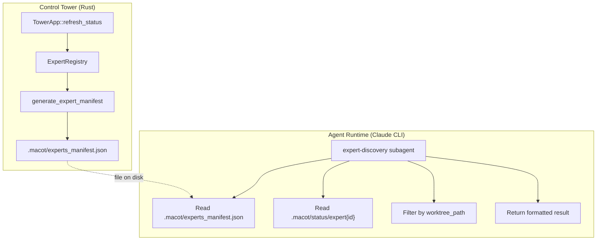

# Design: Expert Discovery Agent

## 1. Overview

Enable agents to query information about other agents operating in the same worktree. Currently, agents only know their own `expert_id` and `expert_name` (injected at launch via templates), and can send messages to other agents via the messaging subagent. However, they have no way to discover which agents exist, what their roles are, or whether they are currently available.

This feature adds an **expert-discovery** subagent that reads a static JSON manifest file generated at launch time. The manifest contains the identity and role of every agent in the same worktree. For real-time status (pending/processing), the subagent reads the status files on disk (`.macot/status/expert{id}`).

### Why a manifest file instead of querying the registry directly?

Agents run as Claude CLI processes and interact with the system exclusively through file I/O and shell commands. They cannot call Rust functions in the control tower. A pre-generated manifest file is the natural bridge between the tower's `ExpertRegistry` and the agent's file-based world.

## 2. Architecture



**Data flow**:
1. The control tower generates `.macot/experts_manifest.json` at startup and refreshes it whenever expert state changes (role updates, worktree assignments).
2. When an agent invokes the `expert-discovery` subagent, the subagent reads the manifest file and status files, filters to same-worktree experts, and returns a formatted summary.

## 3. Components and Interfaces

### 3.1 Expert Manifest Generator

- **File**: `src/instructions/manifest.rs` (new)
- **Purpose**: Generates a JSON manifest file describing all registered experts

```rust
/// Entry in the expert manifest file
#[derive(Debug, Serialize, Deserialize)]
pub struct ExpertManifestEntry {
    pub expert_id: u32,
    pub name: String,
    pub role: String,
    pub worktree_path: Option<String>,
}

/// Generate manifest JSON from config, session expert roles, and registry
pub fn generate_expert_manifest(
    config: &Config,
    session_roles: &SessionExpertRoles,
    registry: &ExpertRegistry,
) -> Result<String>

/// Write manifest to .macot/experts_manifest.json
pub fn write_expert_manifest(
    queue_path: &Path,
    content: &str,
) -> Result<PathBuf>
```

**Why three inputs?** `Config` provides expert names and static configuration. `SessionExpertRoles` provides the current role assignment (which may differ from the config default after a `change_expert_role` call). `ExpertRegistry` provides the `worktree_path` field from `ExpertInfo` (`src/models/expert.rs`), which is the only runtime source for worktree assignments — `Config` does not store this.

The manifest is a JSON array:

```json
[
  {
    "expert_id": 0,
    "name": "Alyosha",
    "role": "architect",
    "worktree_path": null
  },
  {
    "expert_id": 1,
    "name": "Dmitri",
    "role": "developer",
    "worktree_path": null
  }
]
```

### 3.2 Expert Discovery Agent Template

- **File**: `instructions/templates/agents/expert-discovery.md.tmpl`
- **Purpose**: Subagent prompt instructing Claude how to read and present expert information

Template variables: `{{ expert_id }}`, `{{ expert_name }}`, `{{ worktree_path }}`, `{{ manifest_path }}`, `{{ status_dir }}`

The subagent prompt instructs the agent to:
1. Read the manifest file at `{{ manifest_path }}`
2. Parse it as JSON
3. Filter entries to those sharing the same `worktree_path` as the calling agent (injected via `{{ worktree_path }}`, where null means main repo)
4. For each matching expert, read `{{ status_dir }}/expert{id}` to get real-time status
5. Map file contents to status: `"pending"` -> Idle, `"processing"` -> Busy, missing/unknown -> Busy
6. Return a formatted table of results

### 3.3 Extended Agent Renderer

- **File**: `src/instructions/agents.rs` (modified)
- **Purpose**: Load and render both `messaging.md.tmpl` and `expert-discovery.md.tmpl`

```rust
pub fn render_agents_json(
    core_path: &Path,
    expert_id: u32,
    expert_name: &str,
    worktree_path: Option<&str>,  // NEW
    manifest_path: &str,          // NEW
    status_dir: &str,             // NEW
) -> Result<Option<String>>
```

The output JSON gains an additional key:

```json
{
  "messaging": { "description": "...", "prompt": "..." },
  "expert-discovery": {
    "description": "Query information about other experts in your worktree: their IDs, names, roles, and current status (idle/busy).",
    "prompt": "<rendered expert-discovery template>"
  }
}
```

### 3.4 Manifest Refresh Hook

- **File**: `src/tower/app.rs` (modified)
- **Purpose**: Regenerate the manifest when expert state changes

The manifest is regenerated in:
- `TowerApp::new()` — initial generation at startup
- `TowerApp::change_expert_role()` — when a role is updated
- `TowerApp::reset_expert()` — when an expert is reset to its initial state
- `TowerApp::launch_expert_in_worktree()` — when worktree assignment changes
- `TowerApp::return_expert_from_worktree()` — when worktree assignment is cleared

A helper method is added:

```rust
impl TowerApp {
    fn refresh_expert_manifest(&self) -> Result<()>
}
```

This reads from `self.config`, `self.session_roles`, and `self.expert_registry` to regenerate the manifest file.

### 3.5 Extended render_template

- **File**: `src/instructions/template.rs` (modified)
- **Purpose**: Pass `manifest_path` and `status_dir` to agent template rendering

The `render_agents_json` call in `load_instruction_with_template` needs the two new parameters. These are derived from `Config`:

```rust
let manifest_path = config.queue_path.join("experts_manifest.json");
let status_dir = config.queue_path.join("status");
```

Since `load_instruction_with_template` does not currently receive `Config`, the paths are passed as string parameters:

```rust
pub fn load_instruction_with_template(
    core_path: &Path,
    role_instructions_path: &Path,
    role_name: &str,
    expert_id: u32,
    expert_name: &str,
    status_file_path: &str,
    worktree_path: Option<&str>,  // NEW
    manifest_path: &str,          // NEW
    status_dir: &str,             // NEW
) -> Result<InstructionResult>
```

> **Design note**: With 9 parameters, `load_instruction_with_template` approaches a readability threshold. A follow-up refactor could bundle `expert_id`, `expert_name`, `worktree_path`, `manifest_path`, and `status_dir` into an `AgentContext` struct.

All production call sites requiring signature updates:

1. `prepare_expert_files` — `src/commands/common.rs`
2. `reset_expert` (CLI command) — `src/commands/reset.rs`
3. `change_expert_role` — `src/tower/app.rs`
4. `reset_expert` (TowerApp method) — `src/tower/app.rs`
5. `return_expert_from_worktree` — `src/tower/app.rs`
6. `launch_expert_in_worktree` — `src/tower/app.rs`
7. `start_feature_execution` handler — `src/tower/app.rs`

Test call sites: 6 in `src/instructions/template.rs`, 3 in `src/instructions/agents.rs`.

## 4. Data Models

### Expert Manifest (on disk)

```
.macot/experts_manifest.json
```

JSON array of `ExpertManifestEntry`. Updated by the control tower, read by agents.

### Status Files (existing, unchanged)

```
.macot/status/expert{id}
```

Plain text: `"pending"` or `"processing"`. Written by agent hooks, read by both the control tower and the new discovery subagent.

### Status Mapping (for agent subagent logic)

| File Content | Agent-Visible Status |
|---|---|
| `"pending"` | idle |
| `"processing"` | busy |
| File missing or unreadable | busy |

Note: If the status file is missing or unreadable, the expert is assumed to be busy as a safe default. If the file says `"pending"`, report `idle`.

## 5. Error Handling

| Error Case | Handling |
|---|---|
| Manifest file does not exist | Subagent reports "No expert manifest found. The control tower may not have generated it yet." |
| Manifest file is malformed JSON | Subagent reports parse error and suggests re-launching the control tower |
| Status file unreadable for an expert | Report that expert as "busy" |
| Manifest path or status dir not injected | `render_agents_json` returns the discovery agent without those paths; agent template uses default `.macot/` relative paths as fallback |
| `generate_expert_manifest` called with empty registry | Returns valid empty JSON array `[]` |

## 6. Correctness Properties

1. **Worktree Isolation** — An agent can only see experts that share the same `worktree_path` value. An agent with `worktree_path: null` (main repo) sees only other `null`-worktree experts. An agent with `worktree_path: "/path/to/wt"` sees only experts with the same path.

2. **Manifest Freshness** — The manifest is regenerated on every event that changes expert identity or worktree assignment (role change, worktree launch, worktree return). Between these events, the manifest is stale but structurally valid.

3. **Status Accuracy** — The status reported by the subagent reflects the last written status file value at read time. There is no guarantee of real-time accuracy (eventual consistency).

4. **Backward Compatibility** — If `expert-discovery.md.tmpl` does not exist, the system behaves identically to the current version. `render_agents_json` returns only the messaging agent (or `None`).

5. **Complete Expert Visibility** — Every expert registered in the config appears in the manifest, regardless of current state. The manifest is the identity source; status is a separate real-time query.

6. **Subagent Isolation** — The expert-discovery subagent is read-only. It never writes to any file, never modifies the manifest, and never changes status files.

7. **Signature Compatibility** — All existing callers of `render_agents_json` and `load_instruction_with_template` are updated to pass the new parameters. The compiler enforces this via required parameters (no `Option` wrappers for the new params).

## 7. Testing Strategy

### Unit Tests (manifest.rs)

| Test | Property |
|---|---|
| `generate_manifest_empty_config` | Property 5 (edge case: empty) |
| `generate_manifest_includes_all_experts` | Property 5 |
| `generate_manifest_includes_worktree_paths` | Property 1 |
| `generate_manifest_uses_session_roles` | Property 2 |
| `generate_manifest_is_valid_json` | Property 5 |
| `write_manifest_creates_file` | Property 2 |
| `write_manifest_overwrites_existing` | Property 2 |

### Unit Tests (agents.rs)

| Test | Property |
|---|---|
| `render_agents_json_includes_discovery_agent` | Property 4 (present when template exists) |
| `render_agents_json_discovery_absent_without_template` | Property 4 (absent when no template) |
| `render_agents_json_discovery_renders_manifest_path` | Property 7 |
| `render_agents_json_discovery_renders_status_dir` | Property 7 |
| `render_agents_json_discovery_renders_worktree_path` | Property 1 |

### Unit Tests (template.rs)

| Test | Property |
|---|---|
| `load_instruction_passes_manifest_path_to_agents` | Property 7 |
| `load_instruction_passes_status_dir_to_agents` | Property 7 |
| `load_instruction_passes_worktree_path_to_agents` | Property 1 |

### Content Tests

| Test | Property |
|---|---|
| `discovery_template_contains_manifest_path_variable` | Property 7 |
| `discovery_template_contains_status_dir_variable` | Property 7 |
| `discovery_template_contains_worktree_filter_instruction` | Property 1 |
| `discovery_template_is_read_only` | Property 6 |
| `discovery_template_contains_worktree_path_variable` | Property 1 |

### Integration Tests

- `make test` — all existing tests pass
- `make build` — compiles successfully (verifies Property 7 for call site completeness)
- Manual: launch macot, invoke expert-discovery from an agent, verify filtered output
