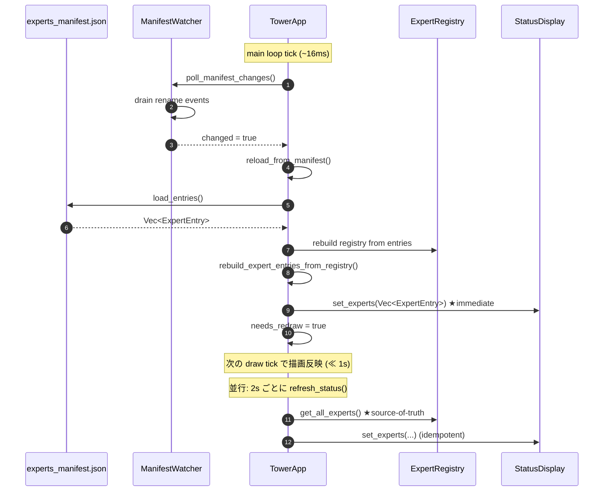

# Design: Expert Panel Manifest Sync (動的追加された expert を Experts パネルに反映)

## 1. Overview

`macot expert add` (および tower TUI の F2 モーダル) で動的に expert を追加しても、tower の **Experts パネルに新 expert が現れない**バグが Katya (expert 3, debugger) の調査で確認された。本設計は当該バグを解消し、 dynamic-expert-add-design.md §6 が定める **Property 8 (Tower Liveness Under Add — ~1s 以内のパネル反映)** を契約として再達成するためのものである。

由来: Katya 診断レポート `.macot/reports/expert3_report.yaml` (task `task-20260509-investigate-expert-panel-no-show`) を参照。

### 1.1 Problem statement

#### Symptom
Expert を動的に追加 (`macot expert add` / TUI F2) しても、tower の Experts パネルに反映されない。`experts_manifest.json` の rename イベントは `ManifestWatcher` が検知し、`TowerApp::reload_from_manifest` も呼ばれるが、UI 上の expert 行が増えない。

#### Root cause
Katya の診断結果 (上記 report) を引用する:

- **`TowerApp::reload_from_manifest` (src/tower/app.rs:422)** は `self.expert_registry` のみ再構築し、`self.config.experts` を更新しない。
- **`refresh_status` (src/tower/app.rs:560–561)** は `(0..self.config.experts.len() as u32).collect()` で expert id 集合を作り、`self.config.experts.iter().enumerate()` で `Vec<ExpertEntry>` を組み立てる。これが `StatusDisplay::set_experts` に渡される。
- **`poll_messages` (src/tower/app.rs:680)** も同じく `for (i, _) in self.config.experts.iter().enumerate()` で iterate しており、追加 expert の status marker が registry に反映されない。
- **`Config::load` (src/config/loader.rs:138)** は起動時に 1 回だけ `config.yaml` を読むのみで、manifest の動的変化を再吸収する経路は無い。
- 結果として `config.experts` は **起動時の snapshot** のまま固定され、watcher が manifest を再読み込みしても `StatusDisplay` に流れる `ExpertEntry` は旧件数となる。
- これは dynamic-expert-add-design.md §3.7 / §6 (Property 8) が定める「~1s 以内に新 expert が Expert Panel に現れる」契約に違反している。

#### 影響範囲 (design surface)
- `src/tower/app.rs:422` `reload_from_manifest`
- `src/tower/app.rs:560` `refresh_status`
- `src/tower/app.rs:680` `poll_messages`
- `src/config/loader.rs:138` `Config::load` (起動時 1 回読み)
- `.macot/specs/dynamic-expert-add-design.md` §3.7 / §6 (Property 8 の契約面)

## 2. Architecture

### 2.1 設計上のキー判断: Single Source of Truth

`ExpertRegistry` を **runtime の唯一の権威 (single source of truth)** とする。`config.experts` は **起動時の snapshot** に格下げし、runtime 中の expert 一覧の問い合わせには使わない。

#### Trade-off 比較

| 案 | 内容 | 利点 | 欠点 | 採否 |
|---|---|---|---|---|
| A. Registry-as-truth | runtime の expert 一覧は `expert_registry.get_all_experts()` から引く。`config.experts` は起動時 snapshot として残すのみ | 既に `reload_from_manifest` が registry を書き戻している(差分は呼び出し側だけ)。manifest と registry の二重管理が無くなる | 既存の `for (i, _) in config.experts.iter().enumerate()` に依存している箇所を全て書き換える必要 (本 PR 対象は app.rs:561 / app.rs:680 の 2 箇所) | **採用** |
| B. config-as-truth | `reload_from_manifest` が `self.config.experts` を manifest の内容で上書き | 呼び出し側コードを書き換えなくてよい | `Config` という構造体名と「動的に変化するデータ」のセマンティクスが噛み合わない。`config.yaml` から来る name/role と manifest の name/role がどう優先されるか曖昧。Property 8 とは別に「config と manifest が disk 上で食い違うとき」の仕様議論を呼ぶ | 不採用 |
| C. 二者並列同期 | 両方を毎 reload で更新 | 呼び出し側コード変更不要 + registry も最新 | 二重管理。invariant 違反のリスク (どちらかが先に観測される race) を増やす | 不採用 |

採用: **案 A (registry-as-truth)**。Katya の推奨と一致し、長期的な mirror divergence を完全に消す。

### 2.2 データフロー (再設計後)



**反映タイミング設計**: watcher tick で即時に `status_display.set_experts(...)` を呼ぶ (immediate path)。`refresh_status` の 2s 間隔を待たない。これにより Property 8 の bound は描画 tick (~16ms) + watcher 検知遅延 (Linux <100ms / macOS <1s / Windows <100ms) で支配され、設計契約の ≤1s に収まる。

### 2.3 Single source of truth 原則の明文化

| データ | 真の源 | runtime での使われ方 |
|---|---|---|
| `experts_manifest.json` | disk | persistent な真実。watcher 経由で registry に流入 |
| `Config::experts` | `config.yaml` (起動時) | **startup snapshot のみ**。runtime での expert 一覧問い合わせに使わない |
| `ExpertRegistry` | manifest からの導出 | runtime での **expert 一覧の唯一の権威**。`get_all_experts()` で引く |
| `StatusDisplay::experts` | registry からの projection | UI の描画用キャッシュ。registry 変更の都度 `set_experts(...)` で再投入 |

## 3. Components and Interfaces

### 3.1 `TowerApp::reload_from_manifest` (src/tower/app.rs:422) — 拡張

- **Purpose**: manifest reload と同時に、`StatusDisplay` を即時更新して Property 8 の bound を満たす。
- **変更内容**:
  1. 既存の registry 再構築ロジックは保持。
  2. registry 構築後、その内容から `Vec<ExpertEntry>` を構築する private helper `rebuild_expert_entries_from_registry()` を呼ぶ。
  3. `status_display.set_experts(...)`、`set_expert_roles(...)` を即時呼ぶ。
  4. `needs_redraw = true` は既存どおり。

```rust
pub fn reload_from_manifest(&mut self) -> Result<()> {
    let persistor = ManifestPersistor::new(self.config.project_path.clone());
    let entries = persistor.load_entries()?;

    let mut registry = ExpertRegistry::new();
    for entry in &entries {
        let info = ExpertInfo::new(/* ... 既存どおり ... */);
        if let Err(e) = registry.register_expert(info) {
            tracing::warn!("manifest reload: register {} failed: {}", entry.expert_id, e);
        }
    }
    self.expert_registry = registry;

    // ★新規: 即時反映パス (Property 8 ≤1s 達成)
    self.push_registry_to_status_display();

    self.needs_redraw = true;
    Ok(())
}

/// Build `Vec<ExpertEntry>` from `self.expert_registry` and push to `status_display`.
/// Snapshot of detector state is taken once for consistency within the tick.
fn push_registry_to_status_display(&mut self) {
    let mut experts = self.expert_registry.get_all_experts();
    experts.sort_by_key(|e| e.id);  // ID 昇順で安定描画

    let entries: Vec<ExpertEntry> = experts
        .iter()
        .map(|info| ExpertEntry {
            expert_id: info.id,
            expert_name: info.name.clone(),
            state: self.detector.detect_state(info.id),
        })
        .collect();
    self.status_display.set_experts(entries);

    let roles: HashMap<u32, String> = experts
        .iter()
        .map(|e| (e.id, e.role.canonical_name()))
        .collect();
    self.status_display.set_expert_roles(roles);
}
```

`push_registry_to_status_display` は `refresh_status` からも再利用される (§3.2)。

### 3.2 `TowerApp::refresh_status` (src/tower/app.rs:560) — 修正

- **Purpose**: 2s 間隔の定期再描画を registry 駆動に切り替える。
- **変更内容**: `self.config.experts` への依存を削除し、`self.expert_registry.get_all_experts()` を権威とする。

変更前 (抜粋):
```rust
let expert_ids: Vec<u32> = (0..self.config.experts.len() as u32).collect();
let states = self.detector.detect_all(&expert_ids);
let entries: Vec<ExpertEntry> = self.config.experts.iter().enumerate().map(|(i, e)| { ... }).collect();
self.status_display.set_experts(entries);
```

変更後 (擬似コード):
```rust
pub async fn refresh_status(&mut self) -> Result<()> {
    self.push_registry_to_status_display();   // §3.1 helper を再利用

    let working_dirs = self.tmux.get_all_pane_current_paths().await
        .unwrap_or_else(|e| { tracing::warn!(...); HashMap::new() });
    self.status_display.set_expert_working_dirs(working_dirs);
    self.status_display.set_project_path(self.config.project_path.display().to_string());
    Ok(())
}
```

**注**: `expert_roles` の source は現状 `self.session_roles.assignments` だが、registry 側にも `Role` が入っているため §3.1 と整合させる。`session_roles.assignments` を引き続き使う場合でも、対象 ID の集合は registry 由来とする。これにより新 expert が roles マップに無い場合のデフォルト挙動 (`role` フィールドが空) が一貫する。

### 3.3 `TowerApp::poll_messages` (src/tower/app.rs:680) — 修正

- **Purpose**: 動的に追加された expert の status marker を polling で拾えるようにする。
- **変更内容**:

変更前:
```rust
for (i, _) in self.config.experts.iter().enumerate() {
    let expert_id = i as u32;
    let expert_state = self.detector.detect_state(expert_id);
    if let Err(e) = router.expert_registry_mut().update_expert_state(expert_id, expert_state) { ... }
}
```

変更後:
```rust
let expert_ids: Vec<u32> = router
    .expert_registry()
    .get_all_experts()
    .iter()
    .map(|e| e.id)
    .collect();
for expert_id in expert_ids {
    let expert_state = self.detector.detect_state(expert_id);
    if let Err(e) = router.expert_registry_mut().update_expert_state(expert_id, expert_state) { ... }
}
```

**借用順序**: `expert_registry()` の不変借用は ID 抽出までに限り、ループ内では `expert_registry_mut()` を呼べるよう、ID を先に `Vec<u32>` で確定させてから iterate する。

### 3.4 `Config::experts` のドキュメンテーション

- **File**: `src/config/loader.rs` (既存) の `Config::experts` フィールド docstring
- **Purpose**: `Config::experts` が **startup snapshot** であり、runtime の権威ではないことを明文化する。

```rust
pub struct Config {
    /// Experts loaded from `config.yaml` at startup.
    ///
    /// **Startup snapshot only.** This vector is *not* updated at runtime when
    /// `experts_manifest.json` changes (e.g. via `macot expert add`). For the
    /// runtime list of experts use `ExpertRegistry::get_all_experts()` via
    /// `TowerApp::expert_registry`. See
    /// `.macot/specs/expert-panel-manifest-sync-design.md` §2.3.
    pub experts: Vec<ExpertConfig>,
    // ...
}
```

これは挙動を変えない注釈のみの変更だが、将来同種のバグを生まないために必須とする。

### 3.5 `ManifestWatcher` (既存、変更不要)

- **File**: `src/tower/manifest_watcher.rs`
- 既存で rename を検知するため、本設計では追加変更なし。tick で `poll_manifest_changes()` が呼ばれている (`src/tower/app.rs:2413`) ことを前提にする。

## 4. Data Models

本設計でスキーマ変更は無い (既存の `experts_manifest.json`, `ExpertRegistry`, `StatusDisplay::experts` をそのまま使う)。

### 4.1 不変条件 (本設計が新たに守るもの)

- **I1 (Registry/Disk Sync)**: `reload_from_manifest` が `Ok` で返った直後において、`expert_registry.get_all_experts()` の `(id, name, role)` 集合は `experts_manifest.json` の `entries` の `(expert_id, name, role)` 集合と**一致**する (manifest 中の重複 ID は既存ロジックで `register_expert` の Err として落とすため除外)。
- **I2 (Display/Registry Sync)**: `reload_from_manifest` および `refresh_status` が完了した直後において、`status_display` 内の expert 行の `expert_id` 集合は `expert_registry.get_all_experts()` の `id` 集合と**一致**する。
- **I3 (Config Snapshot)**: `config.experts` の長さは `TowerApp::new` 後に変化しない。本設計の修正コードは `config.experts` を**読み出さず**、書き換えもしない。

## 5. Error Handling

本設計はバグ修正であり、新規エラー型を導入しない。既存の error path をそのまま尊重する:

- `ManifestPersistor::load_entries()` 失敗時 → 既存どおり `reload_from_manifest` が `Err` を返す。`poll_manifest_changes` は `tracing::warn!` でログを出して継続(StatusDisplay は前回値を維持)。
- `ExpertRegistry::register_expert` 失敗 (重複 ID 等) → 既存どおり `tracing::warn!`、当該 entry はスキップ。Display にも反映されない (I1 を破らない)。
- `detector.detect_state` 失敗の取り扱いは既存どおり (`detect_state` は `Result` ではなく直接状態を返すため、変更なし)。

### 5.1 Failure mode 観点

**「watcher が rename を検知し損ねた」場合の保険**: 本設計では `refresh_status` (2s 周期) も registry 駆動に変えるため、仮に watcher が 1 回イベントを取りこぼしても、最大 ~2s 以内に `refresh_status` 経由で UI が追いつく。これは Property 8 の bound (≤1s) を保証するものではないが、フェイルセーフとして機能する。

## 6. Correctness Properties

dynamic-expert-add-design.md §6 の **Property 8** を以下の bound で再確認・強化する。

8'. **Tower Liveness Under Add (refined bound)** — `ManifestPersistor::append_atomic(entry)` が成功した時刻を `t0` とし、tower main loop が処理する最初の tick 開始時刻を `t1` とする。`t1 - t0` は OS-native の inotify/fsevents/ReadDirectoryChangesW 遅延に従う。tower はその tick 内で:

   1. `poll_manifest_changes()` が `true` を返す
   2. `reload_from_manifest()` が `expert_registry` と `status_display.experts` を atomic に更新する (同一 tick 内)
   3. `needs_redraw = true` のため次の draw tick で描画される

   **Bound**: `t0` から **新 entry が `status_display.experts` に含まれる**までの遅延は OS 通知遅延 + 1 tick (~16ms) 以下。Linux/Windows: < ~120ms、macOS: < ~1s (§dynamic-expert-add-design.md §6 Property 8 と同じ platform 上限)。**設計契約**: ≤ 1s は本設計でも継続して守る。

加えて、本設計が新規に証明する不変条件:

11. **No Stale Mirror** — `TowerApp` のコードベース上、`self.config.experts` を runtime 中に読む箇所は **ゼロ**である(grep で機械的に検証可能)。これにより `config.experts` の stale 化が UI に染み出す経路は構造的に消える。

12. **Display ⊇ Registry** — 任意の `reload_from_manifest` または `refresh_status` 完了直後に、`status_display.experts` の `expert_id` 集合は `expert_registry.get_all_experts()` の `id` 集合と等しい (I2 の再掲)。

## 7. Testing Strategy

### 7.1 回帰テスト (本バグの再発防止)

#### T1. Reload-then-display: N → N+1 (Medium, must-have)

**Layer**: Medium (in-process; tmux/claude モック)。
**Goal**: manifest を N+1 entry に書き換えてから `poll_manifest_changes()` → `refresh_status()` を呼び、`status_display` に N+1 件が反映されていることを assert。

```text
1. config.experts に N=2 を持つ TowerApp を構築 (既存 test fixture)
2. ManifestPersistor::append_atomic で entry id=N(=2) を追記
3. app.poll_manifest_changes() を呼ぶ → true を期待
4. status_display.experts.len() == N+1 を assert
5. status_display.experts に id=N(=2) の entry が含まれることを assert
6. さらに app.refresh_status().await を呼んでも N+1 件のままであることを assert (idempotency)
```

**ファイル**: `src/tower/app.rs` の既存 `#[cfg(test)] mod` に追加 (周辺の reload テストと同じスコープ)。

#### T2. Property 8 timing bound (Medium, must-have)

**Layer**: Medium。
**Goal**: append_atomic → poll_manifest_changes → status_display 反映までの wall-clock 遅延が **1s 以内**であることを assert。

```text
1. TowerApp 構築 (N=2)
2. let t0 = Instant::now();
3. ManifestPersistor::append_atomic(entry id=2)
4. ループ: app.poll_manifest_changes() が true を返すまで spin (16ms sleep)
   タイムアウト 1s
5. status_display.experts に id=2 が含まれることを assert
6. t0.elapsed() <= 1s を assert
```

CI 環境のジッタを考慮して 1s をハードリミットとする (現行の dynamic-expert-add Property 8 acceptance と同じ)。Linux/Windows では <200ms 程度で再現する想定。macOS で flaky になる場合は既存の `flaky_test` 機構があれば従う、無ければ tier を Large に格下げ。

#### T3. StatusDisplay/Registry sync invariant (Small, must-have)

**Layer**: Small。
**Goal**: `push_registry_to_status_display()` 単体テスト。registry の expert id 集合と display の expert id 集合の一致 (I2) を proptest で検証。

```text
proptest!(|(ids in collection::vec(0u32..1000, 0..16))| {
    let mut app = build_test_app();
    for id in &ids { app.expert_registry.register_expert(test_info(*id))?; }
    app.push_registry_to_status_display();
    let display_ids: HashSet<u32> = app.status_display.expert_ids_for_test().into_iter().collect();
    let registry_ids: HashSet<u32> = ids.iter().copied().collect();
    prop_assert_eq!(display_ids, registry_ids);
});
```

`StatusDisplay::expert_ids_for_test()` は `#[cfg(test)]` 限定の getter として追加。

#### T4. poll_messages iterates registry (Medium)

**Layer**: Medium。
**Goal**: `poll_messages` が `config.experts` ではなく registry 上の id を iterate していることを assert。

```text
1. config.experts.len() == 2 だが registry.get_all_experts().len() == 3 のセットアップ
   (manifest reload を 1 度走らせる)
2. detector のモックで id=2 のみ "processing" を返すよう設定
3. app.poll_messages().await を呼ぶ
4. router.expert_registry().get_expert(2).state == Processing を assert
```

これにより `config.experts` の長さが 2 でも id=2 の状態が更新される回帰防止になる。

### 7.2 No-stale-mirror 静的検査 (Property 11)

CI lint として `rg -n 'self\.config\.experts' src/tower/app.rs` の結果が以下のみであることを確認:

- `src/tower/app.rs:188` 周辺 — `TowerApp::new` の startup snapshot 構築コード (許容)

それ以外の出現は本設計違反として PR レビューで blocking。**実装タスクの完了基準にこの grep を含める** (Phase 5)。

### 7.3 既存テストへの影響

- 既存の `poll_manifest_changes_reports_no_change_for_quiescent_disk` (src/tower/app.rs:4432) — そのまま通る (本設計は manifest 不変ケースの挙動を変えない)。
- 既存の Property 8 reload-on-rename テスト (src/tower/app.rs:4392 周辺) — registry の再構築は確認しているが **status_display の更新までは見ていない**ため、本設計の T1/T2 で **置き換えではなく拡張**する形で assertion を追加。
- E2E `tests/e2e_dynamic_expert_add.rs` — 既存の add → assert path は registry を見ているのみなら通る。新たに「tower TUI 起動後に add → status_display.experts に反映」を assert する case を追加する場合は別タスク (Phase 6)。

### 7.4 手動受け入れシナリオ

```
1. macot launch . -n 2
2. tower で 2 体の expert (Alyosha, Ilyusha) が見える
3. 別ターミナル: macot expert add -r general -n Smerdyakov
4. 1 秒以内に tower の Experts パネルに 3 体目 (Smerdyakov) が現れる ★Property 8
5. 3 体目の status marker (status/expert2) を手動で "processing" に書き換える
6. 2 秒以内にパネルの該当行のアイコンが processing 表示に変わる ★T4 相当
```

## 8. 段階分けされた実装タスク

Backend が拾える粒度に分割。各タスクは **赤テスト先行** (CLAUDE.md: TDD) を義務付ける。

### Phase 1 — Test scaffolding

- T1.1: `StatusDisplay::expert_ids_for_test()` を `#[cfg(test)]` で追加
- T1.2: T3 (proptest, Small) を `src/tower/app.rs` test mod に追加 → 失敗を確認

### Phase 2 — `push_registry_to_status_display` 抽出

- T2.1: `TowerApp::push_registry_to_status_display` private fn を追加 (registry → ExpertEntry の変換)
- T2.2: `reload_from_manifest` 末尾でこれを呼ぶ
- T2.3: T3 が緑になることを確認

### Phase 3 — `refresh_status` の registry 化

- T3.1: T1 (Medium, N→N+1 reload-then-refresh) を追加 → 失敗確認
- T3.2: `refresh_status` を `push_registry_to_status_display` ベースに書き換え
- T3.3: T1 が緑になることを確認
- T3.4: 既存の status / report / working_dirs / project_path 注入はそのまま残す

### Phase 4 — `poll_messages` の registry 化

- T4.1: T4 (Medium) を追加 → 失敗確認
- T4.2: `poll_messages` を registry 駆動に書き換える (借用順序に注意 §3.3)
- T4.3: T4 が緑になることを確認

### Phase 5 — Property 8 timing test と static lint

- T5.1: T2 (Property 8 timing bound, Medium) を追加。`t0.elapsed() <= 1s` を assert
- T5.2: `Config::experts` への docstring 追加 (§3.4)
- T5.3: PR description / CHANGELOG に「`config.experts` is startup-snapshot only」と明記
- T5.4: `rg -n 'self\.config\.experts' src/tower/app.rs` 出力が `TowerApp::new` 内のみであることを CI チェックリストに記載

### Phase 6 — Optional E2E 拡張 (本 PR の next)

- T6.1: `tests/e2e_dynamic_expert_add.rs` に「tower 起動 → add → 1s 以内パネル反映」case を追加 (Large 層)
- T6.2: 必要に応じて手動受け入れシナリオ §7.4 をリリース note の検収項目に組み込む

## 9. 参照

- Katya 診断レポート: `.macot/reports/expert3_report.yaml` (task `task-20260509-investigate-expert-panel-no-show`)
- 既存設計: `.macot/specs/dynamic-expert-add-design.md` §3.7 (Tower TUI 統合) / §6 Property 8 (Tower Liveness Under Add)
- 影響コード: `src/tower/app.rs:422` (`reload_from_manifest`), `src/tower/app.rs:560` (`refresh_status`), `src/tower/app.rs:680` (`poll_messages`), `src/config/loader.rs:138` (`Config::load`)
