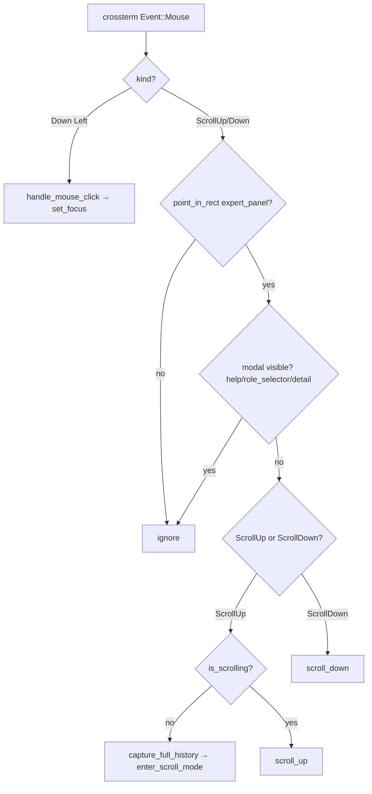

# Design: Expert Panel Mouse Wheel Scrolling

## 1. Overview

The Expert Panel currently supports scrolling only via keyboard (`PageUp` / `PageDown` / `Home` / `End`) after entering scroll mode. Mouse capture is already enabled (`EnableMouseCapture` in `src/tower/ui.rs:27`), but only `MouseEventKind::Down(MouseButton::Left)` is consumed (for click-to-focus in `src/tower/app.rs:754`). Wheel events (`MouseEventKind::ScrollUp` / `ScrollDown`) are silently ignored.

This design adds mouse wheel scrolling to the Expert Panel:

- **Wheel up** over the panel: scroll the visible content backward through history. The first wheel-up event implicitly enters scroll mode (mirroring the existing `PageUp` behavior); subsequent ticks decrement `scroll_offset`.
- **Wheel down** over the panel: scroll forward; reaching the bottom re-enables auto-scroll (existing logic in `render()`).
- **No focus side-effect**: wheel scrolling does not change `FocusArea`. Only left-click sets focus (existing behavior preserved).

The change is intentionally minimal: it routes a new event variant to existing scroll APIs rather than introducing new state.

## 2. Architecture



The wheel handler reuses the same hit-test (`point_in_rect`) and the same scroll-mode entry path (`capture_full_history` + `enter_scroll_mode`) that `PageUp` from `FocusArea::TaskInput` already performs (`src/tower/app.rs:922-939`). Exit from scroll mode remains explicit (`Esc`, focus change, expert change, `End` reaching bottom).

## 3. Components and Interfaces

### 3.1 `TowerApp::handle_events` (modified)

- **File**: `src/tower/app.rs`
- **Change**: Extend the existing `Event::Mouse(mouse)` arm (currently at `src/tower/app.rs:750-762`) to dispatch `ScrollUp` / `ScrollDown` to a new `handle_mouse_wheel` async helper before the existing left-click branch.

**Pseudocode** (inside the existing `Event::Mouse(mouse) => { ... }` arm):

```rust
self.last_input_time = Instant::now();

match mouse.kind {
    MouseEventKind::ScrollUp | MouseEventKind::ScrollDown => {
        self.handle_mouse_wheel(mouse.kind, mouse.column, mouse.row).await?;
    }
    MouseEventKind::Down(MouseButton::Left)
        if !self.help_modal.is_visible()
            && self.report_display.view_mode() != ViewMode::Detail
            && !self.role_selector.is_visible() =>
    {
        self.handle_mouse_click(mouse.column, mouse.row);
    }
    _ => {}
}
return Ok(());
```

### 3.2 `TowerApp::handle_mouse_wheel` (new)

- **File**: `src/tower/app.rs`
- **Signature**: `async fn handle_mouse_wheel(&mut self, kind: MouseEventKind, column: u16, row: u16) -> Result<()>`
- **Responsibility**: Hit-test, suppress when modals are open, dispatch to `ExpertPanelDisplay` scroll APIs, and lazily enter scroll mode on the first upward tick.

**Pseudocode**:

```rust
async fn handle_mouse_wheel(
    &mut self,
    kind: MouseEventKind,
    column: u16,
    row: u16,
) -> Result<()> {
    // Suppress while a modal owns the screen.
    if self.help_modal.is_visible()
        || self.report_display.view_mode() == ViewMode::Detail
        || self.role_selector.is_visible()
    {
        return Ok(());
    }

    if !self.expert_panel_display.is_visible() {
        return Ok(());
    }
    if !Self::point_in_rect((column, row), self.layout_areas.expert_panel) {
        return Ok(());
    }

    match kind {
        MouseEventKind::ScrollUp => {
            if !self.expert_panel_display.is_scrolling() {
                if let Some(expert_id) = self.expert_panel_display.expert_id() {
                    match self.claude.capture_full_history(expert_id).await {
                        Ok(raw) => self.expert_panel_display.enter_scroll_mode(&raw),
                        Err(e) => tracing::warn!(
                            "Failed to capture full history for expert {}: {}",
                            expert_id,
                            e
                        ),
                    }
                }
            } else {
                for _ in 0..WHEEL_SCROLL_LINES {
                    self.expert_panel_display.scroll_up();
                }
            }
        }
        MouseEventKind::ScrollDown => {
            // scroll_down is safe even outside scroll mode; render() clamps
            // to max_scroll and re-enables auto_scroll at the bottom.
            for _ in 0..WHEEL_SCROLL_LINES {
                self.expert_panel_display.scroll_down();
            }
        }
        _ => {}
    }
    Ok(())
}
```

### 3.3 New constant

- **File**: `src/tower/app.rs` (alongside `EVENT_POLL_TIMEOUT`)
- **Definition**: `const WHEEL_SCROLL_LINES: usize = 3;`
- **Rationale**: One wheel notch typically yields one `ScrollUp`/`ScrollDown` event from crossterm. Three logical lines per notch matches conventional terminal scrolling (e.g., tmux default) and feels responsive without overshooting on short panels. Kept as a module-level constant for easy tuning.

### 3.4 `ExpertPanelDisplay` — no changes

`scroll_up`, `scroll_down`, `scroll_to_top`, `scroll_to_bottom`, `enter_scroll_mode`, `exit_scroll_mode`, and `is_scrolling` already provide everything needed. The render-time clamp + auto-scroll re-enable logic at `src/tower/widgets/expert_panel_display.rs:243-251` handles bottom-edge cases for wheel-down identically to keyboard `PageDown`.

## 4. Behavior Details

### 4.1 Scroll-mode entry

The first `ScrollUp` over the panel triggers an async `claude.capture_full_history(expert_id)`. This mirrors the existing `PageUp` semantics from both `FocusArea::TaskInput` (`src/tower/app.rs:922-939`) and `FocusArea::ExpertPanel` (`src/tower/app.rs:1088-1107`). On capture failure, the event is dropped with a `tracing::warn!` — no UI message, matching existing behavior.

### 4.2 Focus preservation

Wheel events do **not** call `set_focus`. Users can scroll the Expert Panel while keeping `FocusArea::TaskInput` for typing — the same way they currently can with `PageUp` from `TaskInput`. This is the natural cross-platform terminal convention.

### 4.3 Modal suppression

When `help_modal`, role selector, or report `Detail` view is visible, wheel events over the panel area are dropped to avoid interfering with the modal layer. This matches the existing left-click guard.

### 4.4 Hit-test scope

Wheel events outside `layout_areas.expert_panel` are ignored. Future extensions (e.g., wheel scrolling for `report_display` or `task_input`) can add their own branches; this design intentionally limits scope to the panel.

### 4.5 Auto-scroll re-enable

`scroll_down` is safe to call when not in scroll mode: the panel is already at the bottom (auto-scroll on), and `render()` clamps `scroll_offset` to `max_scroll`. This means downward wheel ticks at the live tail are no-ops, which is the desired UX. When *in* scroll mode, repeatedly scrolling down past the visual bottom re-enables auto-scroll only outside scroll mode (`src/tower/widgets/expert_panel_display.rs:249`); to fully exit scroll mode the user still presses `Esc` (or changes expert/focus). This is consistent with the existing `PageDown` behavior and avoids surprising mode exits from over-scrolling.

### 4.6 Input debounce

Wheel events update `self.last_input_time`, mirroring the existing left-click handler. This pauses background `poll_status` for 500ms during active scrolling, preventing redraw jitter.

## 5. Testing Strategy

Unit tests are added to the existing `#[cfg(test)] mod tests` block in `src/tower/app.rs` (where `handle_mouse_click_sets_focus_based_on_area` already lives at `app.rs:2481`).

### 5.1 Synchronous tests (no `claude` capture required)

Tests that exercise downward scrolling and the in-scroll-mode upward path can run synchronously by pre-loading content via `expert_panel_display.set_content(...)` and (for the upward case) `expert_panel_display.enter_scroll_mode(...)` directly, bypassing the async capture.

| Test | Setup | Action | Expectation |
|------|-------|--------|-------------|
| `wheel_up_outside_panel_is_noop` | layout: panel at (0,20)-(100,15) | `handle_mouse_wheel(ScrollUp, 50, 5)` | `is_scrolling()` remains `false` |
| `wheel_down_outside_panel_is_noop` | same | `handle_mouse_wheel(ScrollDown, 50, 5)` | `scroll_offset` unchanged |
| `wheel_up_inside_panel_in_scroll_mode_decrements_offset` | enter scroll mode with N>10 lines, render once, then `scroll_to_bottom` | wheel up over panel rect | `scroll_offset` decreases by `WHEEL_SCROLL_LINES` |
| `wheel_down_inside_panel_increments_offset` | scroll mode, scrolled up | wheel down over panel rect | `scroll_offset` increases by `WHEEL_SCROLL_LINES` (clamped by render) |
| `wheel_does_not_change_focus` | focus = `TaskInput` | wheel up over panel | `focus()` still `TaskInput` |
| `wheel_suppressed_when_help_modal_visible` | `help_modal.show()` | wheel up over panel | no scroll-mode entry, offset unchanged |
| `wheel_suppressed_when_panel_hidden` | `expert_panel_display.hide()` | wheel up | no state change |

### 5.2 Async path

The "first wheel-up triggers `capture_full_history`" path depends on `ClaudeBackend`. The simplest verification is an integration-style test that confirms the dispatch routing (the `ScrollUp` arm calls into the same code path as `PageUp`). If `ClaudeBackend` is not easily mockable in this codebase, this branch can be covered by inspection + a manual smoke test (see §6); the synchronous tests above already cover the routing logic for the in-scroll-mode case.

### 5.3 Manual smoke test

1. Launch `make build && ./target/release/macot tower` against a project with at least one running expert.
2. Wait for the Expert Panel to populate.
3. Scroll the wheel up over the panel → `[SCROLL MODE]` indicator appears, content scrolls back.
4. Continue scrolling up → `[N/M]` indicator decreases.
5. Scroll back down → indicator increases, eventually re-pinning at the bottom.
6. Scroll over `TaskInput` area → no panel state change.
7. Open help modal (`F1`), scroll over panel area → no panel state change; close modal, scroll works again.

## 6. Risks & Considerations

- **Wheel sensitivity**: `WHEEL_SCROLL_LINES = 3` is a starting point. If users report it as too fast/slow, expose it via config. Not in scope for this change.
- **Async cost on first tick**: The first wheel-up incurs a `tmux capture-pane` round-trip (same as `PageUp` today). On a slow tmux this may feel like a brief stall — acceptable, and identical to the current keyboard UX.
- **Crossterm portability**: `MouseEventKind::ScrollUp`/`ScrollDown` are emitted on all supported terminals when `EnableMouseCapture` is active, which is already the case. No new platform requirements.
- **No horizontal scroll**: `MouseEventKind::ScrollLeft` / `ScrollRight` are intentionally not handled — the panel content does not support horizontal scroll.
- **Drag/multi-click interactions**: Out of scope. Only `ScrollUp` and `ScrollDown` are added to the dispatcher.

## 7. File Change Summary

| File | Change |
|------|--------|
| `src/tower/app.rs` | Add `WHEEL_SCROLL_LINES` const; extend `Event::Mouse` arm in `handle_events` to dispatch wheel events; add `handle_mouse_wheel` async helper; add unit tests in the existing `tests` mod. |
| `src/tower/widgets/expert_panel_display.rs` | No change. |
| `src/tower/ui.rs` | No change (`EnableMouseCapture` already in place). |

## 8. Out of Scope

- Wheel scrolling for `report_display`, `task_input`, `role_selector`, or `help_modal`.
- Horizontal scrolling.
- Configurable wheel step.
- Click-and-drag scrollbar interactions.
- Mouse-driven scroll-mode exit (still requires `Esc` / focus change / expert change).
