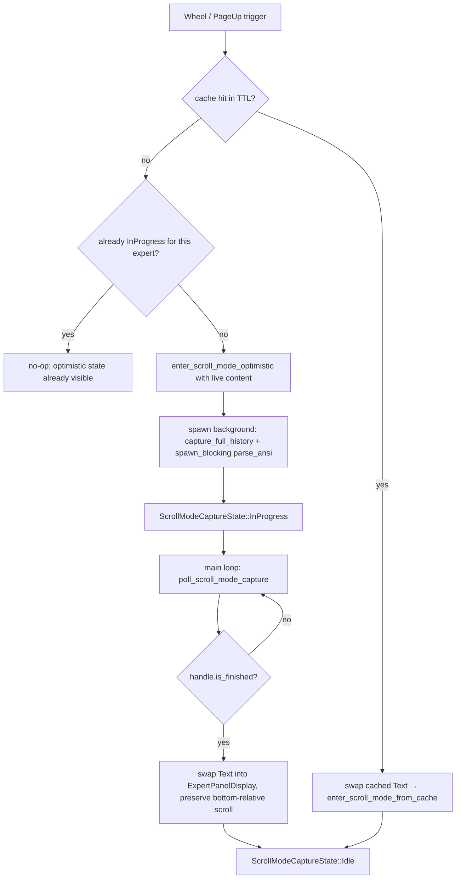

# Design: Expert Panel Scroll Blocking Fix

## 1. Overview

Entering scroll mode on the Expert Panel currently freezes the TUI. Three call sites await `self.claude.capture_full_history(expert_id)` directly on the main event loop:

- `src/tower/app.rs:508` — first wheel-up over the panel (`handle_mouse_wheel`)
- `src/tower/app.rs:1128` — `PageUp` from `TaskInput` focus
- `src/tower/app.rs:1285` — `PageUp` from `ExpertPanel` focus (`handle_expert_panel_keys`)

Each site invokes a `tmux capture-pane -S - -E -` subprocess (captures the entire scrollback, potentially 10k+ lines) and then synchronously parses the ANSI-escaped result via `ansi_to_tui::IntoText` inside `ExpertPanelDisplay::enter_scroll_mode` (`src/tower/widgets/expert_panel_display.rs:138`). During these two steps, the main loop cannot run `handle_events`, `poll_*`, or `terminal.draw` — so keystrokes, wheel events, and status polls are all blocked until the subprocess returns and the parser finishes.

Two secondary issues compound the freeze:
- `reconcile_scroll_mode_at_bottom` auto-exits scroll mode the moment the user returns to the bottom, so a common up-down-up wheel gesture forces a full capture+parse cycle every time the cursor revisits the tail (`src/tower/widgets/expert_panel_display.rs:327`).
- Wheel coalescing in `handle_events` requires exact `(column, row)` equality, which trackpads routinely violate (`src/tower/app.rs:906`). Uncoalesced bursts fall through to `dispatch_event` one event at a time, each triggering a full render.

This design moves `capture_full_history` and `parse_ansi` off the main loop via a dedicated `ScrollModeCaptureState` (mirroring the existing `ExpertPanelUpdateState` pattern at `src/tower/app.rs:188-202, 712-843`), shows an optimistic scroll mode using the already-cached live pane content while the capture runs, and adds a short-lived post-exit cache so consecutive up-down-up gestures do not recapture. Wheel coalescing is relaxed from exact coordinates to panel-rect hit-testing.

Scope is intentionally contained: no new widgets, no tmux API changes, no config surface. All additions live in `src/tower/app.rs` (state + polling + routing) and `src/tower/widgets/expert_panel_display.rs` (optimistic-entry and swap APIs).

## 2. Architecture

### 2.1 Current vs. Proposed Flow

**Current** — synchronous, blocking:
```
handle_mouse_wheel / PageUp
  └─▶ claude.capture_full_history(expert_id).await   ── tmux subprocess (blocking)
        └─▶ enter_scroll_mode(&raw)
              └─▶ parse_ansi(raw)                    ── CPU on main thread (blocking)
                    └─▶ self.content = Text
```

**Proposed** — fire-and-forget with optimistic entry:
```
handle_mouse_wheel / PageUp
  ├─▶ enter_scroll_mode_optimistic(&live_content)     ── instant; shows current tail
  └─▶ begin_scroll_mode_capture(expert_id, origin)    ── tokio::spawn; returns immediately
        └─▶ (background) capture_full_history
              └─▶ (spawn_blocking) parse_ansi
                    └─▶ channel sends Text<'static> + raw_line_count back

main loop
  ├─▶ terminal.draw()
  ├─▶ handle_events()
  ├─▶ poll_scroll_mode_capture()                      ── non-blocking; swaps Text in on completion
  └─▶ poll_*()
```



### 2.2 Component Boundaries

- **`TowerApp`** (`src/tower/app.rs`) owns the non-blocking orchestration: the `ScrollModeCaptureState` enum, the `ScrollModeCache`, `begin_scroll_mode_capture`, `poll_scroll_mode_capture`, and the unified `try_enter_scroll_mode` dispatcher used by all three call sites.
- **`ExpertPanelDisplay`** (`src/tower/widgets/expert_panel_display.rs`) gains three new APIs:
  - `enter_scroll_mode_optimistic(&self)` — flips `is_scrolling` without replacing `self.content`; the live pane content is already there.
  - `swap_scroll_content(Text<'static>, usize)` — replaces `self.content` with the full history while preserving the user's bottom-relative scroll offset.
  - `snapshot_scroll_content()` → `(Text<'static>, usize)` — returns a clone of the current parsed content + line count for cache insertion on auto-exit.
- **No change** to `ClaudeManager` or `TmuxManager`.

## 3. Components and Interfaces

### 3.1 `ScrollModeCaptureState` (new)

- **File**: `src/tower/app.rs`
- **Purpose**: Mirror `ExpertPanelUpdateState`; track one in-flight scroll-mode capture per app.

```
#[derive(Default)]
enum ScrollModeCaptureState {
    #[default]
    Idle,
    InProgress {
        expert_id: u32,
        origin: ScrollOrigin,
        handle: tokio::task::JoinHandle<Result<ScrollModeCaptureResult>>,
    },
}

#[derive(Clone, Copy)]
enum ScrollOrigin {
    WheelUp,        // handle_mouse_wheel
    PageUpRemote,   // TaskInput-focused PageUp
    PageUpLocal,    // ExpertPanel-focused PageUp
}

struct ScrollModeCaptureResult {
    expert_id: u32,
    text: Text<'static>,
    raw_line_count: usize,
}
```

Invariants:
- At most one `InProgress` variant lives at a time. A second trigger while `InProgress` for the same expert is dropped (the user's intent is already satisfied by the optimistic entry). A trigger for a *different* expert aborts the in-flight handle and starts a new one — matching the semantics of `cancel_expert_panel_update` at `src/tower/app.rs:363`.
- On `TowerApp::quit`, the handle is aborted (add to `cancel_expert_panel_update`-equivalent cleanup).

### 3.2 `ScrollModeCache` (new)

- **File**: `src/tower/app.rs`

```
struct ScrollModeCache {
    expert_id: u32,
    text: Text<'static>,
    raw_line_count: usize,
    captured_at: Instant,
    live_hash_at_capture: u64,   // xxh3 of live-pane content at capture time
}

const SCROLL_MODE_CACHE_TTL: Duration = Duration::from_millis(750);
```

Held as `scroll_mode_cache: Option<ScrollModeCache>` on `TowerApp`.

Validity predicate:
```
fn is_fresh(&self, expert_id: u32, current_live_hash: u64) -> bool {
    self.expert_id == expert_id
        && self.captured_at.elapsed() < SCROLL_MODE_CACHE_TTL
        && self.live_hash_at_capture == current_live_hash
}
```

**Writes**: Only on `reconcile_scroll_mode_at_bottom` auto-exit. The design wires this by having `poll_scroll_mode_capture` and the auto-exit path in `render` publish the parsed `Text` back through `snapshot_scroll_content()` → `TowerApp::store_scroll_cache()`. Auto-exit triggering lives in `ExpertPanelDisplay::render`; it cannot call into `TowerApp`, so we invert: the display exposes a `just_auto_exited: bool` flag cleared by `TowerApp` after each render. If the flag is set, the app snapshots and stores.

**Reads**: `try_enter_scroll_mode` checks the cache before spawning a capture. On hit, content is handed to `ExpertPanelDisplay::enter_scroll_mode_from_text(text, raw_line_count)` synchronously — no tmux call, no parse.

**Invalidation**:
- Expert change: checked via `expert_id` mismatch.
- Live content change: `current_live_hash` obtained from `self.expert_panel_display.content_hash()` (new accessor) and compared.
- TTL: hard cap at 750 ms to bound staleness even if tmux output is idle.

The 750 ms TTL is chosen to comfortably cover the typical up-down-up wheel gesture (≲ 300 ms) plus user think-time, while remaining short enough that any new tmux output observed by the 250 ms `poll_expert_panel` loop will be caught on the next tick and invalidate the cache via `live_hash_at_capture`.

### 3.3 `TowerApp::try_enter_scroll_mode` (new)

- **File**: `src/tower/app.rs`
- **Signature**:
  ```
  async fn try_enter_scroll_mode(&mut self, origin: ScrollOrigin) -> Result<()>
  ```
- **Replaces**: The three inline `match self.claude.capture_full_history(...).await` blocks at lines 508, 1128, 1285.

Behavior:
1. Short-circuit if `self.expert_panel_display.is_scrolling()` is already `true` — no new capture needed.
2. Resolve `expert_id = self.expert_panel_display.expert_id()`; early-return if `None`.
3. Compute `live_hash = self.expert_panel_display.content_hash()`.
4. If `self.scroll_mode_cache` is fresh for `(expert_id, live_hash)`:
   - Move the cached `Text` + `raw_line_count` into `ExpertPanelDisplay::enter_scroll_mode_from_text(...)` and drop the cache entry.
   - Skip the spawn.
5. Otherwise:
   - Call `self.expert_panel_display.enter_scroll_mode_optimistic()` so `is_scrolling = true` immediately and the current live tail is visible with a "(loading...)" indicator.
   - If `scroll_mode_capture_state` is `InProgress` for a different expert, abort it.
   - If already `InProgress` for the same expert, return (let the existing task complete).
   - Clone `self.claude` and `spawn(async move { capture_full_history_and_parse(...) })`. The parse uses `tokio::task::spawn_blocking` internally (see §3.5).

### 3.4 `TowerApp::poll_scroll_mode_capture` (new)

- **File**: `src/tower/app.rs`
- **Signature**: `async fn poll_scroll_mode_capture(&mut self)`
- **Called from**: `run()` main loop, alongside `poll_expert_panel()`.

Structure mirrors `poll_expert_panel_update_result` at line 808:
```
let state = std::mem::take(&mut self.scroll_mode_capture_state);
match state {
    InProgress { expert_id, origin, handle } => {
        if handle.is_finished() {
            match handle.await {
                Ok(Ok(result)) => {
                    if self.expert_panel_display.expert_id() == Some(result.expert_id)
                        && self.expert_panel_display.is_scrolling()
                    {
                        self.expert_panel_display.swap_scroll_content(
                            result.text,
                            result.raw_line_count,
                            origin,
                        );
                        self.needs_redraw = true;
                    }
                    // else: user changed expert or already exited; drop result
                }
                Ok(Err(e)) => tracing::warn!("scroll-mode capture failed: {e}"),
                Err(e) => tracing::warn!("scroll-mode capture task panicked: {e}"),
            }
            // scroll_mode_capture_state is already Idle via mem::take
        } else {
            self.scroll_mode_capture_state =
                ScrollModeCaptureState::InProgress { expert_id, origin, handle };
        }
    }
    Idle => {}
}
```

### 3.5 Shared capture helper

- **File**: `src/tower/app.rs` (module-private)
- **Signature**:
  ```
  async fn capture_full_history_and_parse(
      claude: ClaudeManager,
      expert_id: u32,
  ) -> Result<ScrollModeCaptureResult>
  ```
- **Body**:
  ```
  let raw = claude.capture_full_history(expert_id).await?;
  let parsed = tokio::task::spawn_blocking(move || {
      let line_count = raw.lines().count();
      let text = ExpertPanelDisplay::parse_ansi(&raw);
      (text, line_count)
  })
  .await
  .map_err(|e| anyhow::anyhow!("parse_ansi task panicked: {e}"))?;
  Ok(ScrollModeCaptureResult {
      expert_id,
      text: parsed.0,
      raw_line_count: parsed.1,
  })
  ```

`spawn_blocking` is used because `parse_ansi` is CPU-bound and runs regex scans across every line; on a 10k-line scrollback this is tens of milliseconds and would otherwise starve sibling tasks on the current runtime worker.

### 3.6 `ExpertPanelDisplay::enter_scroll_mode_optimistic` (new)

- **File**: `src/tower/widgets/expert_panel_display.rs`
- **Signature**: `pub fn enter_scroll_mode_optimistic(&mut self)`
- **Purpose**: Flip into scroll mode using the content already present (`self.content`, which reflects the live pane capture). No `parse_ansi`, no allocation beyond bookkeeping.

```
pub fn enter_scroll_mode_optimistic(&mut self) {
    self.is_scrolling = true;
    self.auto_scroll = false;
    self.moved_off_bottom_in_scroll = false;
    self.scroll_mode_loading = true;   // new field; controls indicator
    self.scroll_offset = u16::MAX;      // clamp-to-bottom on next render
}
```

The existing `enter_scroll_mode(&str)` remains (for tests and the cache-hit path that builds `Text` directly via a new `enter_scroll_mode_from_text`), but is no longer called from the event loop.

### 3.7 `ExpertPanelDisplay::swap_scroll_content` (new)

- **File**: `src/tower/widgets/expert_panel_display.rs`
- **Signature**:
  ```
  pub fn swap_scroll_content(
      &mut self,
      text: Text<'static>,
      raw_line_count: usize,
      origin: ScrollOrigin,
  )
  ```

Semantics:
- Replaces `self.content` and `self.raw_line_count`.
- Resets cache fields (`content_hash = 0`, `cached_visual_line_count = 0`, `cached_display_width = 0`).
- Clears `scroll_mode_loading`.
- **Preserves the user's scroll position** when the user has already scrolled during the optimistic phase: the scroll offset is interpreted as "N lines above the bottom" (i.e., `bottom_offset = old_line_count - scroll_offset`), then re-anchored against the new line count: `scroll_offset = new_line_count.saturating_sub(bottom_offset)`. If `origin == ScrollOrigin::WheelUp` and the user has not moved, we keep `scroll_offset = u16::MAX` so the clamp in `render()` lands at the new bottom.
- Preserves `moved_off_bottom_in_scroll` so `reconcile_scroll_mode_at_bottom` continues to work correctly.

### 3.8 `ExpertPanelDisplay::enter_scroll_mode_from_text` (new)

- **File**: `src/tower/widgets/expert_panel_display.rs`
- **Signature**: `pub fn enter_scroll_mode_from_text(&mut self, text: Text<'static>, raw_line_count: usize)`
- **Purpose**: Cache-hit path — skip both the tmux call and `parse_ansi`.

Equivalent to the body of the existing `enter_scroll_mode` but starting from a pre-parsed `Text` instead of a raw string:
```
self.is_scrolling = true;
self.auto_scroll = false;
self.moved_off_bottom_in_scroll = false;
self.scroll_mode_loading = false;
self.content_hash = 0;
self.cached_visual_line_count = 0;
self.cached_display_width = 0;
self.content = text;
self.raw_line_count = raw_line_count;
self.scroll_offset = u16::MAX;
```

### 3.9 `ExpertPanelDisplay::snapshot_scroll_content` (new)

- **File**: `src/tower/widgets/expert_panel_display.rs`
- **Signature**: `pub fn snapshot_scroll_content(&self) -> (Text<'static>, usize)`
- **Purpose**: Called by `TowerApp` on the frame after `reconcile_scroll_mode_at_bottom` auto-exits, to populate the cache before the content is torn down by `exit_scroll_mode`.

Note: the auto-exit branch of `reconcile_scroll_mode_at_bottom` (line 338–346 in the current file) does **not** clear `self.content`; it only sets `is_scrolling = false`. The content is thus still valid for snapshotting. We add a companion flag:
```
pub fn take_auto_exit_signal(&mut self) -> bool { std::mem::replace(&mut self.just_auto_exited, false) }
```
that `TowerApp` checks once per main-loop iteration after `terminal.draw`.

### 3.10 `ExpertPanelDisplay::content_hash` (new accessor)

- **File**: `src/tower/widgets/expert_panel_display.rs`
- **Signature**: `pub fn content_hash(&self) -> u64`
- **Purpose**: Expose the existing private `content_hash: u64` field so `TowerApp` can detect live-pane changes for cache invalidation.

### 3.11 Wheel coalescing — panel-rect hit test

- **File**: `src/tower/app.rs`
- **Modifies**: the same-position predicate at line 906 inside `handle_events`.

**Before**:
```
Event::Mouse(nm) if nm.column == acc.column && nm.row == acc.row => { ... }
```
**After**:
```
Event::Mouse(nm) if Self::same_wheel_region(&acc, (nm.column, nm.row), self.layout_areas.expert_panel)
    => { ... }
```
where
```
fn same_wheel_region(acc: &WheelAccumulator, pos: (u16, u16), panel: Rect) -> bool {
    let acc_in_panel = Self::point_in_rect((acc.column, acc.row), panel);
    let new_in_panel = Self::point_in_rect(pos, panel);
    acc_in_panel == new_in_panel
}
```
i.e., coalescing continues as long as the cursor stays on the same side of the panel boundary (both inside or both outside). Leaving or entering the panel mid-burst flushes the accumulator — a necessary boundary because `handle_mouse_wheel` rejects events outside the panel anyway, so mixing the two would silently drop ticks.

**Rationale**: trackpad drift of 1–3 rows within the panel is now absorbed. The cost is a tolerance of up to one panel's worth of column drift, which is strictly a TUI-internal interaction so the semantic risk is nil.

### 3.12 Call-site simplification

Each of the three original blocking sites collapses to a single call:
- `handle_mouse_wheel` (line 506–516) → `self.try_enter_scroll_mode(ScrollOrigin::WheelUp).await?;` replacing the inline `match self.claude.capture_full_history(...)`.
- PageUp from TaskInput (line 1121–1138) → `self.try_enter_scroll_mode(ScrollOrigin::PageUpRemote).await?;`
- PageUp from ExpertPanel focus (line 1282–1297) → `self.try_enter_scroll_mode(ScrollOrigin::PageUpLocal).await?;`

The synchronous branches that already assume `is_scrolling()` (e.g., the wheel-tick loop at line 517-521 and `scroll_up` at line 1299) remain unchanged — they operate on optimistic or swapped content identically.

### 3.13 Secondary fix: single `borrow_lines` per frame

- **File**: `src/tower/widgets/expert_panel_display.rs`
- **Modifies**: `render` — currently builds two `Vec<Line>` views per frame (probe at 267, final at 311).

Hoist the view to a single local:
```
let lines_view: Vec<Line<'_>> = self.borrow_lines();
let visual_line_count = if ... {
    let probe = Paragraph::new(lines_view.clone()).wrap(Wrap { trim: false });
    probe.line_count(inner_width)
} else {
    self.cached_visual_line_count
};
...
let paragraph = Paragraph::new(lines_view).wrap(...).block(block).scroll(...);
```

The `clone()` on the probe path is a shallow `Vec<Line>` clone (each `Line` is a thin struct over `Cow::Borrowed` spans); no string bytes are copied. When the cache is warm (steady state during scrolling), the probe branch is skipped entirely, so there is exactly **one** `borrow_lines` call per frame.

## 4. Data Models

Transient, session-scoped additions only — no on-disk schema changes.

**`TowerApp` struct additions**:
| Field | Type | Purpose |
|---|---|---|
| `scroll_mode_capture_state` | `ScrollModeCaptureState` | Tracks in-flight `capture_full_history + parse` task |
| `scroll_mode_cache` | `Option<ScrollModeCache>` | Post-exit TTL cache to avoid re-capture on rapid re-entry |

**`ExpertPanelDisplay` struct additions**:
| Field | Type | Purpose |
|---|---|---|
| `scroll_mode_loading` | `bool` | Controls "(loading...)" suffix in the title during optimistic entry |
| `just_auto_exited` | `bool` | One-shot flag so `TowerApp` can snapshot content before it is torn down |

No serialization, no new persisted fields. No tmux API changes. No config keys.

## 5. Error Handling

- **`capture_full_history` returns Err**: the background task resolves to `Err(anyhow::Error)`. `poll_scroll_mode_capture` logs via `tracing::warn!` (matching the current behavior at line 510 and 1131). The optimistic scroll state remains — the user sees the live tail but no deeper scrollback. They can `Esc` to exit and retry; the cache is not populated. No user-facing error dialog (consistent with the rest of the app).
- **`parse_ansi` panics inside `spawn_blocking`**: `.await` returns `JoinError`. We convert to `anyhow` and log. The optimistic state still provides a working UX.
- **`poll_scroll_mode_capture` finds stale result**: if the user changed expert or exited scroll mode between spawn and completion, the result is discarded (no swap). This is expected and silent.
- **Double-trigger while `InProgress`**: silently coalesces. The second trigger is already satisfied by the optimistic entry of the first.
- **Different-expert trigger while `InProgress`**: the existing handle is aborted (`handle.abort()`) before a new spawn. `tokio::spawn`'s abort is cooperative; the subprocess may still complete in the background but its result is dropped on receipt (the resolved `expert_id` will not match the new current expert).
- **Cache invalidation races**: `is_fresh` checks `live_hash_at_capture` against the current display `content_hash`. If the background update path (`poll_expert_panel_update_result` at line 822) has already written new content, the hash differs and the cache is skipped — falling through to a fresh capture.
- **Swap during user scroll**: the bottom-relative offset preservation in `swap_scroll_content` ensures the user sees no visual jump at the swap moment, regardless of whether they scrolled during the optimistic phase.

## 6. Correctness Properties

1. **Non-blocking scroll entry** — For any wheel-up or PageUp trigger, `try_enter_scroll_mode` returns within a constant time bound (no `await` on a tmux subprocess, no synchronous `parse_ansi`). Specifically, the function performs at most a hash lookup, a flag flip, and a `tokio::spawn`.
2. **One capture per gesture** — At most one `ScrollModeCaptureState::InProgress` handle exists at any time. Concurrent triggers for the same expert do not spawn additional tasks.
3. **Expert-change aborts capture** — A trigger for a different expert than the current `InProgress` target aborts the running task before spawning a new one.
4. **Optimistic visibility** — Between `try_enter_scroll_mode` and `poll_scroll_mode_capture` seeing completion, `self.expert_panel_display.is_scrolling()` is `true` and the panel renders with the live-pane tail. The user sees `[SCROLL MODE (loading...)]` in the title.
5. **Scroll position preservation across swap** — If the user has scrolled by K visual lines above the bottom during the optimistic phase, after `swap_scroll_content` the user is still exactly K visual lines above the new bottom (modulo one line due to integer rounding when line counts differ).
6. **Cache freshness** — A cached entry is used if and only if: same `expert_id`, `captured_at.elapsed() < SCROLL_MODE_CACHE_TTL`, and the current live-pane `content_hash` equals `live_hash_at_capture`. Any invalidation condition triggers a fresh capture.
7. **Cache capacity** — At most one `ScrollModeCache` entry exists at any time; expert change replaces it.
8. **Quit aborts in-flight capture** — `TowerApp::quit` aborts `scroll_mode_capture_state` (extend the existing `cancel_expert_panel_update` call site).
9. **Auto-exit cache population** — The first render frame after `reconcile_scroll_mode_at_bottom` auto-exits publishes the then-current parsed `Text` into `scroll_mode_cache`.
10. **Coalescing tolerates in-panel drift** — For any burst of wheel events whose cursor positions all lie inside `layout_areas.expert_panel`, `handle_events` coalesces them into one `handle_mouse_wheel` call, regardless of column/row jitter.
11. **Coalescing stops at panel boundary** — If a wheel event's cursor is on the opposite side of the panel boundary from the accumulator seed, the accumulator flushes and the later event is dispatched via the normal path.
12. **Single `borrow_lines` per frame on cache hit** — When `cached_display_width` is valid, `ExpertPanelDisplay::render` calls `borrow_lines` exactly once.

## 7. Testing Strategy

All tests land in the existing `#[cfg(test)] mod tests` blocks (`src/tower/app.rs` and `src/tower/widgets/expert_panel_display.rs`). No new test files.

### 7.1 Latency regression (Property 1)
Property-style unit test using a `FakeClaudeManager` that returns `capture_full_history` after a synthetic `tokio::time::sleep(200ms)`. Assert that `try_enter_scroll_mode(ScrollOrigin::WheelUp)` returns within 5 ms. This requires decoupling `TowerApp` from the concrete `ClaudeManager`; the simplest route is to generalize the existing `ClaudeManager<T: TmuxSender>` used throughout `src/session/claude.rs` and instantiate `TowerApp` with a mock in the test module. A narrower alternative is to extract the capture helper (`capture_full_history_and_parse`) into a free function and test that `try_enter_scroll_mode` takes the `Instant::now()`-to-return path via a boolean probe on `scroll_mode_capture_state`.

### 7.2 `ScrollModeCaptureState` state machine (Properties 2, 3, 8)
Direct state-machine unit tests:
- `begin_capture_when_idle_transitions_to_in_progress`
- `begin_capture_same_expert_while_in_progress_is_noop`
- `begin_capture_different_expert_aborts_previous`
- `quit_aborts_in_flight_capture`

### 7.3 `ScrollModeCache` validity (Properties 6, 7)
Pure unit tests on the cache struct:
- `cache_hit_returns_text_for_fresh_same_expert_same_hash`
- `cache_miss_on_ttl_expiry` (advance `captured_at` past `SCROLL_MODE_CACHE_TTL`)
- `cache_miss_on_live_hash_mismatch`
- `cache_miss_on_expert_change`
- `cache_is_replaced_on_expert_change`

### 7.4 Optimistic / swap correctness (Properties 4, 5)
On `ExpertPanelDisplay`:
- `optimistic_entry_flips_is_scrolling_without_clearing_content`
- `swap_scroll_content_preserves_bottom_relative_offset`:
  1. Seed with live content (20 lines), call `enter_scroll_mode_optimistic`.
  2. Call `scroll_up` 5 times → `scroll_offset = max - 5`.
  3. Call `swap_scroll_content(full_text_200_lines, 200, ScrollOrigin::WheelUp)`.
  4. Assert `scroll_offset == 200 - 5`.
- `swap_scroll_content_clears_loading_flag`.

### 7.5 Auto-exit cache population (Property 9)
- `just_auto_exited_flag_set_once_on_reconcile_auto_exit`.
- `subsequent_try_enter_with_unchanged_live_hash_uses_cache`.
- `cache_hit_path_does_not_call_capture_full_history` (use a `FakeClaudeManager` that panics on call).

### 7.6 Coalescing (Properties 10, 11)
Extract the predicate as a pure fn `same_wheel_region(seed, pos, panel_rect)` and test:
- Positions drifting within a 40×10 panel → `true`.
- Seed inside panel, new position one row below the panel → `false`.
- Seed outside panel (wheel in another widget), new position outside → `true`.

### 7.7 Single `borrow_lines` per frame (Property 12)
Wrap `borrow_lines` with a `#[cfg(test)]` call counter (`AtomicUsize`). Render once with a warm cache and assert counter increments by exactly 1; render with cold cache and assert it increments by 2 (probe + final). The clone on the probe branch does not invoke `borrow_lines` again.

### 7.8 Integration smoke (manual — added to PR checklist)
- Start the tower with a large scrollback (e.g., run `seq 1 20000` in a pane). Wheel-up rapidly and verify:
  - Keystrokes on the `TaskInput` during the capture land without delay.
  - `[SCROLL MODE (loading...)]` appears immediately; switches to `[SCROLL MODE]` within ~0.5 s.
  - Up-down-up gestures do not visibly re-fetch (second entry is instant).
- Switch experts mid-capture; verify the panel snaps to the new expert's live content and no stale full-history text leaks in.

### 7.9 `make ci` acceptance
- `make ci` green on the branch.
- No reduction in test count versus `main` (target: ≥ 839 tests).
- `cargo clippy -- -D warnings` clean.
