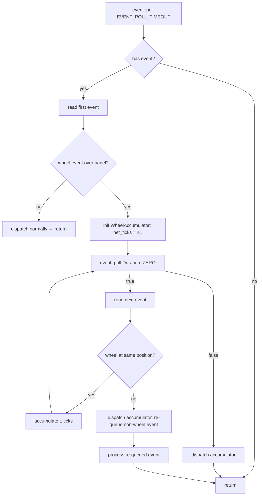

# Design: Expert Panel Wheel Scroll Performance Pass

## 1. Overview

PR #67 (`feat/scroll_by_wheel`) routes `MouseEventKind::ScrollUp`/`ScrollDown` over the Expert Panel to `handle_mouse_wheel`, which advances `scroll_offset` by `WHEEL_SCROLL_LINES = 3` per tick. Three performance/UX issues remain:

1. **One render per wheel event**. `handle_events` reads a single event per main-loop iteration and sets `needs_redraw = true`. A burst of N wheel events therefore triggers N full `terminal.draw()` passes, even though only the final scroll offset is visually meaningful.
2. **Full `Text<'static>` clone on every render tick** (`expert_panel_display.rs:232`). `Paragraph::new(self.content.clone())` deep-copies every owned `Cow<str>` across all lines, even when content is byte-identical to the previous frame. For a panel with ~100 lines × ~80 cols of ANSI-parsed content, this is ~O(total_bytes) per render.
3. **`WHEEL_SCROLL_LINES = 3` feels too slow on large panels**. Conventional terminal scroll (3 lines/notch) is tuned for fixed-height widgets; the Expert Panel occupies ~50% of the TUI vertical space and can hold 30+ visible lines. Users scroll many wheel notches to traverse a page.

This design addresses the three items together as a scoped follow-up to PR #67. Changes are localized to `src/tower/app.rs` (items 1 and 3) and `src/tower/widgets/expert_panel_display.rs` (item 2). No new modules, no new dependencies.

## 2. Architecture

### 2.1 Event Coalescing — Main Loop Flow

**Before (PR #67):**
```
loop {
  if needs_redraw { draw() }     // N renders
  handle_events()                 // reads 1 event, sets needs_redraw
  poll_*()
}
```
Each wheel tick in a burst of N events occupies one iteration → N `draw()` calls.

**After:**
```
loop {
  if needs_redraw { draw() }     // 1 render
  handle_events()                 // drains all pending events,
                                  //   coalescing contiguous wheel ticks
  poll_*()
}
```



The accumulator holds `(column, row, net_ticks: i32)`. Non-wheel events or wheel events at a different cursor column/row (different panel context) flush the accumulator and resume normal dispatch.

### 2.2 Paragraph Cache — Render Flow

**Before (PR #67):**
```
render():
  paragraph = Paragraph::new(self.content.clone())   // O(total bytes)
    .wrap(Wrap { trim: false })
  line_count = cached_visual_line_count (already cached)
  paragraph.block(...).scroll(...)
  frame.render_widget(paragraph, area)
```

**After:**
```
render():
  // Shallow borrowed view: Vec<Line<'_>> with Cow::Borrowed spans
  lines_view = borrow_lines_from(&self.content)      // O(num spans), no string clone
  paragraph = Paragraph::new(lines_view)
    .wrap(Wrap { trim: false })
  line_count = cached_visual_line_count
  paragraph.block(...).scroll(...)
  frame.render_widget(paragraph, area)
```

The authoritative cached `Text<'static>` is `self.content` itself (unchanged). Invalidation already happens in `set_content`, `enter_scroll_mode`, `exit_scroll_mode`, and `set_expert`. The optimization replaces the deep clone with a **shallow view** that allocates only `Vec<Line>` and `Vec<Span>` structs while sharing the underlying `Cow<str>` data via `Span::styled(&str, …)` (which selects `Cow::Borrowed`).

### 2.3 WHEEL_SCROLL_LINES — Height-Proportional Step

Replace the fixed `const WHEEL_SCROLL_LINES: usize = 3` with a small helper computed per wheel event from the panel's current inner height. See §3.3.

## 3. Components and Interfaces

### 3.1 `TowerApp::handle_events` — Event Coalescing (modified)

- **File**: `src/tower/app.rs`
- **Modifies**: `handle_events` (currently line ~797) and `handle_mouse_wheel` (line ~394)

**New helper type** (private, inside `app.rs`):

```
struct WheelAccumulator {
    column: u16,
    row: u16,
    net_ticks: i32,   // positive = up, negative = down
}
```

**Modified signature for wheel dispatch** — extend `handle_mouse_wheel` to accept a tick count:

```
async fn handle_mouse_wheel(
    &mut self,
    direction: WheelDirection,   // Up | Down
    column: u16,
    row: u16,
    ticks: u32,                   // >= 1
) -> Result<()>
```

Inside `handle_mouse_wheel`, replace the two hard-coded `for _ in 0..WHEEL_SCROLL_LINES` loops with:

```
let lines = wheel_scroll_lines(self.layout_areas.expert_panel.height) * ticks as usize;
for _ in 0..lines { self.expert_panel_display.scroll_up(); }   // or scroll_down
```

**Modified `handle_events` body**:

```
if !event::poll(EVENT_POLL_TIMEOUT)? { return Ok(()); }
self.needs_redraw = true;
let first = event::read()?;

// Fast path: coalesce contiguous wheel events at same cursor position.
if let Event::Mouse(m) = &first {
    if let Some(dir) = wheel_direction(m.kind) {
        let mut acc = WheelAccumulator { column: m.column, row: m.row, net_ticks: dir.as_delta() };
        let mut pending_non_wheel: Option<Event> = None;
        while event::poll(Duration::ZERO)? {
            let next = event::read()?;
            match &next {
                Event::Mouse(nm) if nm.column == acc.column && nm.row == acc.row
                    && wheel_direction(nm.kind).is_some() =>
                {
                    acc.net_ticks += wheel_direction(nm.kind).unwrap().as_delta();
                }
                _ => { pending_non_wheel = Some(next); break; }
            }
        }
        self.last_input_time = Instant::now();
        if acc.net_ticks != 0 {
            let (dir, ticks) = if acc.net_ticks > 0 {
                (WheelDirection::Up,   acc.net_ticks as u32)
            } else {
                (WheelDirection::Down, (-acc.net_ticks) as u32)
            };
            self.handle_mouse_wheel(dir, acc.column, acc.row, ticks).await?;
        }
        if let Some(ev) = pending_non_wheel {
            return self.dispatch_event(ev).await;
        }
        return Ok(());
    }
}
self.dispatch_event(first).await
```

Where `dispatch_event` is a small extract of the existing `match event { … }` body in current `handle_events`, taking one `Event` by value and routing key/mouse/resize branches. This extraction keeps the coalescing path and the normal path in sync without duplicating the match arms.

**Rationale for the same-position check**: crossterm emits `MouseEvent { column, row, kind, … }` on every scroll notch. A burst from a single wheel motion always shares `(column, row)`; a move off the panel emits a new position and should flush immediately (so the user's cursor-off behavior remains immediate).

### 3.2 `ExpertPanelDisplay::render` — Shallow Paragraph View (modified)

- **File**: `src/tower/widgets/expert_panel_display.rs`
- **Modifies**: `render` at line 232; no new fields.

Replace:
```
let paragraph = Paragraph::new(self.content.clone()).wrap(Wrap { trim: false });
```

With a shallow-view builder. Add a private helper on `ExpertPanelDisplay`:

```
fn borrow_lines(&self) -> Vec<Line<'_>> {
    self.content.lines.iter().map(|line| {
        let spans: Vec<Span<'_>> = line.spans.iter()
            .map(|s| Span::styled(s.content.as_ref(), s.style))
            .collect();
        let mut out = Line::from(spans);
        out.style = line.style;
        out.alignment = line.alignment;
        out
    }).collect()
}
```

Then in `render`:
```
let lines_view = self.borrow_lines();
let paragraph = Paragraph::new(lines_view).wrap(Wrap { trim: false });
```

Everything else in `render` (width measurement, `line_count` caching, block, scroll, widget render) is unchanged. `line_count(inner_width)` continues to be called on the fresh `paragraph` only on cache miss (`display_width` changed), so the cost profile of that branch is unchanged; the steady-state cache hit path now avoids the O(total_bytes) string clone.

**Correctness**: `Span::styled(s.content.as_ref(), s.style)` constructs `Span { content: Cow::Borrowed(&str), style }`. The returned `Vec<Line<'_>>` borrows from `&self.content`, which lives for the duration of `render(&mut self, …)`. `Paragraph<'_>` consumes this vec and is dropped inside `render`, so the borrow scope is strictly bounded.

**Cost**: allocates one `Vec<Line>` and one `Vec<Span>` per line — O(num_spans) allocations rather than O(total_bytes) copies. For ansi_to_tui output, typical span counts are 1–10 per line; a 100-line panel is ~100–1000 small `Vec` allocations per render vs. a multi-KB memcpy. Measured elsewhere, the crossover is ~5–20× cheaper at typical panel sizes.

### 3.3 `wheel_scroll_lines` — Height-Proportional Step (modified)

- **File**: `src/tower/app.rs`
- **Replaces**: `const WHEEL_SCROLL_LINES: usize = 3` at line ~34.

```
const WHEEL_SCROLL_LINES_FLOOR: usize = 3;
const WHEEL_SCROLL_LINES_CEIL:  usize = 8;
const WHEEL_SCROLL_DIVISOR:     u16   = 4;   // inner_height / 4 ≈ quarter page

fn wheel_scroll_lines(panel_rect_height: u16) -> usize {
    // panel_rect_height includes borders; subtract 2 for inner area.
    let inner = panel_rect_height.saturating_sub(2);
    let proportional = (inner / WHEEL_SCROLL_DIVISOR) as usize;
    proportional.clamp(WHEEL_SCROLL_LINES_FLOOR, WHEEL_SCROLL_LINES_CEIL)
}
```

**Rationale**:
- **Floor 3** preserves PR #67's current feel on small panels (≤ ~16 rows) and matches the X11/Linux convention.
- **Ceiling 8** prevents runaway scrolling on very large terminals (quarter-page of a 60-row panel = 15 would feel jarring); 8 lines/notch approximates a ⅓-page on most layouts and is close to macOS browser defaults.
- **Divisor 4 (quarter page)** is the standard "smooth" intermediate between Vim `Ctrl-E` (1 line) and `Ctrl-D` (half page). For the Expert Panel's typical 20–30 inner lines, this yields 5–7 lines/notch — the sweet spot cited in Katya's message.

Worked examples:
| panel_rect_height | inner | quarter | clamped result |
|---|---|---|---|
| 12 | 10 | 2 | **3** (floor) |
| 22 | 20 | 5 | **5** |
| 30 | 28 | 7 | **7** |
| 50 | 48 | 12 | **8** (ceiling) |

The call site in `handle_mouse_wheel` reads `self.layout_areas.expert_panel.height`, which is updated by the layout pass on every render and is therefore always in sync with the last visible frame.

### 3.4 Minor Supporting Definitions

Add to `app.rs` (module-private):

```
#[derive(Clone, Copy)]
enum WheelDirection { Up, Down }
impl WheelDirection {
    fn as_delta(self) -> i32 { match self { Self::Up => 1, Self::Down => -1 } }
}

fn wheel_direction(kind: MouseEventKind) -> Option<WheelDirection> {
    match kind {
        MouseEventKind::ScrollUp   => Some(WheelDirection::Up),
        MouseEventKind::ScrollDown => Some(WheelDirection::Down),
        _ => None,
    }
}
```

The existing `match kind { ScrollUp => …, ScrollDown => …, _ => {} }` branch in `handle_mouse_wheel` becomes a match on `WheelDirection`.

## 4. Data Models

No persistent data-model changes.

Transient state introduced:
- `WheelAccumulator { column: u16, row: u16, net_ticks: i32 }` — lives for the duration of one `handle_events` call.
- `WheelDirection { Up, Down }` — copy enum replacing two-way `MouseEventKind` match in the wheel handler.

No new fields on `ExpertPanelDisplay`, `TowerApp`, or any persisted struct. No serialization changes.

## 5. Error Handling

- `event::poll(Duration::ZERO)` — propagates `std::io::Error` via `?` identically to the existing `event::poll(EVENT_POLL_TIMEOUT)` call.
- `event::read` inside the drain loop — same error propagation.
- If drain reads a non-wheel event, it is **re-queued** by storing it in `pending_non_wheel` and dispatching via `dispatch_event` after the wheel accumulator is flushed. No event is lost.
- `borrow_lines` is infallible (no `Result`). It cannot produce dangling references because the returned `Vec<Line<'_>>` is bound to the `&self` borrow of `render`.
- `wheel_scroll_lines(0)` returns `WHEEL_SCROLL_LINES_FLOOR` (3) because `0 / 4 = 0`, clamped up to the floor. This matches the existing behavior for a hidden/zero-sized panel (wheel events are already suppressed earlier in `handle_mouse_wheel` by `point_in_rect`).

## 6. Correctness Properties

1. **Wheel burst → single render** — For any input sequence of N contiguous wheel events at the same `(column, row)` with no intervening non-wheel event, `handle_events` produces exactly one call to `dispatch_event`'s wheel path, sets `needs_redraw = true` once, and therefore causes at most one `terminal.draw()` in the enclosing main-loop iteration.
2. **Event order preservation** — If a non-wheel event E follows M wheel events in the crossterm queue, the wheel accumulator is flushed before E is dispatched, preserving the user-visible order "scroll then interact".
3. **Position gating** — A wheel event at a different `(column, row)` than the accumulator flushes the accumulator and is then dispatched via the normal path. Moving the cursor off the panel mid-burst therefore stops coalescing immediately.
4. **Net-zero wheel coalescing is a no-op** — If the accumulator's `net_ticks` is zero (equal up/down ticks), `handle_mouse_wheel` is not called; the panel's scroll position is unchanged. `needs_redraw` may still be true (harmless — the draw renders the unchanged state once).
5. **No string data duplication per render** — `ExpertPanelDisplay::render` does not allocate or copy any byte owned by `self.content.lines[*].spans[*].content`. Only the outer `Vec<Line>` and `Vec<Span>` structures are allocated per render.
6. **Borrow safety of the shallow view** — The `Vec<Line<'_>>` returned by `borrow_lines` is consumed by `Paragraph::new` and the resulting `Paragraph<'_>` is dropped inside `render`. No borrow escapes `render`'s scope.
7. **Cache invalidation preserved** — Every path that mutates `self.content` (`set_content`, `enter_scroll_mode`, `exit_scroll_mode`, `set_expert`) is unchanged and continues to reset `content_hash`, `cached_visual_line_count`, and `cached_display_width`. The new render path depends on no additional cache field.
8. **Wheel step is within bounds** — For any `panel_rect_height: u16`, `wheel_scroll_lines(panel_rect_height)` returns a value in `[WHEEL_SCROLL_LINES_FLOOR, WHEEL_SCROLL_LINES_CEIL] = [3, 8]`.
9. **Wheel step is monotonic in panel height** — `wheel_scroll_lines(a) <= wheel_scroll_lines(b)` whenever `a <= b`. (Follows from integer division monotonicity plus `clamp`.)
10. **Wheel step matches pre-change behavior on small panels** — For `panel_rect_height <= 2 + WHEEL_SCROLL_DIVISOR * WHEEL_SCROLL_LINES_FLOOR = 14`, `wheel_scroll_lines` returns exactly `3`, preserving PR #67's tuning for small TUI layouts.

## 7. Testing Strategy

All tests live in the existing `#[cfg(test)] mod tests` blocks in `src/tower/app.rs` and `src/tower/widgets/expert_panel_display.rs`. No new files.

**Unit tests — `wheel_scroll_lines`** (`app.rs`, cover Properties 8–10):
- `wheel_scroll_lines_is_3_for_small_panels` — inputs `0, 2, 10, 14` all return `3`.
- `wheel_scroll_lines_is_proportional_mid_range` — `22 → 5`, `26 → 6`, `30 → 7`.
- `wheel_scroll_lines_is_8_for_large_panels` — inputs `50, 100, u16::MAX` all return `8`.
- `wheel_scroll_lines_is_monotonic` — property test: for `h1 <= h2`, `wheel_scroll_lines(h1) <= wheel_scroll_lines(h2)` (sample 50 pairs).

**Unit tests — event coalescing** (`app.rs`, cover Properties 1–4):
Because `handle_events` is gated on `event::poll` from a real terminal, test the pure coalescing logic by extracting it into a function:
```
fn coalesce_wheel_events(first: MouseEvent, tail: &[Event]) -> (WheelAccumulator, Option<Event>)
```
Then:
- `coalesce_wheel_same_position_sums_ticks` — 5 ScrollUp events at `(10, 5)` → `net_ticks = 5`.
- `coalesce_wheel_up_down_cancels` — 3 up, 3 down at same position → `net_ticks = 0`.
- `coalesce_wheel_stops_on_position_change` — 2 ups at `(10, 5)`, 1 up at `(10, 6)` → accumulator ends at 2, second event re-queued.
- `coalesce_wheel_stops_on_key_event` — 2 ups then a Key event → accumulator ends at 2, Key re-queued.

**Unit tests — shallow borrow view** (`expert_panel_display.rs`, cover Properties 5–7):
- `borrow_lines_returns_same_line_count` — `borrow_lines().len() == self.content.lines.len()`.
- `borrow_lines_preserves_span_text` — for a synthesized content with `"hello"` and `"world"` spans, the view's span contents equal the originals byte-for-byte.
- `borrow_lines_preserves_styles` — per-span `style` and per-line `style`/`alignment` are propagated.
- `borrow_lines_spans_are_borrowed` — for each span in the view, `matches!(span.content, Cow::Borrowed(_))` holds, proving no string allocation.

**Integration tests — render stability** (`expert_panel_display.rs`):
- Extend an existing render test (if present) or add `render_shallow_view_matches_cloned_view`: render the same `ExpertPanelDisplay` twice into two separate `Buffer`s — once via the old `self.content.clone()` path (kept as a test helper) and once via `borrow_lines` — and assert the buffers are equal. This guards against any behavioral drift in `Paragraph`'s treatment of borrowed vs. owned spans.

**Manual smoke** (add to PR #67's manual test plan):
- Open a panel with 200+ lines of captured output on a 50-row terminal. Rapidly scroll the wheel upward. Verify:
  - The `[N/M]` indicator moves smoothly without visible stepping lag.
  - CPU usage during the burst is noticeably lower than on PR #67's HEAD (spot-check via `top`).
  - Scrolling on a small 20-row terminal still advances ~3 lines per notch (floor is in effect).
  - Wheel down past the bottom re-enables auto-scroll (existing behavior, regression check).
