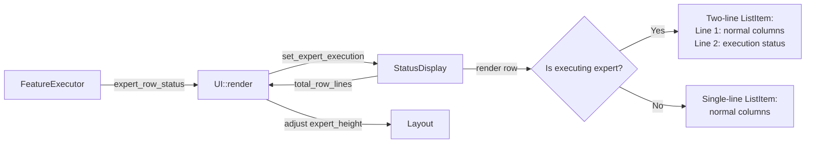

# Design: Expert Row Execution Status

## 1. Overview

Move the auto-task execution indicator from the Experts panel title badge to an inline status display within the executing expert's row, using a **two-line ListItem** approach that preserves both column alignment and working directory visibility.

**Current behavior**: When auto-task execution is active, the panel title shows `Experts [> feature-name]` or `Experts [~ resetting...]`. The executing expert's row shows no execution-specific information.

**New behavior**: The panel title always reads `Experts`. The targeted expert's row gains a second line showing execution status. The first line (with all columns) remains identical to non-executing experts. Non-targeted expert rows are single-line and unchanged.

## 2. Architecture



**Data flow per frame:**
1. `UI::render()` calls `FeatureExecutor::expert_row_status()` → `Option<ExpertRowStatus>`
2. Passes it to `StatusDisplay::set_expert_execution()`
3. `StatusDisplay::render()` builds each expert as a `ListItem`:
   - Matching expert: two `Line`s (normal row + execution status)
   - Others: one `Line` (normal row)
4. `UI::render()` uses `StatusDisplay::total_row_lines()` for dynamic height calculation

## 3. Components and Interfaces

### 3.1 ExpertRowStatus (New Struct)

- **File**: `src/tower/widgets/status_display.rs`
- **Purpose**: Carries per-expert execution information for row rendering

```rust
#[derive(Debug, Clone)]
pub struct ExpertRowStatus {
    pub expert_id: u32,
    pub text: String,   // e.g., "▶ auth-feature 2/5" or "⟳ resetting..."
    pub color: Color,   // Magenta for running, Yellow for resetting
}
```

### 3.2 FeatureExecutor Changes

- **File**: `src/feature/executor.rs`
- **Purpose**: Produce `ExpertRowStatus` from current execution phase

```rust
pub fn expert_row_status(&self) -> Option<ExpertRowStatus>;
```

Phase-to-status mapping:

| Phase | Text | Color |
|-------|------|-------|
| `ExitingExpert` | `⟳ resetting...` | Yellow |
| `RelaunchingExpert` | `⟳ resetting...` | Yellow |
| `SendingBatch` | `▶ {feature} {done}/{total}` | Magenta |
| `WaitingPollDelay` | `▶ {feature} {done}/{total}` | Magenta |
| `PollingStatus` | `▶ {feature} {done}/{total}` | Magenta |
| `Idle`, `Completed`, `Failed` | *(None)* | — |

Feature name is truncated to fit within the status text max width.

### 3.3 StatusDisplay Changes

- **File**: `src/tower/widgets/status_display.rs`
- **Purpose**: Render execution status as a second line in the expert row

**Field changes:**
- Remove: `execution_badge: Option<String>`
- Add: `expert_execution: Option<ExpertRowStatus>`

**Method changes:**
- Remove: `set_execution_badge()`, `execution_badge()`
- Add: `set_expert_execution(status: Option<ExpertRowStatus>)`
- Add: `total_row_lines() -> usize` — returns total display lines (expert_count + extra lines for executing experts)

**Render logic change (per expert):**
```rust
// Line 1: always the same — all columns preserved
let line1 = Line::from(vec![id_span, status_span, name_span, role_span, report_span, workdir_span]);

// Check if this expert is the executing one
if let Some(exec) = &self.expert_execution {
    if exec.expert_id == entry.expert_id {
        // Line 2: execution status, indented to align with name column
        let indent = " ".repeat(6); // aligns with position after "[N] ● "
        let line2 = Line::from(vec![
            Span::raw(indent),
            Span::styled(&exec.text, Style::default().fg(exec.color)),
        ]);
        return ListItem::new(vec![line1, line2]);
    }
}
ListItem::new(line1)
```

**Title change:**
```rust
// Before:
let title = match &self.execution_badge {
    Some(badge) => format!("Experts [{badge}]"),
    None => "Experts".to_string(),
};

// After:
let title = "Experts";
```

### 3.4 UI::render Changes

- **File**: `src/tower/ui.rs`
- **Purpose**: Pass execution info and adjust height

```rust
// Before:
let badge = app.feature_executor().and_then(|e| e.execution_badge());
app.status_display().set_execution_badge(badge);
let expert_height = (app.status_display().expert_count() + 2).max(3) as u16;

// After:
let exec_status = app.feature_executor().and_then(|e| e.expert_row_status());
app.status_display().set_expert_execution(exec_status);
let expert_height = (app.status_display().total_row_lines() + 2).max(3) as u16;
```

## 4. Data Models

### ExpertRowStatus

| Field | Type | Description |
|-------|------|-------------|
| `expert_id` | `u32` | Target expert for this execution status |
| `text` | `String` | Display text (e.g., `▶ auth 2/5`) |
| `color` | `Color` | ratatui color for the status text |

### Visual Layout

**Normal state (no execution):**
```
┌ Experts ──────────────────────────────────────────┐
│ [0] ● architect  (analyst)    󰧮 ./src             │
│ [1] ○ frontend   (developer)    ./app              │
│ [2] ○ backend    (developer)    ./api              │
└───────────────────────────────────────────────────┘
```

**During execution (expert 0 running "auth-feature", 2/5 done):**
```
┌ Experts ──────────────────────────────────────────┐
│ [0] ● architect  (analyst)    󰧮 ./src             │
│      ▶ auth-feature 2/5                           │
│ [1] ○ frontend   (developer)    ./app              │
│ [2] ○ backend    (developer)    ./api              │
└───────────────────────────────────────────────────┘
```

**During reset phase (expert 0 resetting):**
```
┌ Experts ──────────────────────────────────────────┐
│ [0] ● architect  (analyst)    󰧮 ./src             │
│      ⟳ resetting...                               │
│ [1] ○ frontend   (developer)    ./app              │
│ [2] ○ backend    (developer)    ./api              │
└───────────────────────────────────────────────────┘
```

**Key observations:**
- Line 1 of every expert is always identically formatted → column alignment preserved
- Line 2 only exists for the executing expert → no wasted space for others
- Working directory (`./src`) is always visible on line 1
- Execution status on line 2 is indented 6 spaces to align with the name column

### Status Text Format

- **Running**: `▶ {feature_name} {completed}/{total}` — feature name truncated if total exceeds 25 chars
- **Resetting**: `⟳ resetting...` — fixed string

### Color Scheme

| Element | Color | Rationale |
|---------|-------|-----------|
| Running line 2 (`▶ ...`) | `Color::Magenta` | Distinct from all existing row colors |
| Resetting line 2 (`⟳ ...`) | `Color::Yellow` | Matches warning/transitional semantics |
| Line 1 columns | Unchanged | Gray/Green symbol, Bold name, Cyan role, DarkGray path |

### Height Calculation

```rust
pub fn total_row_lines(&self) -> usize {
    let extra = if self.expert_execution.is_some() { 1 } else { 0 };
    self.experts.len() + extra
}
```

The layout constraint uses `total_row_lines() + 2` (borders) instead of `expert_count() + 2`.

## 5. Error Handling

No new error paths are introduced. All changes are purely presentational.

- If `FeatureExecutor` is `None`, `expert_row_status()` returns `None`, all rows are single-line.
- If `expert_id` doesn't match any displayed expert, the status is silently ignored (all rows single-line).
- Multi-line `ListItem` is natively supported by ratatui — no special handling needed.

## 6. Correctness Properties

1. **Title Invariant** — The Experts panel title is always `"Experts"` and never contains bracket badges.
2. **Single-Expert Targeting** — At most one expert row has a second line at any given time.
3. **Column Alignment** — Line 1 of every expert row uses identical column structure regardless of execution state.
4. **Working Directory Preservation** — Working directory is always displayed on line 1, even for the executing expert.
5. **Phase-Accurate Display** — The line 2 text correctly reflects the current `ExecutionPhase` (resetting vs. running with progress).
6. **Non-interference** — Expert rows whose `expert_id` does not match the executing expert are always single-line.
7. **Lifecycle Consistency** — When execution completes, is cancelled, or fails, all rows revert to single-line.
8. **Progress Accuracy** — The `completed/total` numbers match `FeatureExecutor::completed_tasks()` and `FeatureExecutor::total_tasks()`.
9. **Height Accuracy** — `total_row_lines()` returns `expert_count` when no execution, `expert_count + 1` during execution.
10. **Selection Integrity** — ListState selection index maps correctly to experts regardless of multi-line items.

## 7. Testing Strategy

### Unit Tests — FeatureExecutor

Covers **Properties 5, 7, 8**.

- `expert_row_status_none_when_idle` — Returns `None` in Idle phase.
- `expert_row_status_resetting_during_exit` — Returns resetting text with Yellow color during `ExitingExpert`.
- `expert_row_status_resetting_during_relaunch` — Returns resetting text during `RelaunchingExpert`.
- `expert_row_status_running_during_sending_batch` — Returns running text with Magenta color and correct progress.
- `expert_row_status_running_during_waiting_poll` — Returns running text during `WaitingPollDelay`.
- `expert_row_status_running_during_polling` — Returns running text during `PollingStatus`.
- `expert_row_status_none_when_completed` — Returns `None` when `Completed`.
- `expert_row_status_none_when_failed` — Returns `None` when `Failed`.
- `expert_row_status_truncated_for_long_feature_name` — Status text respects max length.
- `expert_row_status_expert_id_matches_executor` — Returned `expert_id` matches the executor's `expert_id`.

### Unit Tests — StatusDisplay

Covers **Properties 1, 2, 6, 9**.

- `title_always_experts` — Panel title is `"Experts"` regardless of execution state.
- `set_expert_execution_stores_status` — Status is stored and retrievable.
- `set_expert_execution_none_clears` — Setting `None` clears any previous status.
- `total_row_lines_without_execution` — Returns `expert_count` when no execution active.
- `total_row_lines_with_execution` — Returns `expert_count + 1` when execution is active.

### Existing Test Migration

- Remove `execution_badge_*` tests in both `executor.rs` and `status_display.rs`.
- Replace with equivalent `expert_row_status_*` and two-line rendering tests.
