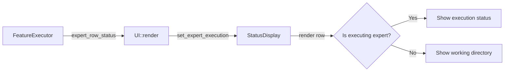

# Design: Expert Row Execution Status

## 1. Overview

Move the auto-task execution indicator from the Experts panel title badge to an inline status display within the executing expert's row.

**Current behavior**: When auto-task execution is active, the panel title shows `Experts [> feature-name]` or `Experts [~ resetting...]`.

**New behavior**: The panel title always reads `Experts`. The targeted expert's row replaces its working directory column with execution status text (e.g., `▶ auth 2/5` or `⟳ resetting...`). Non-targeted expert rows remain unchanged.

## 2. Architecture



**Data flow per frame:**
1. `UI::render()` calls `FeatureExecutor::expert_row_status()` to get `Option<ExpertRowStatus>`
2. Passes it to `StatusDisplay::set_expert_execution()`
3. `StatusDisplay::render()` checks each row: if `entry.expert_id == status.expert_id`, render execution text instead of working directory

## 3. Components and Interfaces

### 3.1 ExpertRowStatus (New Struct)

- **File**: `src/tower/widgets/status_display.rs`
- **Purpose**: Carries per-expert execution information for row rendering

```rust
#[derive(Debug, Clone)]
pub struct ExpertRowStatus {
    pub expert_id: u32,
    pub text: String,   // e.g., "▶ auth 2/5" or "⟳ resetting..."
    pub color: Color,   // Magenta for running, Yellow for resetting
}
```

### 3.2 FeatureExecutor Changes

- **File**: `src/feature/executor.rs`
- **Purpose**: Produce `ExpertRowStatus` from current execution phase

```rust
pub fn expert_row_status(&self) -> Option<ExpertRowStatus>;
```

Phase-to-status mapping:

| Phase | Text | Color |
|-------|------|-------|
| `ExitingExpert` | `⟳ resetting...` | Yellow |
| `RelaunchingExpert` | `⟳ resetting...` | Yellow |
| `SendingBatch` | `▶ {feature} {done}/{total}` | Magenta |
| `WaitingPollDelay` | `▶ {feature} {done}/{total}` | Magenta |
| `PollingStatus` | `▶ {feature} {done}/{total}` | Magenta |
| `Idle`, `Completed`, `Failed` | *(None)* | — |

Feature name is truncated to fit within the status text max width.

### 3.3 StatusDisplay Changes

- **File**: `src/tower/widgets/status_display.rs`
- **Purpose**: Render execution status inline in the expert row

**Field changes:**
- Remove: `execution_badge: Option<String>`
- Add: `expert_execution: Option<ExpertRowStatus>`

**Method changes:**
- Remove: `set_execution_badge()`, `execution_badge()`
- Add: `set_expert_execution(status: Option<ExpertRowStatus>)`

**Render logic change (per row):**
```
if expert_execution.expert_id == entry.expert_id:
    show Span(status.text, status.color) instead of working_dir Span
else:
    show working_dir as before
```

**Title change:**
```rust
// Before:
let title = match &self.execution_badge {
    Some(badge) => format!("Experts [{badge}]"),
    None => "Experts".to_string(),
};

// After:
let title = "Experts";
```

### 3.4 UI::render Changes

- **File**: `src/tower/ui.rs`
- **Purpose**: Pass execution info from executor to display

```rust
// Before:
let badge = app.feature_executor().and_then(|e| e.execution_badge());
app.status_display().set_execution_badge(badge);

// After:
let exec_status = app.feature_executor().and_then(|e| e.expert_row_status());
app.status_display().set_expert_execution(exec_status);
```

## 4. Data Models

### ExpertRowStatus

| Field | Type | Description |
|-------|------|-------------|
| `expert_id` | `u32` | Target expert for this execution status |
| `text` | `String` | Display text (e.g., `▶ auth 2/5`) |
| `color` | `Color` | ratatui color for the status text |

### Visual Layout

**Normal row (no execution):**
```
[0] ● architect  (analyst)  󰧮 ./src
[1] ○ frontend   (developer)    ./app
```

**During execution (expert 0 running "auth-feature", 2/5 done):**
```
[0] ● architect  (analyst)  󰧮 ▶ auth-feature 2/5
[1] ○ frontend   (developer)    ./app
```

**During reset phase (expert 0 resetting):**
```
[0] ● architect  (analyst)  󰧮 ⟳ resetting...
[1] ○ frontend   (developer)    ./app
```

### Status Text Format

- **Running**: `▶ {feature_name} {completed}/{total}` — max 25 chars total, feature name truncated as needed
- **Resetting**: `⟳ resetting...` — fixed 15 chars

### Color Scheme

| Status | Color | Rationale |
|--------|-------|-----------|
| Running (`▶`) | `Color::Magenta` | Distinct from existing colors (Gray, Green, Cyan, Yellow, DarkGray) |
| Resetting (`⟳`) | `Color::Yellow` | Matches warning/transitional semantics |
| Working dir | `Color::DarkGray` | Unchanged |

## 5. Error Handling

No new error paths are introduced. All changes are purely presentational.

- If `FeatureExecutor` is `None` (no active execution), `expert_row_status()` returns `None`, and all rows show working directory normally.
- If `expert_id` doesn't match any displayed expert, the status is silently ignored.

## 6. Correctness Properties

1. **Title Invariant** — The Experts panel title is always `"Experts"` and never contains bracket badges.
2. **Single-Expert Targeting** — At most one expert row displays execution status at any given time.
3. **Phase-Accurate Display** — The displayed text correctly reflects the current `ExecutionPhase` (resetting vs. running with progress).
4. **Non-interference** — Expert rows whose `expert_id` does not match the executing expert are rendered identically to the no-execution case.
5. **Lifecycle Consistency** — When execution completes, is cancelled, or fails, all rows revert to showing working directory.
6. **Progress Accuracy** — The `completed/total` numbers in running status match the values from `FeatureExecutor::completed_tasks()` and `FeatureExecutor::total_tasks()`.
7. **Text Length Bound** — Execution status text never exceeds `WORKING_DIR_MAX_CHARS` (25 characters).

## 7. Testing Strategy

### Unit Tests — FeatureExecutor

Covers **Properties 3, 5, 6, 7**.

- `expert_row_status_none_when_idle` — Returns `None` in Idle phase.
- `expert_row_status_resetting_during_exit` — Returns resetting status with Yellow color during `ExitingExpert`.
- `expert_row_status_resetting_during_relaunch` — Returns resetting status during `RelaunchingExpert`.
- `expert_row_status_running_during_sending_batch` — Returns running status with Magenta color and correct progress.
- `expert_row_status_running_during_waiting_poll` — Returns running status during `WaitingPollDelay`.
- `expert_row_status_running_during_polling` — Returns running status during `PollingStatus`.
- `expert_row_status_none_when_completed` — Returns `None` when `Completed`.
- `expert_row_status_none_when_failed` — Returns `None` when `Failed`.
- `expert_row_status_text_truncated_for_long_feature_name` — Status text respects max length.
- `expert_row_status_expert_id_matches_executor` — Returned `expert_id` matches the executor's `expert_id`.

### Unit Tests — StatusDisplay

Covers **Properties 1, 2, 4**.

- `title_always_experts` — Panel title is `"Experts"` regardless of execution state.
- `set_expert_execution_stores_status` — Status is stored and retrievable.
- `set_expert_execution_none_clears` — Setting `None` clears any previous status.

### Existing Test Migration

- Remove or adapt `execution_badge_*` tests in both `executor.rs` and `status_display.rs`.
- Replace with equivalent `expert_row_status_*` tests.
