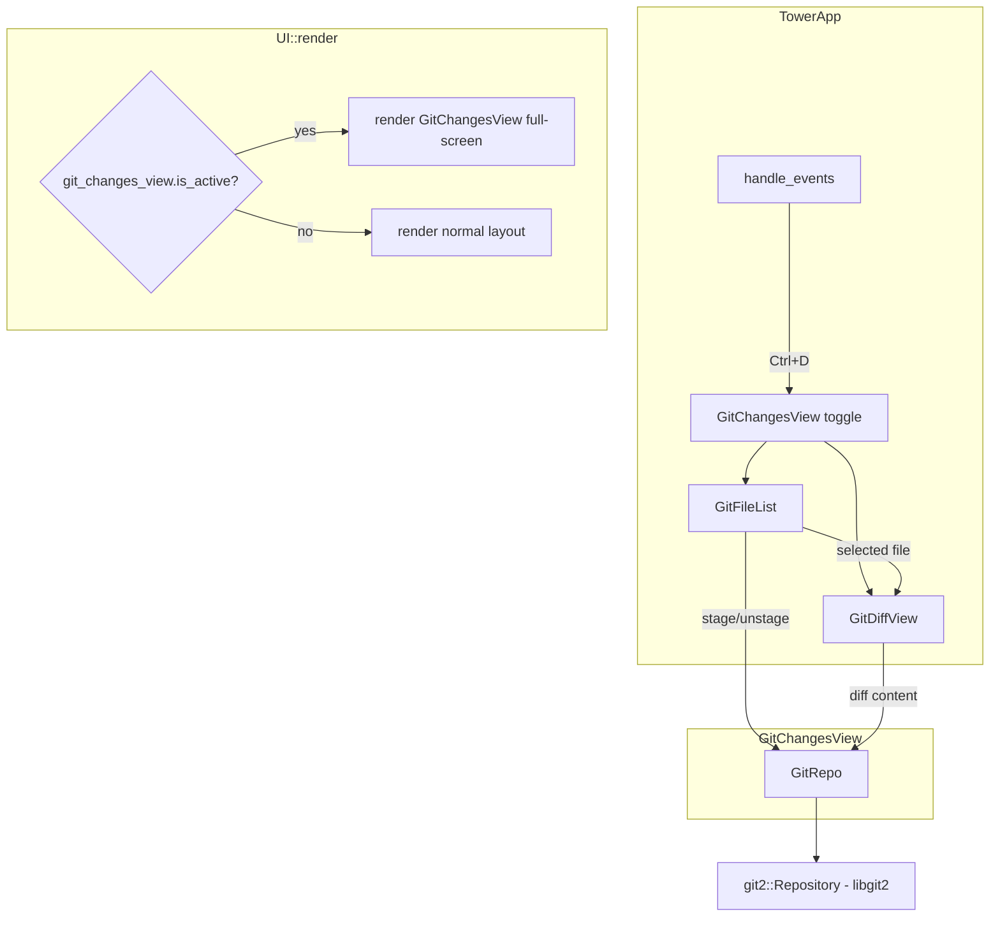

# Design: Git Changes View

## 1. Overview

The Git Changes View is a lazygit-style two-pane split UI for viewing diffs, staging, and unstaging files. It replaces the normal MACOT layout (Header, StatusDisplay, TaskInput, ExpertPanel) with a dedicated git-focused screen activated via `Ctrl+D`.

**Motivation**: Experts working within MACOT worktrees accumulate changes that currently require switching to an external tool (lazygit, `git status`) to review and stage. An integrated view reduces context switching and enables a faster commit workflow without leaving the TUI.

**System fit**: The view operates as a modal screen overlay, similar in concept to `HelpModal` or `ReportDetailModal` — it captures all input while active and hides the normal layout. Unlike those modals, it occupies the full terminal area (minus margin) and runs its own two-pane layout engine.

**Library choice**: Git operations use `git2` (libgit2 bindings) with `default-features = false` instead of shelling out via `std::process::Command`. This eliminates porcelain output parsing, diff text parsing, and external process management. The `git2` crate is maintained under the `rust-lang` organization (2,000+ stars, active as of 2026-02), providing structured APIs for status, diff, staging, and unstaging.

```toml
[dependencies]
git2 = { version = "0.20", default-features = false }
```

`default-features = false` disables `ssh` and `https` transport features, which are unnecessary for local-only repository operations and avoids pulling in OpenSSL/libssh2.

## 2. Architecture



### Screen lifecycle

1. User presses `Ctrl+D` from any `FocusArea`.
2. `TowerApp` sets `git_changes_view.active = true`.
3. `UI::render` detects active state, delegates entire frame to `GitChangesView::render`.
4. All key events route through `GitChangesView::handle_key` while active.
5. `q` / `Esc` sets `active = false`, returning to normal layout.

### Separation from normal focus system

The `FocusArea` enum remains unchanged. While the git view is active, `handle_events` short-circuits before the normal focus-dispatch logic (same pattern as `help_modal.is_visible()` and `role_selector.is_visible()` guards). An internal `GitFocusPane` enum (`FileList | DiffView`) governs focus within the git view.

## 3. Components and Interfaces

### 3.1 GitChangesView (Container)

- **File**: `src/tower/widgets/git_changes_view.rs`
- **Purpose**: Top-level container managing two-pane layout, focus routing, and git operations orchestration.

```rust
pub struct GitChangesView {
    active: bool,
    focus: GitFocusPane,
    file_list: GitFileList,
    diff_view: GitDiffView,
    repo: GitRepo,
}

#[derive(Debug, Clone, Copy, PartialEq, Eq)]
pub enum GitFocusPane {
    FileList,
    DiffView,
}

impl GitChangesView {
    pub fn new(project_path: PathBuf) -> Result<Self>;
    pub fn is_active(&self) -> bool;
    pub fn toggle(&mut self);
    pub fn activate(&mut self);
    pub fn deactivate(&mut self);
    pub fn handle_key(&mut self, code: KeyCode, modifiers: KeyModifiers) -> GitAction;
    pub fn refresh(&mut self);
    pub fn render(&mut self, frame: &mut Frame, area: Rect);
}
```

`new()` returns `Result` because `git2::Repository::open()` may fail (not a git repo). The caller stores `Option<GitChangesView>` and skips `Ctrl+D` handling if `None`.

`handle_key` returns a `GitAction` enum so that the caller (`TowerApp::handle_events`) can react to side-effecting actions without the widget needing direct access to app state.

```rust
pub enum GitAction {
    None,
    Close,
    StageFile(String),
    UnstageFile(String),
    StageAll,
    UnstageAll,
    Refresh,
}
```

### 3.2 GitFileList (Left Pane)

- **File**: `src/tower/widgets/git_file_list.rs`
- **Purpose**: Displays staged, unstaged, and untracked files. Handles navigation and selection.

```rust
pub struct GitFileList {
    staged: Vec<GitFileEntry>,
    unstaged: Vec<GitFileEntry>,
    untracked: Vec<GitFileEntry>,
    selected_index: usize,          // flat index across all sections
    focused: bool,
}

pub struct GitFileEntry {
    pub path: String,
    pub status: GitFileStatus,
}

#[derive(Debug, Clone, Copy, PartialEq, Eq)]
pub enum GitFileStatus {
    Modified,
    Added,
    Deleted,
    Renamed,
    Untracked,
}

impl GitFileList {
    pub fn new() -> Self;
    pub fn set_files(
        &mut self,
        staged: Vec<GitFileEntry>,
        unstaged: Vec<GitFileEntry>,
        untracked: Vec<GitFileEntry>,
    );
    pub fn selected_file(&self) -> Option<&GitFileEntry>;
    pub fn selected_section(&self) -> FileSection;
    pub fn next(&mut self);
    pub fn prev(&mut self);
    pub fn total_count(&self) -> usize;
    pub fn is_empty(&self) -> bool;
    pub fn set_focused(&mut self, focused: bool);
    pub fn render(&self, frame: &mut Frame, area: Rect);
}

#[derive(Debug, Clone, Copy, PartialEq, Eq)]
pub enum FileSection {
    Staged,
    Unstaged,
    Untracked,
}
```

### 3.3 GitDiffView (Right Pane)

- **File**: `src/tower/widgets/git_diff_view.rs`
- **Purpose**: Renders diff output with syntax coloring and scrolling.

```rust
pub struct GitDiffView {
    file_path: Option<String>,
    lines: Vec<DiffLine>,
    scroll_offset: usize,
    visible_height: usize,
    focused: bool,
}

pub struct DiffLine {
    pub kind: DiffLineKind,
    pub content: String,
}

#[derive(Debug, Clone, Copy, PartialEq, Eq)]
pub enum DiffLineKind {
    Context,
    Added,
    Removed,
    HunkHeader,
    FileHeader,
    Binary,
}

impl GitDiffView {
    pub fn new() -> Self;
    pub fn set_diff(&mut self, file_path: &str, lines: Vec<DiffLine>);
    pub fn clear(&mut self);
    pub fn scroll_up(&mut self);
    pub fn scroll_down(&mut self);
    pub fn page_up(&mut self);
    pub fn page_down(&mut self);
    pub fn scroll_to_top(&mut self);
    pub fn scroll_to_bottom(&mut self);
    pub fn total_lines(&self) -> usize;
    pub fn set_focused(&mut self, focused: bool);
    pub fn render(&self, frame: &mut Frame, area: Rect);
}
```

Key change from previous design: `set_diff` accepts `Vec<DiffLine>` (already parsed) instead of `&str` (raw diff text). The parsing is done in `GitRepo::diff()` via the `git2` callback API, so `GitDiffView` is a pure display widget with no parsing logic.

### 3.4 GitRepo (git2 wrapper)

- **File**: `src/tower/widgets/git_repo.rs`
- **Purpose**: Encapsulates all `git2` interactions. Keeps widget code free of libgit2 details.

```rust
use git2::{Repository, Status, StatusOptions, DiffFormat, DiffOptions, IndexAddOption};

pub struct GitRepo {
    repo: Repository,
}

impl GitRepo {
    pub fn open(project_path: &Path) -> Result<Self>;
    pub fn status(&self) -> Result<GitStatusResult>;
    pub fn diff(&self, file: &str, staged: bool) -> Result<Vec<DiffLine>>;
    pub fn stage(&self, file: &str) -> Result<()>;
    pub fn unstage(&self, file: &str) -> Result<()>;
    pub fn stage_all(&self) -> Result<()>;
    pub fn unstage_all(&self) -> Result<()>;
}
```

#### Implementation details

**`open`**:
```rust
pub fn open(project_path: &Path) -> Result<Self> {
    let repo = Repository::open(project_path)?;
    Ok(Self { repo })
}
```

**`status`** — uses `repo.statuses()` with `git2::Status` bitflags:
```rust
pub fn status(&self) -> Result<GitStatusResult> {
    let mut opts = StatusOptions::new();
    opts.include_untracked(true)
        .recurse_untracked_dirs(true)
        .include_ignored(false);

    let statuses = self.repo.statuses(Some(&mut opts))?;
    let mut result = GitStatusResult::default();

    for entry in statuses.iter() {
        let path = entry.path().unwrap_or("").to_string();
        let s = entry.status();

        // Index (staged) changes
        if s.intersects(
            Status::INDEX_NEW
            | Status::INDEX_MODIFIED
            | Status::INDEX_DELETED
            | Status::INDEX_RENAMED
        ) {
            result.staged.push(GitFileEntry {
                path: path.clone(),
                status: index_status_to_file_status(s),
            });
        }

        // Worktree (unstaged) changes
        if s.intersects(Status::WT_MODIFIED | Status::WT_DELETED | Status::WT_RENAMED) {
            result.unstaged.push(GitFileEntry {
                path: path.clone(),
                status: wt_status_to_file_status(s),
            });
        }

        // Untracked
        if s.contains(Status::WT_NEW) {
            result.untracked.push(GitFileEntry {
                path,
                status: GitFileStatus::Untracked,
            });
        }
    }

    Ok(result)
}
```

**`diff`** — uses `git2::Diff` callback to build `Vec<DiffLine>` directly:
```rust
pub fn diff(&self, file: &str, staged: bool) -> Result<Vec<DiffLine>> {
    let mut opts = DiffOptions::new();
    opts.pathspec(file);

    let diff = if staged {
        let head_tree = self.repo.head()?.peel_to_tree()?;
        self.repo.diff_tree_to_index(Some(&head_tree), None, Some(&mut opts))?
    } else {
        self.repo.diff_index_to_workdir(None, Some(&mut opts))?
    };

    let mut lines = Vec::new();
    diff.print(DiffFormat::Patch, |_delta, _hunk, line| {
        let kind = match line.origin() {
            '+' => DiffLineKind::Added,
            '-' => DiffLineKind::Removed,
            'H' => DiffLineKind::HunkHeader,
            'F' => DiffLineKind::FileHeader,
            'B' => DiffLineKind::Binary,
            _ => DiffLineKind::Context,
        };
        let content = String::from_utf8_lossy(line.content()).to_string();
        lines.push(DiffLine { kind, content });
        true
    })?;

    Ok(lines)
}
```

**`stage`** — uses `Index::add_path`:
```rust
pub fn stage(&self, file: &str) -> Result<()> {
    let mut index = self.repo.index()?;
    index.add_path(Path::new(file))?;
    index.write()?;
    Ok(())
}
```

**`unstage`** — uses `Repository::reset_default` (equivalent to `git reset HEAD -- <file>`):
```rust
pub fn unstage(&self, file: &str) -> Result<()> {
    let head = self.repo.head()?.peel_to_commit()?;
    self.repo
        .reset_default(Some(head.as_object()), [file])?;
    Ok(())
}
```

**`stage_all`**:
```rust
pub fn stage_all(&self) -> Result<()> {
    let mut index = self.repo.index()?;
    index.add_all(["*"], IndexAddOption::DEFAULT, None)?;
    index.write()?;
    Ok(())
}
```

**`unstage_all`** — resets all staged entries:
```rust
pub fn unstage_all(&self) -> Result<()> {
    let head = self.repo.head()?.peel_to_commit()?;
    self.repo.reset_default(Some(head.as_object()), ["*"])?;
    Ok(())
}
```

#### Helper functions

```rust
fn index_status_to_file_status(s: Status) -> GitFileStatus {
    if s.contains(Status::INDEX_NEW) {
        GitFileStatus::Added
    } else if s.contains(Status::INDEX_DELETED) {
        GitFileStatus::Deleted
    } else if s.contains(Status::INDEX_RENAMED) {
        GitFileStatus::Renamed
    } else {
        GitFileStatus::Modified
    }
}

fn wt_status_to_file_status(s: Status) -> GitFileStatus {
    if s.contains(Status::WT_DELETED) {
        GitFileStatus::Deleted
    } else if s.contains(Status::WT_RENAMED) {
        GitFileStatus::Renamed
    } else {
        GitFileStatus::Modified
    }
}
```

## 4. Data Models

### 4.1 GitFileEntry

| Field | Type | Description |
|-------|------|-------------|
| `path` | `String` | Relative file path from repo root |
| `status` | `GitFileStatus` | Change type (M/A/D/R/?) |

Derived from `git2::StatusEntry`. The `git2::Status` bitflags provide separate bit groups for index (staged) and worktree (unstaged) changes, eliminating porcelain format parsing.

**Classification rules** (from `git2::Status` bitflags):
- `INDEX_NEW | INDEX_MODIFIED | INDEX_DELETED | INDEX_RENAMED` → entry in **staged** list
- `WT_MODIFIED | WT_DELETED | WT_RENAMED` → entry in **unstaged** list
- `WT_NEW` → entry in **untracked** list

A single file may appear in both staged and unstaged if it has been partially staged (e.g., staged then edited again). This is correct behavior — the same file shows in both sections with potentially different statuses.

### 4.2 DiffLine

| Field | Type | Description |
|-------|------|-------------|
| `kind` | `DiffLineKind` | Line classification for coloring |
| `content` | `String` | Line text (without origin prefix) |

Built from the `git2::Diff::print()` callback. The callback provides `line.origin()` as a `char` and `line.content()` as raw bytes:

| `line.origin()` | `DiffLineKind` |
|------------------|----------------|
| `'+'` | `Added` |
| `'-'` | `Removed` |
| `'H'` | `HunkHeader` |
| `'F'` | `FileHeader` |
| `'B'` | `Binary` |
| `' '` or other | `Context` |

No text-based parsing is needed. The `Binary` variant replaces the previous design's "detect binary files from diff output" approach.

### 4.3 Internal state model

```
GitChangesView
├── active: bool                    // Whether the view occupies the screen
├── focus: GitFocusPane             // FileList or DiffView
├── file_list: GitFileList
│   ├── staged: Vec<GitFileEntry>
│   ├── unstaged: Vec<GitFileEntry>
│   ├── untracked: Vec<GitFileEntry>
│   └── selected_index: usize      // Flat index across all sections
├── diff_view: GitDiffView
│   ├── lines: Vec<DiffLine>
│   ├── scroll_offset: usize
│   └── visible_height: usize
└── repo: GitRepo                   // Wraps git2::Repository
```

Selection index is **flat** across all three sections. If staged has 2 files, unstaged has 3, and untracked has 1, indices 0-1 are staged, 2-4 are unstaged, 5 is untracked. Section headers are not selectable items.

### 4.4 Change detection

Use xxh3 hashing (already a dependency) on the concatenated file paths + statuses from `GitRepo::status()` to avoid redundant UI updates on `refresh()`. Store the hash and skip `set_files()` if unchanged. This matches the `ExpertPanelDisplay::try_set_content` pattern.

## 5. Error Handling

### 5.1 Error types

| Scenario | Handling |
|----------|----------|
| `Repository::open` fails | `GitChangesView::new()` returns `Err`; `TowerApp` stores `None`; `Ctrl+D` shows message "Not a git repository" |
| `repo.statuses()` fails | Display error text in file list area; allow retry with `r` |
| `Diff::print()` fails | Show error text in diff pane; file list remains navigable |
| `index.add_path()` / `reset_default()` fails | Return error via `GitAction`; caller surfaces via `set_message()` |
| No files changed | File list shows "No changes" centered; diff pane shows placeholder |
| Binary file selected | `DiffLineKind::Binary` detected via `line.origin() == 'B'`; diff pane shows "Binary file" |

### 5.2 Error propagation

`GitRepo` methods return `Result<T, git2::Error>` (wrapped in `anyhow`). `GitChangesView` catches errors internally and renders them as user-visible text rather than propagating panics. For stage/unstage operations, errors are returned as `GitAction::None` plus a side-effected error message, which the caller (`handle_events`) surfaces via `set_message()`.

### 5.3 Edge cases

- **Renamed files**: `git2::Status::INDEX_RENAMED` / `WT_RENAMED` flags identify renames. The `DiffDelta` in the callback provides both `old_file()` and `new_file()` paths. Display the new path with `(R)` indicator.
- **Submodule changes**: `git2` reports submodule changes as modified entries. The diff callback provides the commit pointer change.
- **Very large diffs**: No explicit truncation. The scroll mechanism handles arbitrarily long diffs. If performance becomes an issue, a line cap (e.g., 10,000 lines) with a "Diff truncated" indicator can be added.
- **Concurrent external changes**: `r` (refresh) re-runs `repo.statuses()`. Auto-refresh on re-activation (when toggling back via `Ctrl+D`). `git2::Repository` always reads current on-disk state — no stale cache.
- **Initial commit (empty HEAD)**: `unstage` uses `reset_default` which requires a HEAD commit. For repos with no commits, use `index.remove_path()` + `index.write()` as fallback.

## 6. Correctness Properties

1. **Toggle Idempotence** — Pressing `Ctrl+D` twice returns the application to its exact previous layout state (focus area, scroll positions in TaskInput/ExpertPanel). No state is lost during toggle.

2. **Section Integrity** — Every entry returned by `repo.statuses()` appears in exactly one section (Staged, Unstaged, or Untracked) per its `git2::Status` bitflags. A file with both index and worktree changes correctly appears in two sections. The total count in section headers equals the actual number of entries.

3. **Selection Bounds** — `selected_index` is always in range `[0, total_count)` when `total_count > 0`, and is `0` when `total_count == 0`. Navigation wraps or clamps at boundaries.

4. **Diff-Selection Consistency** — The diff pane always displays the diff for the currently selected file. After a stage/unstage operation, the diff refreshes to reflect the new state. If the file disappears (fully staged/unstaged), selection moves to the nearest remaining file.

5. **Stage/Unstage Correctness** — Staging uses `Index::add_path()` + `Index::write()`. Unstaging uses `Repository::reset_default()`. These correspond exactly to `git add <file>` and `git reset HEAD -- <file>`. "Stage all" uses `Index::add_all()`. "Unstage all" uses `reset_default` with wildcard path.

6. **Focus Isolation** — While the git view is active, no key events leak to the normal `FocusArea` dispatch (TaskInput, ExpertList, ExpertPanel). Conversely, while the git view is inactive, no key events reach `GitChangesView`.

7. **Scroll Invariant** — `scroll_offset` satisfies `0 <= scroll_offset <= max(0, total_lines - visible_height)`. Scrolling past the end clamps to the maximum. Scrolling past the beginning clamps to zero.

8. **Layout Responsiveness** — At any terminal width >= 60 columns, both panes are visible simultaneously. Below 60 columns, the layout degrades to single-pane mode without panic or layout overflow.

9. **Repository Consistency** — `GitRepo` wraps a single `git2::Repository` instance opened at construction. All operations go through this instance, which always reflects the current on-disk state. No stale caches or background state.

10. **Clean Deactivation** — When the view deactivates, it does not leave dangling state that affects the normal UI. The `FocusArea` and all widget states return to their pre-activation values.

## 7. Testing Strategy

### 7.1 Unit tests (per widget)

**GitFileList** (covers Properties 2, 3):
- `set_files` correctly categorizes entries into sections
- Navigation (`next`/`prev`) respects bounds and wraps appropriately
- `selected_file` returns the correct entry for any valid index
- Empty state (`is_empty`, `total_count == 0`) handled correctly
- Section headers show correct counts

**GitDiffView** (covers Property 7):
- `set_diff` with pre-built `Vec<DiffLine>` stores lines correctly
- Scroll operations clamp within bounds
- `page_up`/`page_down` move by `visible_height` lines
- Empty diff (no changes) renders placeholder
- `DiffLineKind::Binary` renders "Binary file" message

**GitRepo** (covers Properties 5, 9):
- Uses `git2::Repository::init()` with `tempfile::TempDir` for isolated test repos
- `status()` correctly classifies files by `git2::Status` bitflags
- `diff()` returns correctly typed `DiffLine` entries via callback
- `stage()` / `unstage()` modify the index as expected
- `stage_all()` / `unstage_all()` handle multiple files
- Renamed file detection via `INDEX_RENAMED` / `WT_RENAMED`
- Error case: open non-repo path returns error

### 7.2 Integration tests

**GitChangesView** (covers Properties 1, 4, 6, 10):
- Toggle activates/deactivates correctly
- Key routing isolation (events don't leak)
- File selection updates diff view
- Stage/unstage refreshes file list and diff
- `Tab` switches focus pane
- `q`/`Esc` deactivates

### 7.3 Layout tests

**Responsive layout** (covers Property 8):
- Wide terminal (120+ cols): 30/70 split
- Medium terminal (80-119): fixed 25 + remaining
- Narrow terminal (60-79): fixed 20 + remaining
- Very narrow (<60): single-pane mode

### 7.4 Render tests

Follow the existing pattern in `ExpertPanelDisplay` tests (`render_to_string`, `render_panel`):
- Verify diff coloring (added=green, removed=red, hunk=cyan)
- Verify file status icons and colors
- Verify selection indicator rendering
- Verify scroll position indicator format

### 7.5 Test infrastructure advantage

With `git2`, tests create real git repositories in memory via `Repository::init(&tmpdir)` — no need to mock CLI output or assert on `Command` arguments. This makes tests more reliable and closer to production behavior.
