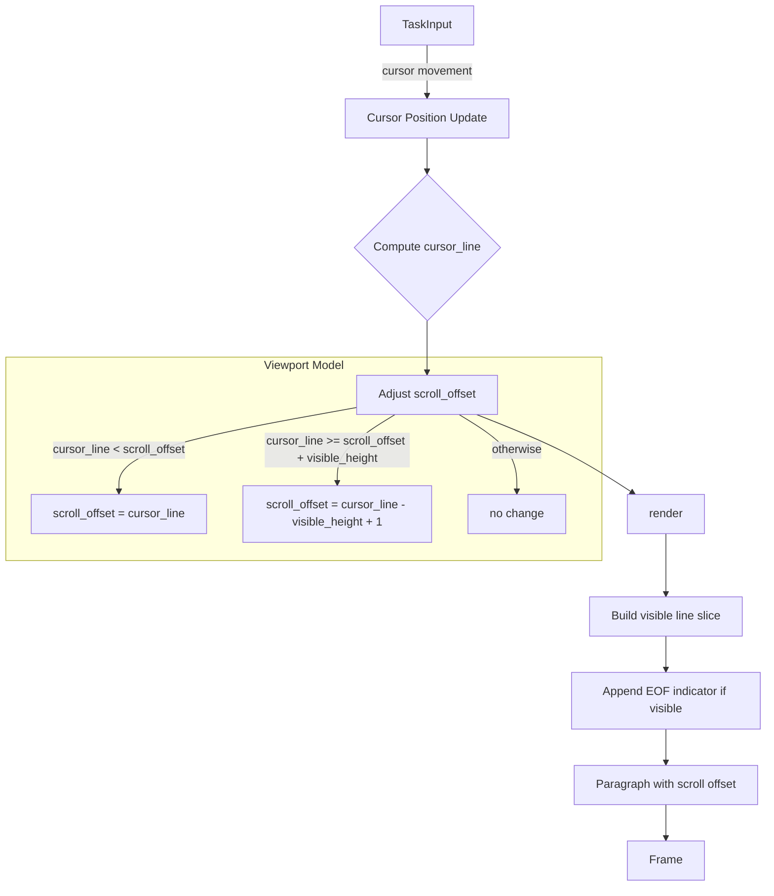

# Design: TaskInput Vim-like Scrolling and EOF Indicator

## 1. Overview

The TaskInput widget (Command screen) currently renders all content lines directly via ratatui `Paragraph` with no viewport management. When the buffer content exceeds the visible area, lines beyond the viewport are silently clipped, and the cursor can move off-screen without any visual feedback.

This design adds two features:

1. **Vim-like cursor-following scroll**: The viewport tracks the cursor position. Moving the cursor below the last visible line scrolls the view down; moving above the first visible line scrolls up. The behavior mirrors Vim's default scrolling (no `scrolloff` margin for simplicity).

2. **EOF indicator**: A `[EOF]` marker is displayed on the line immediately following the last line of the buffer, styled as dimmed text. This is inspired by Hidemaru editor's end-of-file visualization and provides clear visual feedback that the user has reached the end of the content.

Both features must respect the two layout states of the Command screen:
- **Expanded** (expert panel hidden): `Constraint::Min(8)` — variable height
- **Compact** (expert panel visible): `Constraint::Length(5)` — fixed height, inner_height = 3

## 2. Architecture



The core idea is a **viewport window** defined by `scroll_offset` (the index of the first visible line) and `visible_height` (derived from the render area at draw time). Every cursor mutation triggers viewport adjustment in the `render()` method, ensuring the cursor line is always within the visible range.

### Key Constraint

Ratatui's `Paragraph` widget has a `.scroll((y, x))` method that offsets the rendered content. We use this for vertical scrolling. The EOF line is appended to the display text before creating the `Paragraph`, so it scrolls naturally with the rest of the content.

## 3. Components and Interfaces

### 3.1 TaskInput (modified)

- **File**: `src/tower/widgets/task_input.rs`
- **Purpose**: Multi-line text input with cursor-following scroll and EOF indicator

**New fields**:

```rust
pub struct TaskInput {
    content: String,
    cursor_position: usize,  // character-based
    focused: bool,
    scroll_offset: usize,    // NEW: first visible line index (0-based)
}
```

**New helper methods**:

```rust
/// Returns (line_index, column) of the current cursor position.
/// Both are 0-based. This is the logical line (not visual/wrapped).
fn cursor_line_col(&self) -> (usize, usize)

/// Returns the total number of logical lines in the buffer.
/// An empty buffer has 1 line. A trailing newline adds an extra empty line.
fn line_count(&self) -> usize

/// Adjusts scroll_offset so cursor_line is within [scroll_offset, scroll_offset + visible_height).
/// Called during render() with the actual visible_height derived from the render area.
fn ensure_cursor_visible(&mut self, visible_height: usize)
```

**Modified `render()` signature** (unchanged externally):

```rust
pub fn render(&mut self, frame: &mut Frame, area: Rect, title: &str)
```

Note: `render` changes from `&self` to `&mut self` because `ensure_cursor_visible` mutates `scroll_offset`. This is the same pattern used by `ExpertPanelDisplay::render()`.

**EOF indicator rendering**:
After building the display text lines, append an `[EOF]` line:

```rust
lines.push(Line::from(Span::styled(
    "[EOF]",
    Style::default().fg(Color::DarkGray),
)));
```

### 3.2 TowerApp (caller adjustment)

- **File**: `src/tower/app.rs`
- **Purpose**: Passes mutable reference to TaskInput for render

The only change is that `task_input()` must return `&mut TaskInput` (or `render_task_input` in `ui.rs` must call it via mutable borrow). Currently, `UI::render_task_input` already takes `app: &mut TowerApp`, so this is straightforward.

### 3.3 UI layout (no changes)

- **File**: `src/tower/ui.rs`
- **Purpose**: Layout allocation is unchanged

The two layout states (expanded/compact) already provide `area: Rect` to `render()`. The `visible_height` is derived dynamically from `area.height - 2` (minus borders). No layout changes are required.

## 4. Data Models

### 4.1 Viewport State

```
scroll_offset: usize
```

- **Range**: `0..=max(0, line_count - 1)`
- **Invariant**: After `ensure_cursor_visible`, the cursor line is always within `[scroll_offset, scroll_offset + visible_height)`
- **Initial value**: `0`
- **Reset on `clear()`**: Set to `0`

### 4.2 Cursor-to-Line Mapping

The `cursor_line_col()` method iterates through `self.content.chars()` counting newlines up to `cursor_position`:

```
cursor_position = 0..N (character index)
line = number of '\n' characters before cursor_position
col  = distance from last '\n' (or start) to cursor_position
```

### 4.3 EOF Line

The EOF indicator is a virtual line appended at render time. It is not part of the content buffer. Its position is `line_count` (one past the last content line index).

The EOF line participates in scroll calculations: the total rendered line count is `line_count + 1` (content lines + EOF line). This means users can scroll the EOF line into view but the viewport will not scroll past it.

## 5. Error Handling

### 5.1 Empty Buffer

When the buffer is empty, `line_count()` returns 1 (one empty line). The EOF indicator appears on line 1 (the second visual line). `scroll_offset` stays at 0.

### 5.2 Single-line Content

With content "hello" and `visible_height >= 2`, both the content line and `[EOF]` are visible. No scrolling occurs.

### 5.3 Visible Height = 0

If the render area is too small (height <= 2, meaning inner height = 0), `ensure_cursor_visible` is a no-op. The `Paragraph` will render nothing, which is the existing behavior.

### 5.4 scroll_offset Overflow

After content deletion (backspace, kill-line, clear), `scroll_offset` may exceed the valid range. `ensure_cursor_visible` clamps it:

```rust
let max_offset = total_lines.saturating_sub(visible_height);
self.scroll_offset = self.scroll_offset.min(max_offset);
```

This runs before the cursor visibility check, ensuring scroll_offset is always valid.

## 6. Correctness Properties

1. **Cursor Always Visible** — After any cursor movement or content mutation followed by a render, the cursor's logical line index satisfies: `scroll_offset <= cursor_line < scroll_offset + visible_height`.

2. **Scroll Minimum Movement** — `ensure_cursor_visible` adjusts `scroll_offset` by the minimum amount necessary: if the cursor is above the viewport, `scroll_offset = cursor_line`; if below, `scroll_offset = cursor_line - visible_height + 1`; otherwise, no change.

3. **EOF Always Present** — The rendered output always contains exactly one `[EOF]` line, positioned immediately after the last content line. The `[EOF]` line is never part of the editable content.

4. **EOF Scrollable** — The `[EOF]` line participates in viewport calculations. When the cursor is on the last content line and the viewport has room, the `[EOF]` line is visible below the cursor.

5. **Scroll Reset on Clear** — `clear()` resets `scroll_offset` to 0, ensuring the viewport starts at the top of the (now empty) buffer.

6. **Layout Independence** — Scrolling behavior is identical in expanded and compact states, differing only in `visible_height`. The scroll logic has no hardcoded height assumptions.

7. **Unicode Safety** — `cursor_line_col()` operates on character indices (not byte indices), correctly handling multi-byte characters (Japanese, emoji) for line/column computation.

8. **Render Signature Change** — `render()` takes `&mut self` instead of `&self`. All call sites pass a mutable reference. This is required because `ensure_cursor_visible` mutates `scroll_offset` during rendering (same pattern as `ExpertPanelDisplay::render`).

## 7. Testing Strategy

### 7.1 Unit Tests (Properties 1, 2, 5, 6, 7)

All tests are in `src/tower/widgets/task_input.rs` within the existing `#[cfg(test)] mod tests` block.

**Scroll follows cursor down**:
- Create content with N lines where N > visible_height
- Move cursor to last line
- Assert `scroll_offset` positions cursor within viewport

**Scroll follows cursor up**:
- Set scroll_offset to bottom of content
- Move cursor to first line
- Assert `scroll_offset` = 0

**Scroll minimum movement**:
- Position cursor in middle of viewport
- Move cursor one line down (still within viewport)
- Assert `scroll_offset` unchanged

**Clear resets scroll**:
- Set content with many lines, scroll down
- Call `clear()`
- Assert `scroll_offset` = 0

**Unicode line counting**:
- Create multi-line content with Japanese characters
- Assert `cursor_line_col()` returns correct line/column
- Assert scroll behavior works correctly

**Compact vs expanded**:
- Render with `visible_height = 3` (compact) and `visible_height = 6` (expanded)
- Assert cursor visibility invariant holds in both

### 7.2 Render Tests (Properties 3, 4, 8)

**EOF line present**:
- Render TaskInput with test backend
- Assert rendered output contains `[EOF]`

**EOF position**:
- Create content "line1\nline2"
- Render with sufficient height
- Assert `[EOF]` appears on line 3 (after line2)

**EOF scrollable**:
- Create content with many lines
- Move cursor to last line
- Render and assert `[EOF]` is visible in the viewport

**Mutable render**:
- Verify that the render call compiles with `&mut self`
- Verify that scroll_offset is adjusted after render

### 7.3 Integration Considerations

- The `UI::render_task_input` call in `ui.rs` already uses `app.task_input()` which returns `&mut TaskInput` from the mutable `app` reference.
- No changes to key bindings in `app.rs` are needed — cursor movement methods are unchanged, and `ensure_cursor_visible` is called lazily in `render()`.
