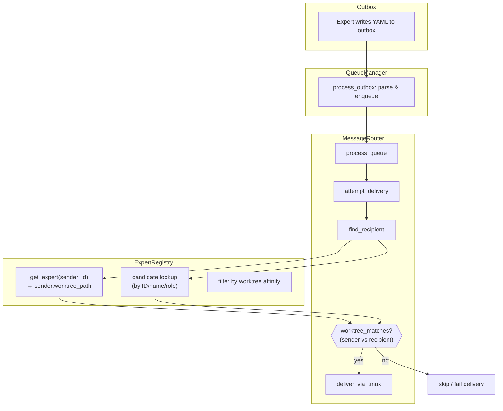

# Design: Worktree Message Isolation

## 1. Overview

When experts are launched in separate git worktrees (via `Ctrl+w`), they currently share a single global message queue. This means an expert in worktree A can receive messages intended for experts working on an entirely different feature branch in worktree B.

This feature adds **worktree-scoped message isolation**: messages are only delivered to recipients that share the same worktree context as the sender. Experts in the main repository can communicate with each other but not with worktree experts, and vice versa.

### Use Case

- Expert 0 (architect) works in the main repo
- Expert 1 (developer) is launched into worktree `feature-auth`
- Expert 2 (reviewer) is also launched into worktree `feature-auth`
- Expert 3 (developer) is launched into worktree `feature-payments`

**Expected behavior**:
- Expert 1 sends a message to role `"reviewer"` → Expert 2 receives it (same worktree)
- Expert 3 sends a message to role `"reviewer"` → **No delivery** (Expert 2 is in a different worktree; no reviewer exists in `feature-payments`)
- Expert 0 sends a message to Expert 1 by name → **No delivery** (main repo vs worktree)
- Expert 0 sends a message to Expert 0's own worktree-mate → Delivered (if both in main repo)

## 2. Architecture

The isolation is enforced at the **routing layer**. No changes to the queue storage format or outbox mechanism are required. The `MessageRouter` gains worktree awareness by comparing the sender's worktree context against each candidate recipient's worktree context.



### Key Design Decisions

1. **Routing-layer enforcement**: The queue and outbox remain worktree-agnostic. Isolation is purely a routing concern, keeping the storage layer simple.
2. **`ExpertInfo` carries worktree context**: Rather than looking up `ExpertContext` (a persistence layer concern) during routing, we add `worktree_path: Option<String>` directly to `ExpertInfo` in the registry.
3. **`None` matches `None`**: Experts without a worktree (main repo) can communicate with each other. `Some(path_a)` matches `Some(path_b)` only if `path_a == path_b`.
4. **All targeting strategies filtered**: ID, name, and role-based targeting all enforce worktree affinity. A message sent by ID to an expert in a different worktree will fail delivery.

## 3. Components and Interfaces

### 3.1 ExpertInfo (modified)

- **File**: `src/models/expert.rs`
- **Purpose**: Add worktree association to expert metadata
- **Change**: New optional field

```rust
#[derive(Debug, Clone, Serialize, Deserialize)]
pub struct ExpertInfo {
    pub id: ExpertId,
    pub name: String,
    pub role: Role,
    pub tmux_session: String,
    #[serde(alias = "tmux_pane")]
    pub tmux_window: String,
    pub state: ExpertState,
    pub last_activity: DateTime<Utc>,
    #[serde(default, skip_serializing_if = "Option::is_none")]
    pub worktree_path: Option<String>,  // NEW
}
```

New methods:

```rust
impl ExpertInfo {
    /// Set the worktree path for this expert
    pub fn set_worktree_path(&mut self, path: Option<String>);

    /// Check if this expert shares the same worktree context as another
    pub fn same_worktree(&self, other: &ExpertInfo) -> bool;
}
```

### 3.2 ExpertRegistry (modified)

- **File**: `src/experts/registry.rs`
- **Purpose**: Support worktree-aware expert lookup
- **Changes**: New method for updating worktree path; modified idle-expert queries

```rust
impl ExpertRegistry {
    /// Update the worktree path for an expert
    pub fn update_expert_worktree(
        &mut self,
        expert_id: ExpertId,
        worktree_path: Option<String>,
    ) -> Result<(), RegistryError>;

    /// Get idle experts by role, filtered to only those sharing the given worktree
    pub fn get_idle_experts_by_role_str_in_worktree(
        &self,
        role: &str,
        worktree_path: &Option<String>,
    ) -> Vec<ExpertId>;
}
```

### 3.3 MessageRouter (modified)

- **File**: `src/queue/router.rs`
- **Purpose**: Enforce worktree isolation during recipient resolution
- **Changes**: `find_recipient` gains a `sender_id` parameter for worktree comparison

```rust
impl<T: TmuxSender> MessageRouter<T> {
    /// Find recipient with worktree affinity check
    pub async fn find_recipient(
        &self,
        recipient: &MessageRecipient,
        sender_id: ExpertId,  // NEW: needed for worktree comparison
    ) -> Result<Option<ExpertId>, RouterError>;

    /// Check if sender and recipient share the same worktree context
    fn worktree_matches(
        &self,
        sender_id: ExpertId,
        recipient_id: ExpertId,
    ) -> bool;
}
```

### 3.4 App (modified)

- **File**: `src/tower/app.rs`
- **Purpose**: Propagate worktree path to expert registry when launching in worktree
- **Changes**: After worktree launch completes, update the expert's worktree_path in the registry

```rust
// In poll_worktree_launch, on success:
if let Some(ref mut router) = self.message_router {
    let _ = router.expert_registry_mut().update_expert_worktree(
        result.expert_id,
        Some(result.worktree_path.clone()),
    );
}
let _ = self.expert_registry.update_expert_worktree(
    result.expert_id,
    Some(result.worktree_path.clone()),
);
```

### 3.5 Messaging Template (modified)

- **File**: `instructions/templates/agents/messaging.md.tmpl`
- **Purpose**: Document worktree isolation behavior for agents
- **Change**: Add a section explaining that messages are scoped to the sender's worktree

## 4. Data Models

### ExpertInfo.worktree_path

| Value | Meaning |
|-------|---------|
| `None` | Expert is in the main repository (no worktree) |
| `Some("/path/to/.macot/worktrees/feature-auth")` | Expert is in the `feature-auth` worktree |

### Worktree Affinity Matrix

| Sender | Recipient | Match? |
|--------|-----------|--------|
| `None` | `None` | Yes |
| `None` | `Some(X)` | No |
| `Some(X)` | `None` | No |
| `Some(X)` | `Some(X)` | Yes |
| `Some(X)` | `Some(Y)` | No |

Affinity is determined by **exact string equality** of the worktree path, or both being `None`.

## 5. Error Handling

### Delivery to a different worktree

When `find_recipient` resolves a candidate but the worktree check fails:
- **By ID/Name**: Return `DeliveryResult::failed` with error message `"Expert {id} is in a different worktree"`. The message stays in the queue for retry (the recipient might return to the same worktree later, though unlikely).
- **By Role**: Skip experts in different worktrees during candidate filtering. If no candidates remain, return `None` (same as current "no idle experts" behavior). The message retries until expiration.

### Backward compatibility

- Experts registered without a worktree path default to `None` (serde default).
- Existing serialized `ExpertInfo` YAML without the `worktree_path` field will deserialize with `None`, preserving backward compatibility.

## 6. Correctness Properties

1. **Worktree Isolation** — A message from sender S is never delivered to recipient R if `S.worktree_path != R.worktree_path`.

2. **Main Repo Affinity** — Experts with `worktree_path = None` can exchange messages with each other, forming a default communication group.

3. **Role Scoping** — When targeting by role, only idle experts in the same worktree as the sender are considered candidates. An idle expert in a different worktree is invisible to role-based routing.

4. **ID/Name Targeting Enforcement** — Even explicit targeting by expert ID or name is subject to worktree filtering. An expert cannot bypass isolation by knowing another expert's ID.

5. **Backward Compatibility** — Experts without `worktree_path` (deserialized from old data or never launched in a worktree) default to `None` and communicate normally with other `None` experts.

6. **Worktree Path Propagation** — After a successful worktree launch (`poll_worktree_launch` completes), the expert's `worktree_path` in the registry is updated before the next message poll cycle.

7. **Retry Semantics Preserved** — A message failing delivery due to worktree mismatch increments the delivery attempt counter and follows the same retry/expiry logic as other delivery failures.

## 7. Testing Strategy

### Unit Tests

**ExpertInfo**:
- `same_worktree` returns `true` for `(None, None)`
- `same_worktree` returns `true` for `(Some(X), Some(X))`
- `same_worktree` returns `false` for `(None, Some(X))`
- `same_worktree` returns `false` for `(Some(X), Some(Y))`
- `set_worktree_path` updates the field correctly
- Serialization/deserialization with and without `worktree_path` (covers Property 5)

**ExpertRegistry**:
- `update_expert_worktree` sets the path correctly
- `update_expert_worktree` for nonexistent expert returns error
- `get_idle_experts_by_role_str_in_worktree` filters by both role and worktree (covers Property 3)
- `get_idle_experts_by_role_str_in_worktree` with `None` worktree returns only `None` experts

**MessageRouter**:
- `worktree_matches` returns correct results for all affinity matrix combinations (covers Properties 1, 2)
- `find_recipient` by ID with worktree mismatch returns `None` (covers Property 4)
- `find_recipient` by name with worktree mismatch returns `None` (covers Property 4)
- `find_recipient` by role with mixed worktrees returns only same-worktree experts (covers Property 3)
- `attempt_delivery` with worktree mismatch produces `DeliveryResult::failed` (covers Property 7)

### Integration Tests

- End-to-end: Enqueue a message from expert in worktree A targeting role, verify it is delivered only to an expert in worktree A (covers Properties 1, 3)
- End-to-end: Enqueue a message from main-repo expert to worktree expert by ID, verify delivery fails (covers Properties 1, 4)
- End-to-end: Verify main-repo experts can still communicate with each other (covers Property 2)

### Property-Based Tests

- For any two experts, `same_worktree(a, b) == same_worktree(b, a)` (symmetry)
- For any expert, `same_worktree(a, a) == true` (reflexivity)
