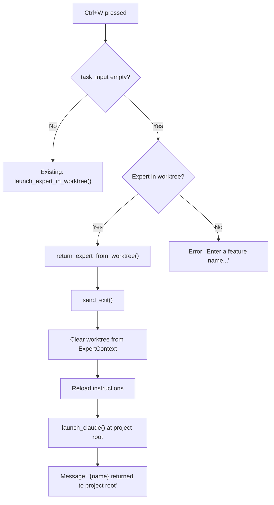

# Design: Worktree Return on Ctrl+W with Empty Input

## 1. Overview

When `Ctrl+W` is pressed and the task input (Command panel) is empty, the behavior changes based on the selected expert's current working directory:

- **Expert is in a worktree** (`.macot/worktrees/*`): Exit Claude, clear worktree context, move the expert back to the project root (`./`), and restart Claude there.
- **Expert is at the project root** (`./`): Display the existing error message (unchanged).

This gives `Ctrl+W` dual purpose — launch into a worktree (with text) or return from a worktree (without text) — creating a natural toggle.

## 2. Architecture



The new `return_expert_from_worktree()` method follows the same pattern as `reset_expert()` but additionally clears the worktree state from `ExpertContext`.

## 3. Components and Interfaces

### 3.1 TowerApp (modified)

- **File**: `src/tower/app.rs`
- **Purpose**: Handles the branching logic for Ctrl+W based on input state

**Modified method — `handle_events` key dispatch block (around line 882):**

The existing `Ctrl+W` handler currently calls `launch_expert_in_worktree()` unconditionally. It will be changed to check whether the input is empty and route accordingly.

```rust
// Ctrl+W handler (replaces current unconditional call)
if key.code == KeyCode::Char('w')
    && key.modifiers.contains(KeyModifiers::CONTROL)
    && self.focus == FocusArea::TaskInput
{
    let input = self.task_input.content().trim().to_string();
    if input.is_empty() {
        self.return_expert_from_worktree().await?;
    } else {
        self.launch_expert_in_worktree().await?;
    }
}
```

**New method — `return_expert_from_worktree`:**

```rust
pub async fn return_expert_from_worktree(&mut self) -> Result<()>
```

Detects if the selected expert is in a worktree via `ExpertContext.worktree_path`. If yes, exits Claude, clears worktree state, and relaunches at the project root. If not, falls back to the existing error message.

### 3.2 ExpertContext (unchanged, for reference)

- **File**: `src/context/expert.rs`
- **Purpose**: Stores per-expert worktree state

Relevant fields used for detection:
```rust
pub worktree_branch: Option<String>,
pub worktree_path: Option<String>,
```

A `clear_worktree` method will be added to complement `set_worktree`:

```rust
pub fn clear_worktree(&mut self) {
    self.worktree_branch = None;
    self.worktree_path = None;
    self.touch();
}
```

### 3.3 Help Modal (modified)

- **File**: `src/tower/widgets/help_modal.rs`
- **Purpose**: Updated help text for Ctrl+W to describe the dual behavior

```
Ctrl+W  Launch expert in worktree / Return from worktree
```

## 4. Data Models

No new data models are introduced. The feature relies on the existing `ExpertContext` struct and its `worktree_branch`/`worktree_path` fields.

**State transitions for `ExpertContext` worktree fields:**

| Action | `worktree_branch` | `worktree_path` |
|--------|-------------------|-----------------|
| Initial / at project root | `None` | `None` |
| After `launch_expert_in_worktree` | `Some("branch-name")` | `Some("/path/to/worktree")` |
| After `return_expert_from_worktree` | `None` | `None` |

## 5. Error Handling

| Condition | Behavior |
|-----------|----------|
| No expert selected | Message: "No expert selected" |
| Input empty + expert not in worktree | Message: "Enter a feature name in the task input before launching worktree" (existing) |
| `send_exit` fails | Propagate error via `?` |
| Context load fails | Treat as "not in worktree" (no worktree_path → show error) |
| `launch_claude` fails | Propagate error via `?` |

## 6. Correctness Properties

1. **Input-Based Routing** — When Ctrl+W is pressed with non-empty input, the existing `launch_expert_in_worktree()` behavior is preserved exactly.
2. **Worktree Detection** — The expert is considered "in a worktree" if and only if `ExpertContext.worktree_path` is `Some(path)` and `path` is non-empty.
3. **Context Cleanup** — After `return_expert_from_worktree` succeeds, `ExpertContext.worktree_branch` and `ExpertContext.worktree_path` are both `None`.
4. **Restart Correctness** — After returning, the expert's Claude instance runs at `config.project_path` (the project root), not at the old worktree path.
5. **Instruction Reload** — Instructions are regenerated and reloaded on return, matching the `reset_expert` behavior.
6. **Error Fallback** — When input is empty and the expert has no worktree context, the existing error message is shown. No action is taken.
7. **Idempotency** — Calling `return_expert_from_worktree` when already at project root produces an error message but no side effects.

## 7. Testing Strategy

### Unit Tests

| Test | Property |
|------|----------|
| `ctrl_w_empty_input_expert_in_worktree_calls_return` | Property 1, 2 |
| `ctrl_w_with_input_calls_launch` | Property 1 |
| `return_expert_clears_worktree_context` | Property 3 |
| `return_expert_no_worktree_shows_error` | Property 6, 7 |
| `return_expert_no_expert_selected_shows_error` | Error handling |
| `clear_worktree_resets_fields_to_none` | Property 3 |
| `help_modal_shows_dual_behavior_text` | Documentation accuracy |

### Integration Tests

| Test | Property |
|------|----------|
| Full round-trip: launch into worktree → return from worktree | Properties 1-5 |
| Return preserves role selection across worktree exit | Property 5 |

All tests should use the existing mock infrastructure (`MockSender`, `create_test_app`) consistent with the codebase's patterns.
