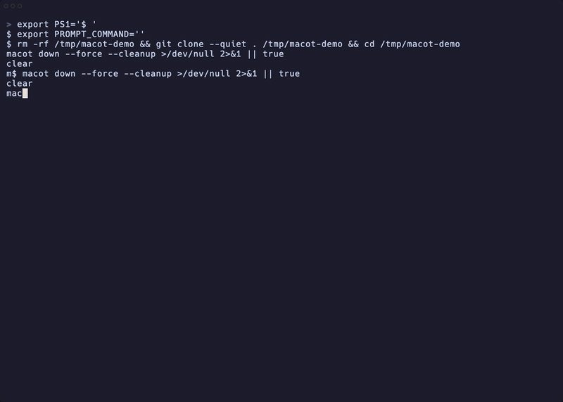

<div align="center">

# macot

[](https://github.com/Cassin01/multi_agent_control_tower/actions/workflows/ci.yml)
[](https://crates.io/crates/macot)
[](https://docs.rs/macot)
[](LICENSE)
[](https://www.rust-lang.org/)

**Control Tower for parallel Claude workflows in your terminal**

Coordinate multiple role-based coding agents on one codebase with a Rust-native CLI + TUI.



[Features](#-features) •
[Quick Start](#-quick-start) •
[Installation](#-installation) •
[Configuration](#%EF%B8%8F-configuration) •
[Commands](#-commands) •
[FAQ](#-faq) •
[Contributing](#-contributing)

</div>

---

## ✨ Features

- **⚡ Parallel orchestration**: run multiple experts concurrently in isolated tmux panes.
- **🧠 Role-based execution**: assign experts like `architect`, `backend`, `frontend`, and `tester`.
- **🖥️ Control Tower TUI**: dispatch tasks, monitor status, and review reports in one screen.
- **🌲 Worktree-friendly flow**: reduce branch conflicts with isolated workspaces per expert.
- **🧩 Configurable by design**: tune experts, roles, timeouts, and paths via YAML.
- **🔒 Local-first runtime**: queue and context live locally with no external coordinator service.

## 🚀 Quick Start

Install, launch, and verify in under a minute.

```bash
# 0) Prerequisites: rust + tmux + Claude CLI
cargo install macot

# 1) Start a session in your current project
macot start .

# 2) Open the control tower
macot tower

# 3) Verify from another terminal
macot status
```

Success looks like:

- session name appears as `macot-<hash>`
- at least one expert moves to `Thinking` or `Executing`
- a report appears in the tower report list

## 📦 Installation

Use crates.io for the fastest setup.

```bash
cargo install macot
```

<details>
<summary><b>Install from source</b></summary>

```bash
git clone https://github.com/Cassin01/multi_agent_control_tower.git
cd multi_agent_control_tower
cargo install --path .
```

</details>

<details>
<summary><b>Homebrew / prebuilt binaries</b></summary>

Homebrew formula and release binaries are planned but not published yet.

</details>

## ⚙️ Configuration

Use YAML config when you need custom experts, roles, or runtime timeouts.

```yaml
experts:
  - name: architect
    role: architect
  - name: backend
    role: backend
  - name: frontend
    role: frontend
  - name: tester
    role: tester

runtime:
  startup_timeout_seconds: 30
  graceful_shutdown_timeout_seconds: 10

paths:
  instructions_dir: ./instructions
```

```bash
macot start -c ./config/macot.yaml
macot tower --config ./config/macot.yaml
```

See full reference: [`doc/configuration.md`](doc/configuration.md)

## 📋 Commands

Core command surface:

| Command | Purpose |
|---|---|
| `macot start [project_path]` | Initialize a session and launch experts |
| `macot tower [session_name]` | Open the control tower UI |
| `macot status [session_name]` | Print live session and expert status |
| `macot sessions` | List running `macot-*` sessions |
| `macot down [session_name]` | Stop a session gracefully or forcefully |
| `macot reset expert <id\|name>` | Reset one expert context/runtime |

More examples and TUI keybindings: [`doc/cli.md`](doc/cli.md)

## ❓ FAQ

### Where are session artifacts stored?

Inside your project at `.macot/`.

## 🤝 Contributing

Contributions are welcome. Contribution flow, issue templates, and PR checklist are documented in [`CONTRIBUTING.md`](CONTRIBUTING.md).

```bash
make ci
```

## 📄 License

[Apache-2.0](LICENSE) © Cassin01
