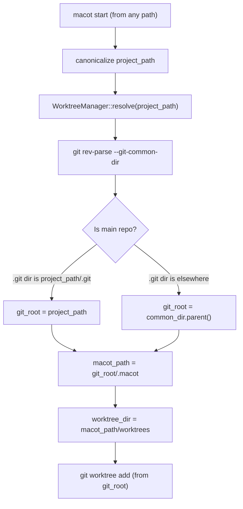

# Design: Fix Worktree Nesting — Session-Local Worktree Placement

## 1. Overview

When `macot start` is invoked from inside an existing git worktree (e.g., `/project/.worktrees/ttt5`), `WorktreeManager` uses that worktree path as its base. New worktrees are then created at `{worktree}/.macot/worktrees/`, nesting worktrees inside worktrees. This is incorrect — all worktrees must be created relative to the **git main working tree root**, not the current working directory.

The fix resolves the git main working tree at `WorktreeManager` construction time, ensuring `macot_path` always points to the main repo's `.macot/` regardless of where MACOT was started.

## 2. Architecture

### Problem: Current Path Resolution

```
User runs: macot start   (from /project/.worktrees/ttt5)
                ↓
project_path = /project/.worktrees/ttt5   (canonicalized cwd)
                ↓
WorktreeManager::new(project_path)
  macot_path = /project/.worktrees/ttt5/.macot         ← WRONG (symlink)
  worktree_dir = /project/.worktrees/ttt5/.macot/worktrees
                ↓
git worktree add /project/.worktrees/ttt5/.macot/worktrees/branch
                ↓
Nested worktree inside a worktree ← BUG
```

### Fix: Resolve Git Root

```
User runs: macot start   (from /project/.worktrees/ttt5)
                ↓
project_path = /project/.worktrees/ttt5
                ↓
WorktreeManager::resolve(project_path)
  git rev-parse --path-format=absolute --git-common-dir
    → /project/.git
  git_root = /project/.git → parent → /project
  macot_path = /project/.macot                         ← CORRECT
  worktree_dir = /project/.macot/worktrees
                ↓
git worktree add /project/.macot/worktrees/branch
                ↓
Worktree at session-local path ← FIXED
```

### Data Flow Diagram



## 3. Components and Interfaces

### 3.1 WorktreeManager (modified)

- **File**: `src/session/worktree.rs`
- **Change**: Add `git_root` field; add async factory `resolve()`; run git commands from `git_root` instead of `project_path`

```rust
#[derive(Clone)]
pub struct WorktreeManager {
    git_root: PathBuf,
    macot_path: PathBuf,
}

impl WorktreeManager {
    // Synchronous constructor for testing (no git resolution)
    pub fn new(git_root: PathBuf) -> Self {
        let macot_path = git_root.join(".macot");
        Self { git_root, macot_path }
    }

    // Async factory that resolves the true git root
    pub async fn resolve(project_path: PathBuf) -> Result<Self> {
        let git_root = resolve_git_root(&project_path).await?;
        Ok(Self::new(git_root))
    }

    // All git commands use self.git_root as current_dir
    pub async fn create_worktree(&self, branch_name: &str) -> Result<PathBuf> { ... }
    pub async fn remove_worktree(&self, branch_name: &str) -> Result<()> { ... }
}
```

### 3.2 resolve_git_root (new helper)

- **File**: `src/session/worktree.rs`
- **Purpose**: Determine the main git working tree root, even when invoked from within a worktree

```rust
async fn resolve_git_root(project_path: &Path) -> Result<PathBuf> {
    // Runs: git rev-parse --path-format=absolute --git-common-dir
    // For main repo:  returns /project/.git       → parent = /project
    // For worktree:   returns /project/.git       → parent = /project
    // (--git-common-dir always returns the shared .git directory)
}
```

### 3.3 TowerApp (modified)

- **File**: `src/tower/app.rs`
- **Change**: `TowerApp::new()` calls `WorktreeManager::resolve()` instead of `WorktreeManager::new()`

Current:
```rust
let worktree_manager = WorktreeManager::new(config.project_path.clone());
```

After:
```rust
let worktree_manager = WorktreeManager::resolve(config.project_path.clone()).await?;
```

This requires `TowerApp::new()` to become async, or the resolution to happen before construction. Since `TowerApp::new()` is currently synchronous, the resolution should be done in the caller (`tower::execute()`) and passed in.

**Preferred approach**: Resolve in `tower::execute()` and add `worktree_manager` to `TowerApp::new()` signature:

```rust
// src/commands/tower.rs
let worktree_manager = WorktreeManager::resolve(PathBuf::from(&project_path)).await?;
let mut app = TowerApp::new(config, worktree_manager);
```

## 4. Data Models

No new data models. The `WorktreeManager` struct changes from:

| Field | Before | After |
|-------|--------|-------|
| `project_path: PathBuf` | Working directory at startup | **Removed** |
| `git_root: PathBuf` | N/A | **New** — resolved main working tree root |
| `macot_path: PathBuf` | `project_path/.macot` | `git_root/.macot` (same logic, different base) |

## 5. Error Handling

### New Error Cases

1. **`git rev-parse` fails**: The project path is not a git repository.
   - Action: Propagate `anyhow::Error` with context `"Failed to resolve git root — is this a git repository?"`
   - Caller (`tower::execute()`) will surface this to the user.

2. **Common dir has no parent**: Pathological case (e.g., root `/`).
   - Action: Fall back to using `project_path` as `git_root` (same as current behavior).

3. **`git rev-parse` not on PATH**: Git is not installed.
   - Action: Propagate error. This is already an implicit requirement.

## 6. Correctness Properties

1. **No Nesting** — `worktree_dir()` must never return a path inside an existing git worktree. It must always be under the main repo's `.macot/worktrees/`.

2. **Idempotent from Any Checkout** — `WorktreeManager::resolve(p1)` and `WorktreeManager::resolve(p2)` must produce the same `git_root` and `macot_path` when `p1` and `p2` are different worktrees of the same repository.

3. **Main Repo Unchanged** — When `project_path` is already the main repo root, `resolve()` must return the same path. No behavioral change for users who don't use worktrees.

4. **Git Commands Run from Root** — All `git worktree add/remove` commands must use `git_root` as `current_dir`, ensuring git can find the correct `.git` directory.

5. **Symlink Consistency** — `setup_macot_symlink()` must create a symlink in the new worktree pointing to the resolved `macot_path` (which is now always the main repo's `.macot`).

6. **Path Uniqueness Preserved** — `worktree_path(branch_a) != worktree_path(branch_b)` for distinct branch names (existing property, must be preserved).

## 7. Testing Strategy

### Unit Tests (sync, `WorktreeManager::new()`)

- **Property 3**: `WorktreeManager::new("/project")` produces `macot_path = /project/.macot` (existing tests, no change).
- **Property 6**: Path uniqueness (existing proptest, no change).

### Integration Tests (async, `WorktreeManager::resolve()`)

- **Property 1**: Create a temp git repo, create a worktree, run `resolve()` from inside the worktree. Assert `git_root` equals the main repo root.
- **Property 2**: Run `resolve()` from main repo and from a worktree. Assert `git_root` is identical.
- **Property 3**: Run `resolve()` from a plain (non-worktree) repo. Assert `git_root` equals the input path.
- **Property 4**: After `resolve()`, verify `create_worktree()` runs git from the correct directory.

### Property Tests (proptest)

- Existing property tests remain unchanged since they use `WorktreeManager::new()` directly.
